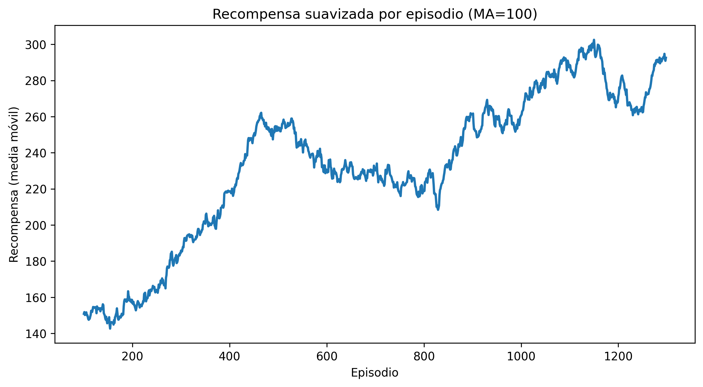
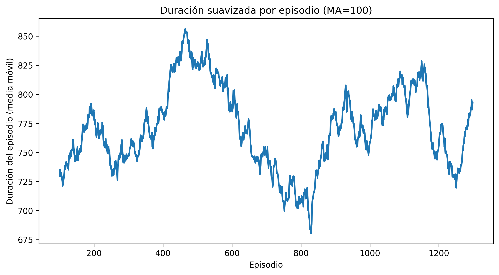
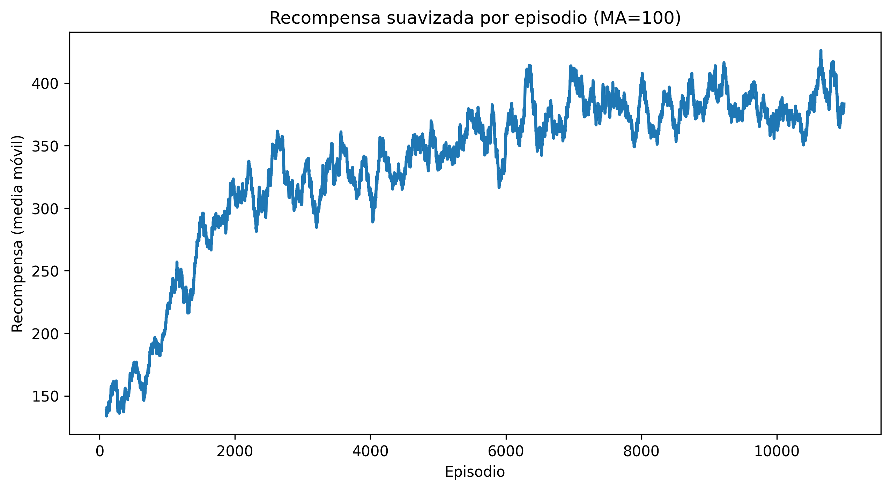
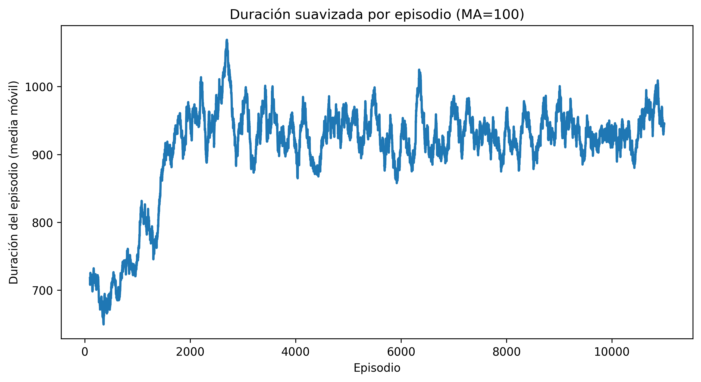
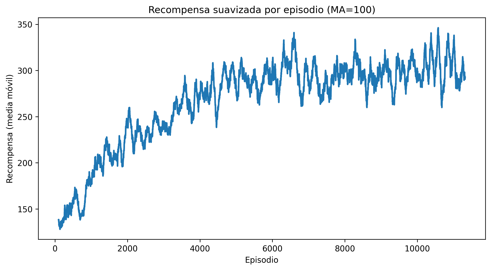
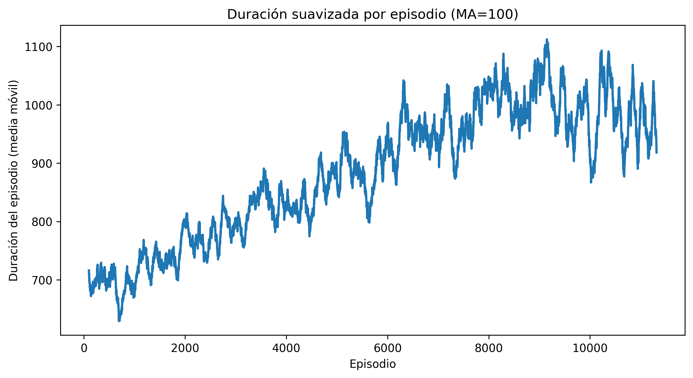

## Modelo 1

### Hiperparámetros:
```
policy="CnnPolicy",
env=env,
learning_rate=1e-4,
buffer_size=100_000,
learning_starts=10_000,
batch_size=128,
tau=1.0,
gamma=0.99,
train_freq=4,
gradient_steps=1,
target_update_interval=10_000,
exploration_fraction=0.1,
exploration_final_eps=0.01,
verbose=1
```

### Entorno:
- Sólo se implementó el wrapper Custom Env para recortar la imagen y transformarla en escala de grises.

### Recompensas:
- Se mantienen las que el entorno ofrece:
    - Son 6 filas de enemigos, cada fila otorga una cantidad fija de puntos por enemigo derrotado: 5, 10, 15, 20, 25 y 30 puntos respectivamente.
    - No tiene reward negativo al perder vida.

### Resultados
<figure style="text-align: center;">
  
  <figcaption><em>Figura 1. Promedio de recompensas obtenidas por el agente DQN (modelo 1) durante el entrenamiento.</em></figcaption>
</figure>


<figure style="text-align: center;">
  
  <figcaption><em>Figura 2. Promedio de duración (en pasos) del agente DQN (modelo 1) durante el entrenamiento.</em></figcaption>
</figure>

### Observaciones
- El promedio de recompensas se mantiene bajo. Para completar una partida se requieren entre 630 y 830 puntos, dependiendo de si se elimina o no al enemigo especial que otorga 200 puntos adicionales.
- El entrenamiento muestra inestabilidad notable: las recompensas presentan ciclos de mejora y deterioro sin una tendencia sostenida.

## Modelo 2

### Hiperparámetros:
```
policy="CnnPolicy",
env=env,
learning_rate=1e-4,
buffer_size=100_000,
learning_starts=10_000,
batch_size=128,
tau=1.0,
gamma=0.99,
train_freq=4,
gradient_steps=1,
target_update_interval=10_000,
exploration_fraction=0.15,
exploration_final_eps=0.05,
verbose=1
```

### Entorno:
- El mismo que el implementado para el modelo 1.

### Recompensas:
- Mismas reglas que el modelo 1.

### Resultados
<figure style="text-align: center;">
  
  <figcaption><em>Figura 3. Promedio de recompensas obtenidas por el agente DQN (modelo 2) durante el entrenamiento.</em></figcaption>
</figure>


<figure style="text-align: center;">
  
  <figcaption><em>Figura 4. Promedio de duración (en pasos) del agente DQN (modelo 2) durante el entrenamiento.</em></figcaption>
</figure>

### Observaciones
- El promedio de recompensas aumenta ligeramente respecto al modelo 1. En algunos episodios logra finalizar la primera partida, aunque el desempeño medio sigue siendo limitado.
- El comportamiento del aprendizaje es más estable. Las recompensas muestran una tendencia ascendente más consistente, aunque el progreso es reducido.

## Modelo 3

### Hiperparámetros:
```
policy="CnnPolicy",
env=env,
learning_rate=5e-4,
buffer_size=100_000,
learning_starts=10_000,
batch_size=128,
tau=1.0,
gamma=0.98,
train_freq=4,
gradient_steps=1,
target_update_interval=10_000,
exploration_fraction=0.3,
exploration_final_eps=0.01,
verbose=1
```

### Entorno:
- El mismo que el implementado para el modelo 1 y 2.

### Recompensas:
- Mismas reglas que el modelo 1 y 2.

### Resultados
<figure style="text-align: center;">
  
  <figcaption><em>Figura 5. Promedio de recompensas obtenidas por el agente DQN (modelo 3) durante el entrenamiento.</em></figcaption>
</figure>


<figure style="text-align: center;">
  
  <figcaption><em>Figura 6. Promedio de duración (en pasos) del agente DQN (modelo 3) durante el entrenamiento.</em></figcaption>
</figure>

### Observaciones
- El rendimiento deterioró con respecto al modelo 2, y es más inestable incluso. Por ahora el mejor modelo dqn es el 2.