## Modelo 1

### Hiperparámetros:
```
policy="CnnPolicy",
env=env,
learning_rate=1e-4,
buffer_size=100_000,
learning_starts=10_000,
batch_size=128,
tau=1.0,
gamma=0.99,
train_freq=4,
gradient_steps=1,
target_update_interval=10_000,
exploration_fraction=0.1,
exploration_final_eps=0.01,
verbose=1
```

### Entorno:
- Sólo se implementó el wrapper Custom Env para recortar la imagen y transformarla en escala de grises.
- Frameskip 3: no muestra todos los frames, muestra cada 3.

### Recompensas:
- Se mantienen las que el entorno ofrece:
    - Son 6 filas de enemigos, cada fila otorga una cantidad fija de puntos por enemigo derrotado: 5, 10, 15, 20, 25 y 30 puntos respectivamente.
    - No tiene reward negativo al perder vida.

### Resultados
<figure style="text-align: center;">
  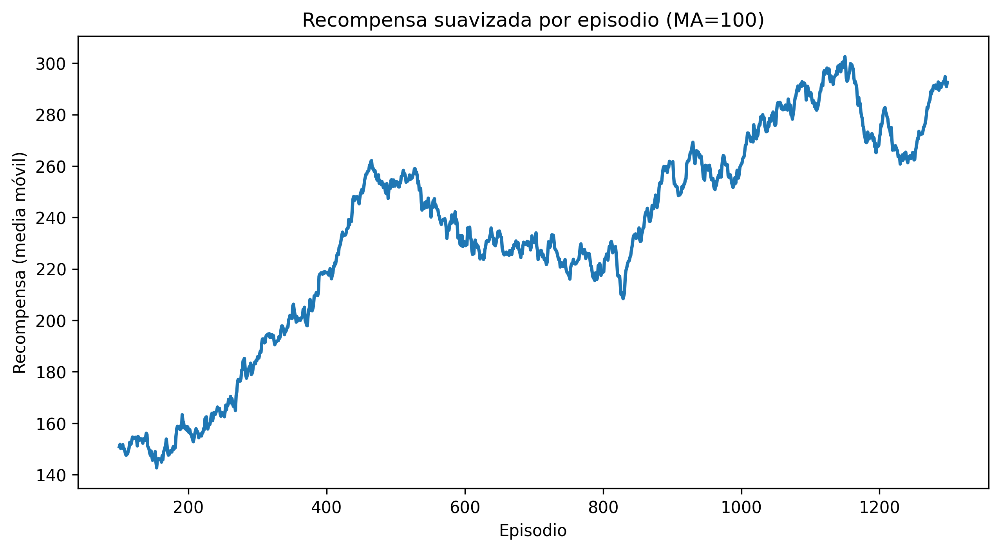
  <figcaption><em>Figura 1. Promedio de recompensas obtenidas por el agente DQN (modelo 1) durante el entrenamiento.</em></figcaption>
</figure>


<figure style="text-align: center;">
  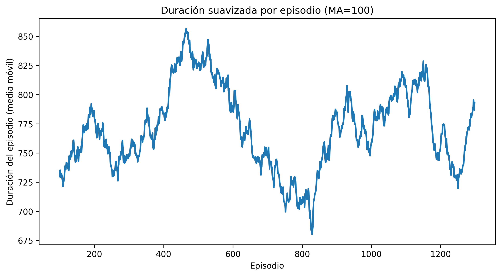
  <figcaption><em>Figura 2. Promedio de duración (en pasos) del agente DQN (modelo 1) durante el entrenamiento.</em></figcaption>
</figure>

### Observaciones
- El promedio de recompensas se mantiene bajo. Para completar una partida se requieren entre 630 y 830 puntos, dependiendo de si se elimina o no al enemigo especial que otorga 200 puntos adicionales.
- El entrenamiento muestra inestabilidad notable: las recompensas presentan ciclos de mejora y deterioro sin una tendencia sostenida.

## Modelo 2

### Hiperparámetros:
```
policy="CnnPolicy",
env=env,
learning_rate=1e-4,
buffer_size=100_000,
learning_starts=10_000,
batch_size=128,
tau=1.0,
gamma=0.99,
train_freq=4,
gradient_steps=1,
target_update_interval=10_000,
exploration_fraction=0.15,
exploration_final_eps=0.05,
verbose=1
```

### Entorno:
- El mismo que el implementado para el modelo 1.

### Recompensas:
- Mismas reglas que el modelo 1.

### Resultados
<figure style="text-align: center;">
  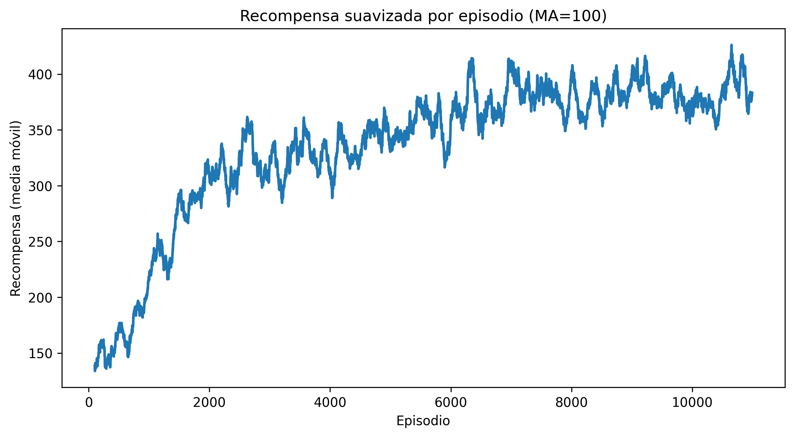
  <figcaption><em>Figura 3. Promedio de recompensas obtenidas por el agente DQN (modelo 2) durante el entrenamiento.</em></figcaption>
</figure>


<figure style="text-align: center;">
  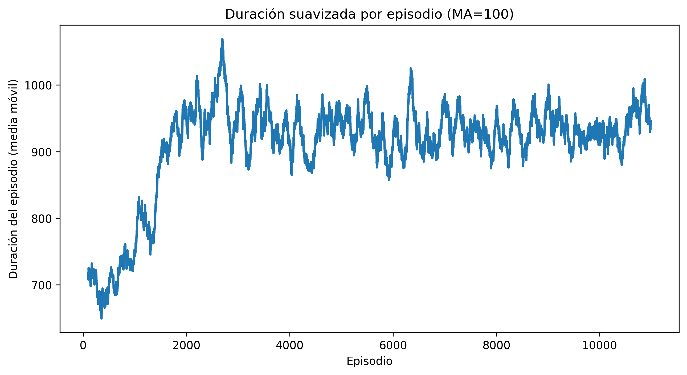
  <figcaption><em>Figura 4. Promedio de duración (en pasos) del agente DQN (modelo 2) durante el entrenamiento.</em></figcaption>
</figure>

### Observaciones
- El promedio de recompensas aumenta ligeramente respecto al modelo 1. En algunos episodios logra finalizar la primera partida, aunque el desempeño medio sigue siendo limitado.
- El comportamiento del aprendizaje es más estable. Las recompensas muestran una tendencia ascendente más consistente, aunque el progreso es reducido.

## Modelo 3

### Hiperparámetros:
```
policy="CnnPolicy",
env=env,
learning_rate=5e-4,
buffer_size=100_000,
learning_starts=10_000,
batch_size=128,
tau=1.0,
gamma=0.98,
train_freq=4,
gradient_steps=1,
target_update_interval=10_000,
exploration_fraction=0.3,
exploration_final_eps=0.01,
verbose=1
```

### Entorno:
- El mismo que el implementado para el modelo 1 y 2.

### Recompensas:
- Mismas reglas que el modelo 1 y 2.

### Resultados
<figure style="text-align: center;">
  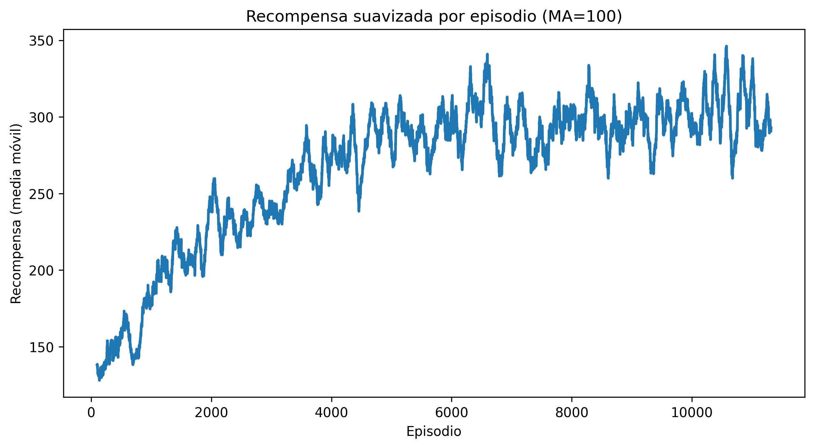
  <figcaption><em>Figura 5. Promedio de recompensas obtenidas por el agente DQN (modelo 3) durante el entrenamiento.</em></figcaption>
</figure>


<figure style="text-align: center;">
  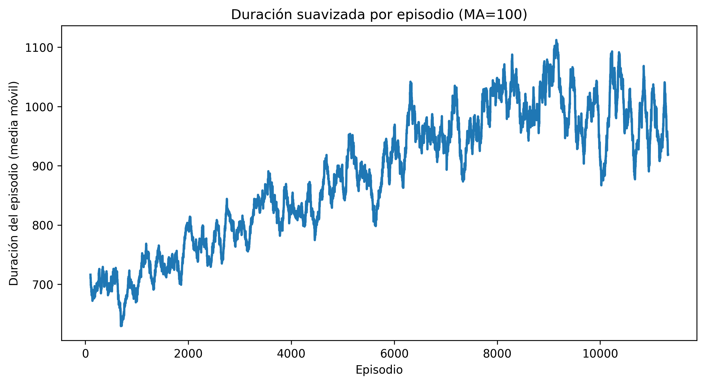
  <figcaption><em>Figura 6. Promedio de duración (en pasos) del agente DQN (modelo 3) durante el entrenamiento.</em></figcaption>
</figure>

### Observaciones
- El rendimiento deterioró con respecto al modelo 2, y es más inestable incluso. Por ahora el mejor modelo dqn es el 2.

## Modelo 4

### Hiperparámetros:
```
policy="CnnPolicy",
env=env,
learning_rate=1e-4,
buffer_size=100_000,
learning_starts=100_000,
batch_size=64,
tau=1.0,
gamma=0.993,
train_freq=4,
gradient_steps=1,
target_update_interval=10_000,
exploration_fraction=0.3,
exploration_final_eps=0.01,
verbose=1
```

### Entorno:
- Mismo que los anteriores.

### Recompensas:
- Reward shaping: se asigna una recompensa negativa por cada vida perdida.
- Reward clipping:
    - Si gana recompensa positiva, se convierte en un punto.
    - Si no gana nada, devuelve 0.
    - Si obtiene recompensa negativa, devuelve -1.

### Resultados
<figure style="text-align: center;">
  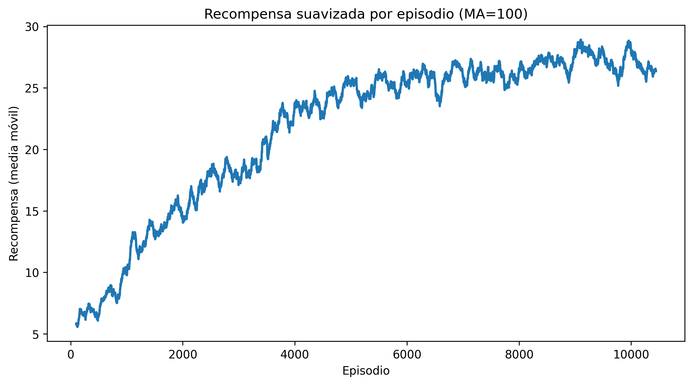
  <figcaption><em>Figura 7. Promedio de recompensas obtenidas por el agente DQN (modelo 4) durante el entrenamiento.</em></figcaption>
</figure>


<figure style="text-align: center;">
  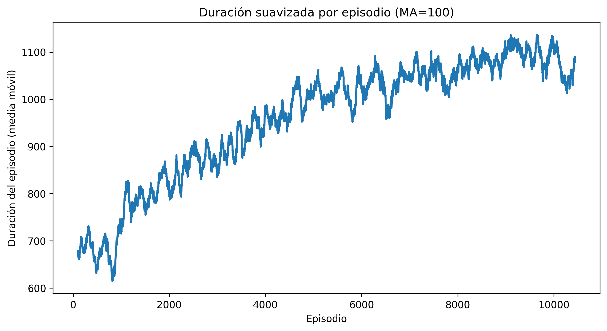
  <figcaption><em>Figura 8. Promedio de duración (en pasos) del agente DQN (modelo 4) durante el entrenamiento.</em></figcaption>
</figure>

### Observaciones
- El rendimiento mejoró significativamente, ya que en promedio estaba cerca de ganar (algunas partidas las ganaba y otras no).
- El entrenamiento se estabilizó al tener recompensas más estables (aumentan de 1 en 1 en vez de tener diferencias de hasta 400 puntos).


## Modelo 5

### Hiperparámetros:
```
policy="CnnPolicy",
env=env,
learning_rate=1e-5,
buffer_size=100_000,
learning_starts=100_000,
batch_size=132,
tau=1.0,
gamma=0.99,
train_freq=4,
gradient_steps=1,
target_update_interval=10_000,
exploration_fraction=0.3,
exploration_final_eps=0.05,
verbose=1
```

### Entorno:
- Mismo que los anteriores.

### Recompensas:
- Reward shaping: se asigna una recompensa negativa por cada vida perdida.
- Reward clipping:
    - Si gana recompensa positiva, se convierte en un punto.
    - Si no gana nada, devuelve 0.
    - Si obtiene recompensa negativa, devuelve -1.

### Resultados
<figure style="text-align: center;">
  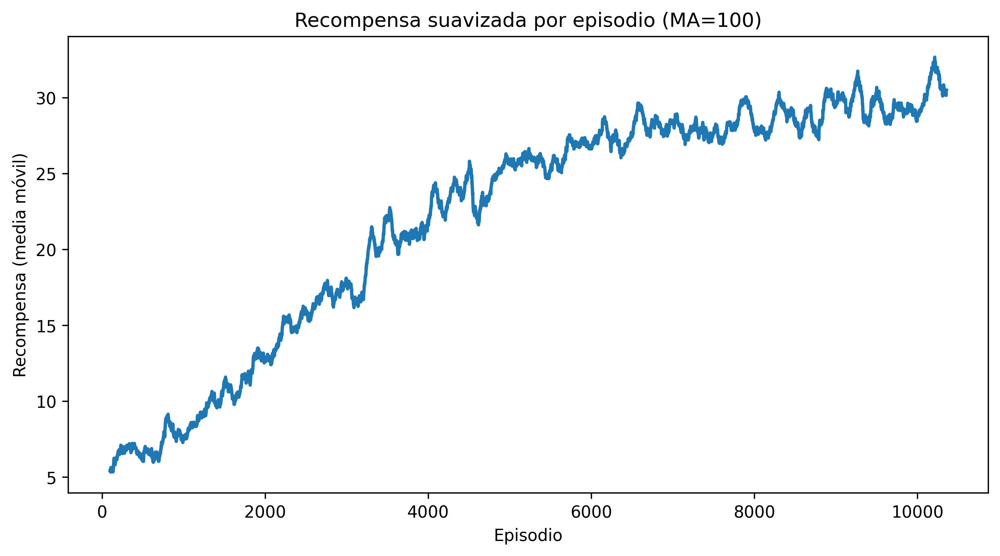
  <figcaption><em>Figura 9. Promedio de recompensas obtenidas por el agente DQN (modelo 5) durante el entrenamiento.</em></figcaption>
</figure>


<figure style="text-align: center;">
  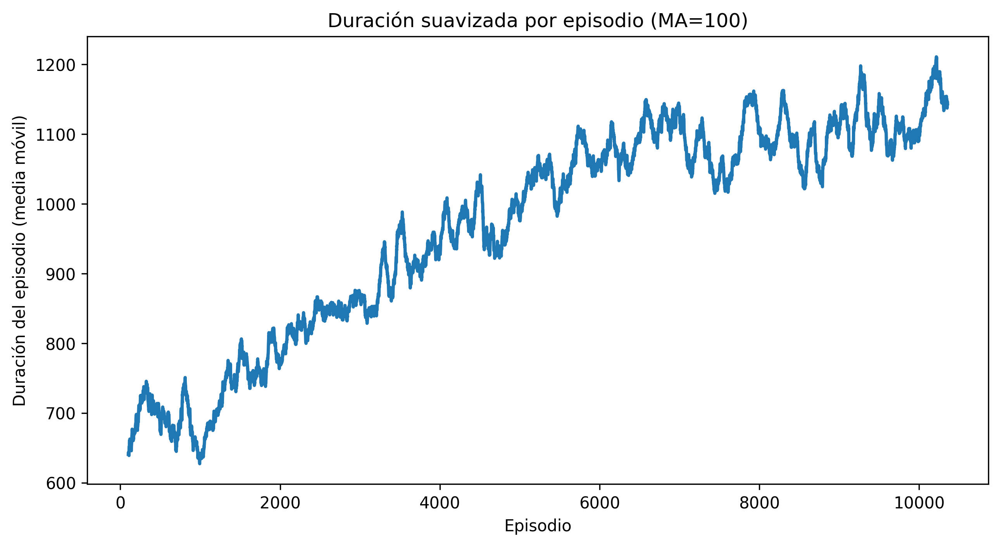
  <figcaption><em>Figura 10. Promedio de duración (en pasos) del agente DQN (modelo 5) durante el entrenamiento.</em></figcaption>
</figure>

### Observaciones
- El rendimiento mejoró aún más con respecto al modelo anterior, en promedio obtenía un poco más de 30 puntos, es decir que en promedio ganaba la partida.
- El entrenamiento sigue siendo estable pero ahora la tendencia a mejorar es un poco más elevada.


## Modelo 6

### Hiperparámetros:
```
policy="CnnPolicy",
env=env,
learning_rate=1e-6,
buffer_size=100_000,
learning_starts=100_000,
batch_size=132,
tau=1.0,
gamma=0.99,
train_freq=4,
gradient_steps=1,
target_update_interval=10_000,
exploration_fraction=0.3,
exploration_final_eps=0.05,
verbose=1,
```

### Entorno:
- Mismo que los anteriores.
- La diferencia es que frameskip ahora es 1, es decir, muestra todos los frames.

### Recompensas:
- Reward shaping: se asigna una recompensa negativa por cada vida perdida.
- Reward clipping:
    - Si gana recompensa positiva, se convierte en un punto.
    - Si no gana nada, devuelve 0.
    - Si obtiene recompensa negativa, devuelve -1.

### Resultados
<figure style="text-align: center;">
  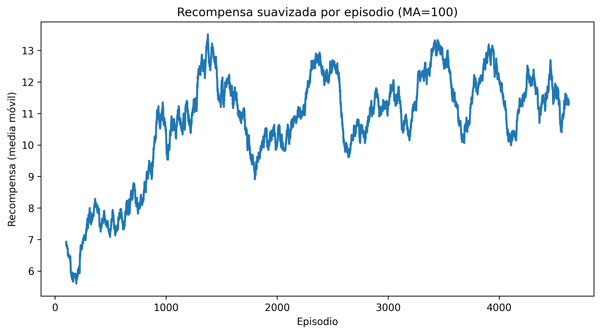
  <figcaption><em>Figura 11. Promedio de recompensas obtenidas por el agente DQN (modelo 6) durante el entrenamiento.</em></figcaption>
</figure>


<figure style="text-align: center;">
  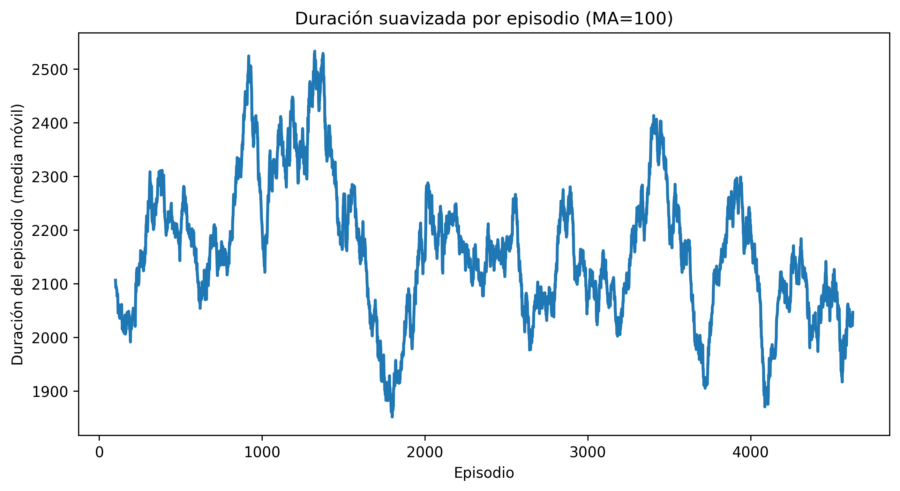
  <figcaption><em>Figura 12. Promedio de duración (en pasos) del agente DQN (modelo 6) durante el entrenamiento.</em></figcaption>
</figure>

### Observaciones
- El rendimiento se deterioró significativamente, en promedio no llega ni a la mitad del puntaje requerido para superar el primer nivel, es decir, no llega a eliminar a la mitad de los enemigos.
- Entrenamiento muy inestable.

## Modelo 7

### Hiperparámetros:
```
policy="CnnPolicy",
env=env,
learning_rate=1e-7,
buffer_size=100_000,
learning_starts=100_000,
batch_size=132,
tau=1.0,
gamma=0.99,
train_freq=4,
gradient_steps=1,
target_update_interval=10_000,
exploration_fraction=0.3,
exploration_final_eps=0.05,
verbose=1,
```

### Entorno:
- Mismo que los anteriores.
- Frameskip = 3

### Recompensas:
- Reward shaping: se asigna una recompensa negativa por cada vida perdida.
- Reward clipping:
    - Si gana recompensa positiva, se convierte en un punto.
    - Si no gana nada, devuelve 0.
    - Si obtiene recompensa negativa, devuelve -1.

### Resultados
<figure style="text-align: center;">
  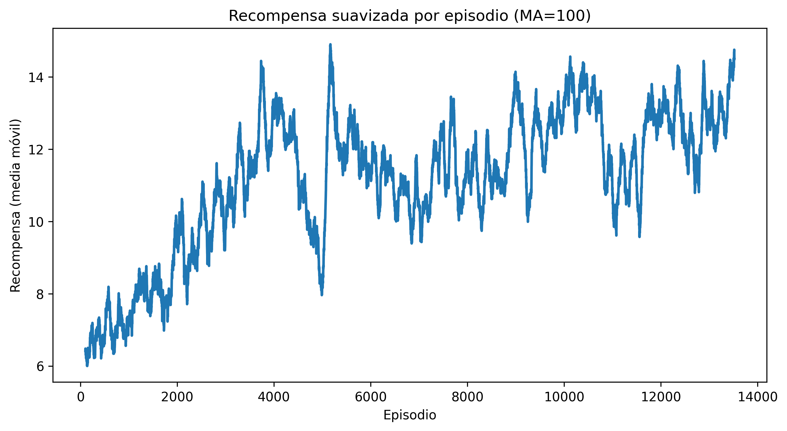
  <figcaption><em>Figura 13. Promedio de recompensas obtenidas por el agente DQN (modelo 7) durante el entrenamiento.</em></figcaption>
</figure>


<figure style="text-align: center;">
  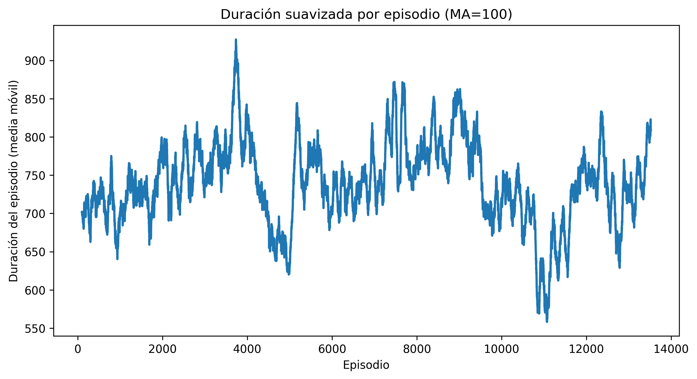
  <figcaption><em>Figura 14. Promedio de duración (en pasos) del agente DQN (modelo 7) durante el entrenamiento.</em></figcaption>
</figure>

### Observaciones
- Este modelo es una copia del modelo 5, lo único que cambió fue el learning rate que bajó de 1e-5 a 1e-7.
- Tanto el rendimiento como la estabilidad se deterioraron significativamente.

## Modelo 8

### Hiperparámetros:
```
policy="CnnPolicy",
env=env,
learning_rate=1e-5,
buffer_size=100_000,
learning_starts=100_000,
batch_size=64,
tau=1.0,
gamma=0.99,
train_freq=4,
gradient_steps=1,
target_update_interval=10_000,
exploration_fraction=0.2,
exploration_final_eps=0.05,
verbose=1,
```

### Entorno:
- Mismo que los anteriores.
- Frameskip = 3

### Recompensas:
- Reward shaping: se asigna una recompensa negativa por cada vida perdida.
- Reward clipping:
    - Si gana recompensa positiva, se convierte en un punto.
    - Si no gana nada, devuelve 0.
    - Si obtiene recompensa negativa, devuelve -1.

### Resultados
<figure style="text-align: center;">
  
  <figcaption><em>Figura 13. Promedio de recompensas obtenidas por el agente DQN (modelo 7) durante el entrenamiento.</em></figcaption>
</figure>


<figure style="text-align: center;">
  
  <figcaption><em>Figura 14. Promedio de duración (en pasos) del agente DQN (modelo 7) durante el entrenamiento.</em></figcaption>
</figure>

### Observaciones
- Este modelo es una copia del modelo 5, se cambió el batch size (de 132 a 64) y exploration fraction (de 0.3 a 0.2)
- Al principio el modelo parecía estar mejorando significativamente, pero se estancó y se desestabilizó el entrenamiento.