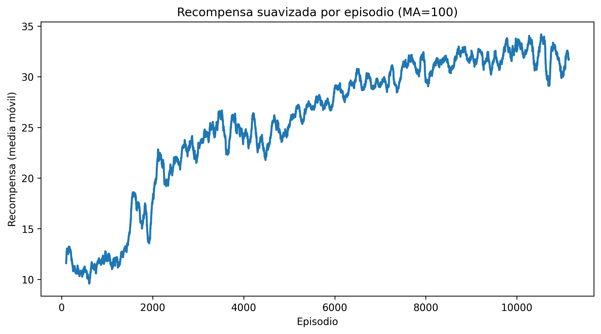
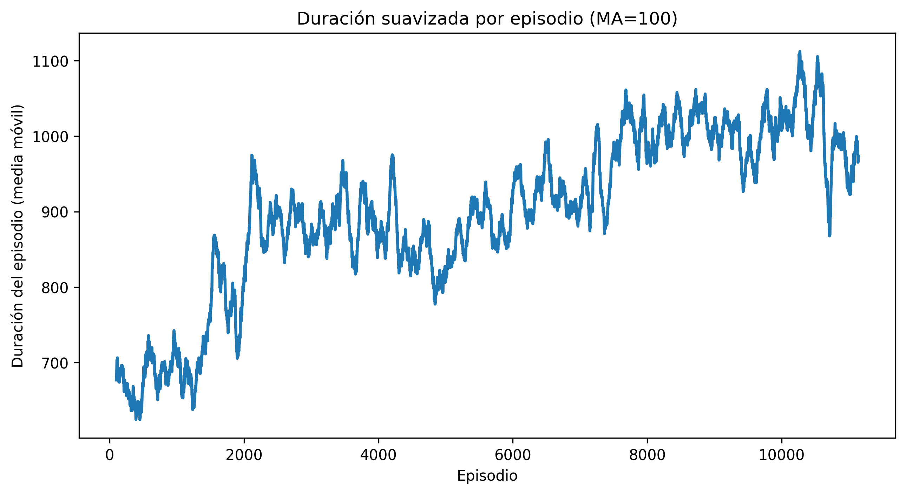

## Modelo 1

### Hiperparámetros:
```
policy="CnnPolicy",
env=env,
verbose=1,
tensorboard_log=tensorboard_log,
learning_rate=1e-4,
n_step=512,
batch_size=256,
n_epochs=4,
gamma=0.99,
ent_coef=0.01,
device="cuda"
```

### Entorno:
- Se implementó el wrapper Custom Env y se realizó una mejora con respecto a los modelos dqn 1, 2 y 3:
    - Recorte de las imágenes a 84×84.
    - Conversión a escala de grises.
    - Reward shaping: se asigna una recompensa negativa por cada vida perdida.
- Reward clipping:
    - Si gana recompensa positiva, se convierte en un punto.
    - Si no gana nada, devuelve 0.
    - Si obtiene recompensa negativa, devuelve -1.
- Se incorporó DummyVecEnv para vectorizar el entorno: la observación pasa de (84, 84) a (1, 84, 84).
- Se incorporó VecFrameStack para apilar la vectorización, si el stack es 4 pasa de (1, 84, 84) a (4, 84, 84).

### Recompensas:
- Se mantienen las que el entorno ofrece:
    - Son 6 filas de enemigos, cada fila otorga una cantidad fija de puntos por enemigo derrotado: 5, 10, 15, 20, 25 y 30 puntos respectivamente.
    - No tiene reward negativo al perder vida.

### Resultados
<figure style="text-align: center;">
  
  <figcaption><em>Figura 1. Promedio de recompensas obtenidas por el agente PPO (modelo 1) durante el entrenamiento.</em></figcaption>
</figure>


<figure style="text-align: center;">
  
  <figcaption><em>Figura 2. Promedio de duración (en pasos) del agente PPO (modelo 1) durante el entrenamiento.</em></figcaption>
</figure>

### Observaciones
- Presenta una mejora notable respecto a los modelos DQN 1, 2 y 3: a partir de aproximadamente 8000 episodios obtiene en promedio alrededor de 30 puntos, lo que indica que derrota a todos los enemigos de la primera fase (30 unidades, más un bonus opcional) y avanza a una segunda fase.
- El entrenamiento es más estable, ya que el reward clipping reduce la variabilidad del entorno original, donde las recompensas podían diferir en valores de cien puntos. Con la escala actual, las variaciones son menores y más uniformes.