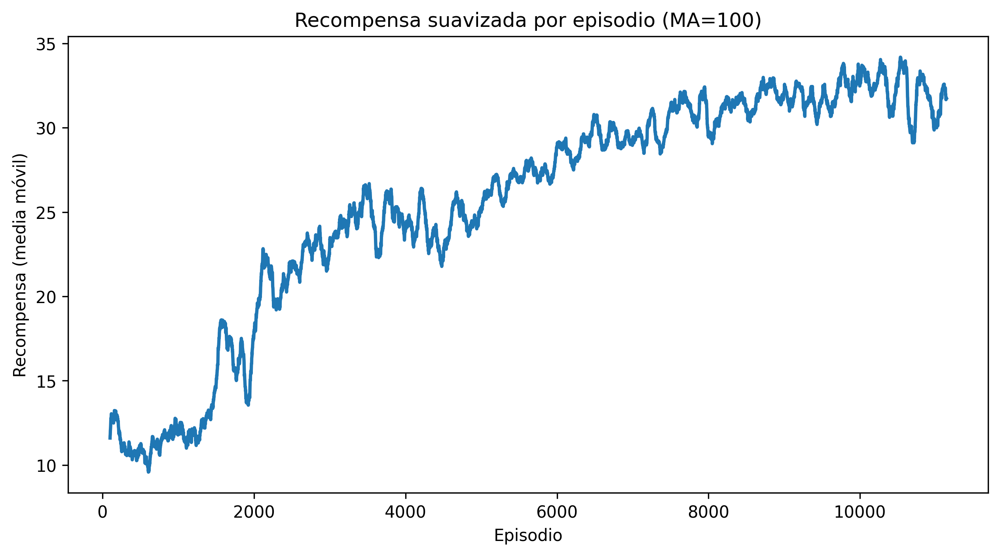
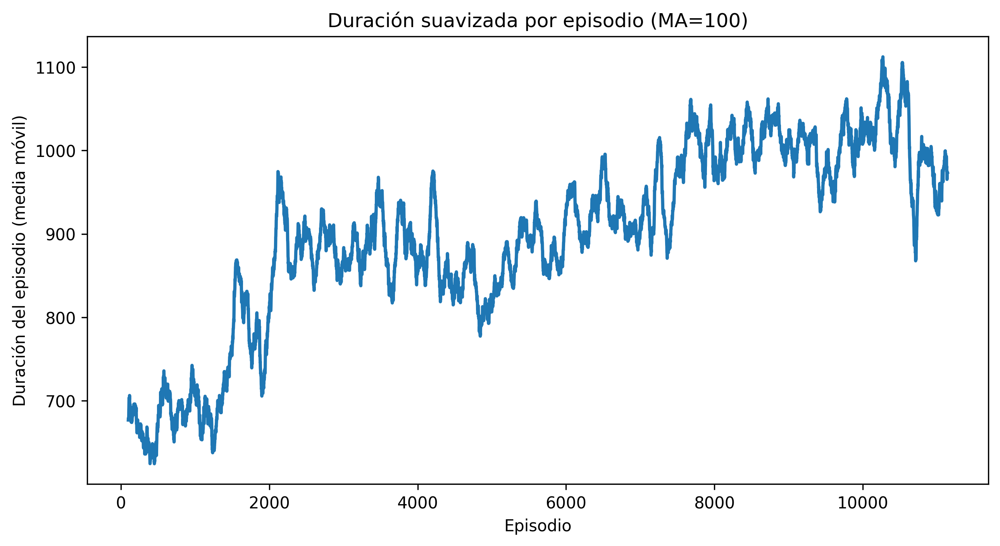
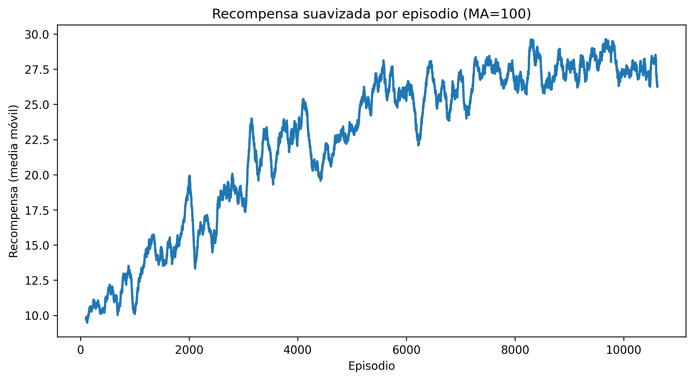
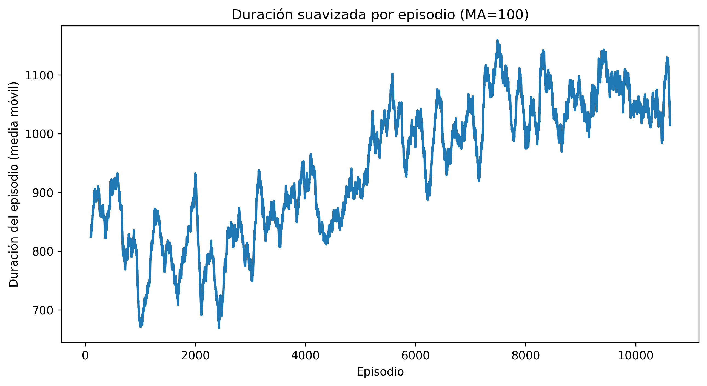
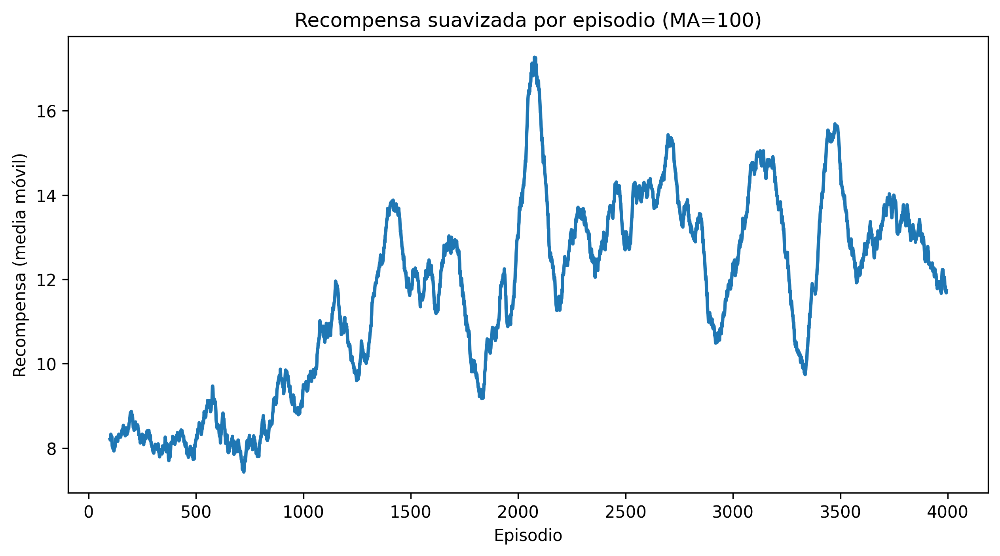
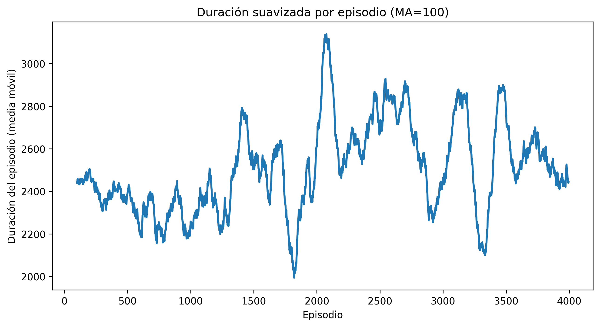
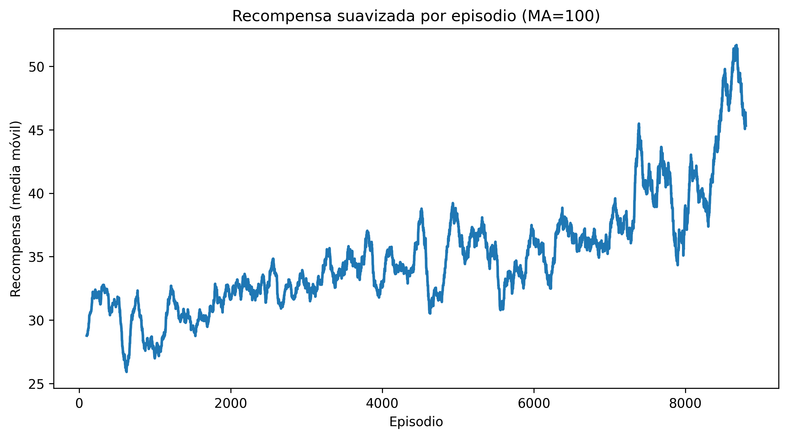
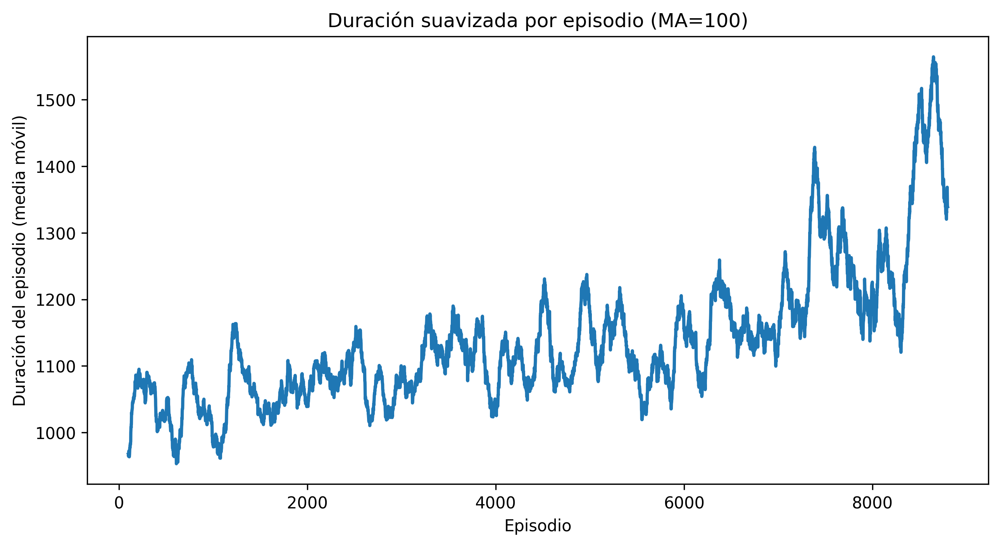
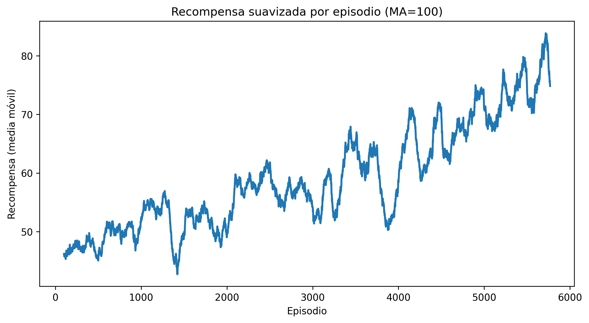
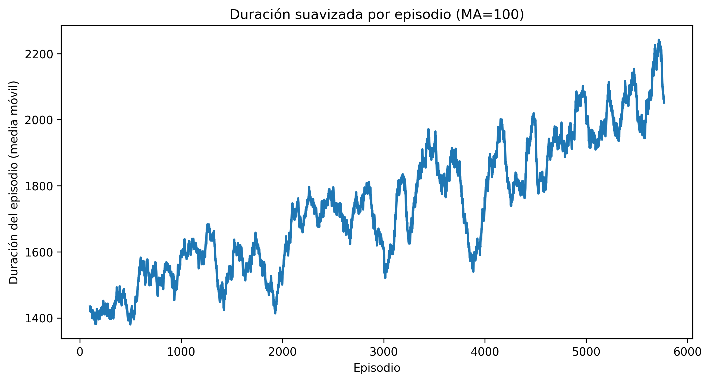

## Modelo 1

### Hiperparámetros:
```
policy="CnnPolicy",
env=env,
verbose=1,
tensorboard_log=tensorboard_log,
learning_rate=1e-4,
n_step=512,
batch_size=256,
n_epochs=4,
gamma=0.99,
ent_coef=0.01,
device="cuda"
```

### Entorno:
- Se implementó el wrapper Custom Env para recortar la imagen y transformarla en escala de grises.
- Frameskip 3: no muestra todos los frames, muestra cada 3.
- Se incorporó DummyVecEnv para vectorizar el entorno: la observación pasa de (84, 84) a (1, 84, 84).
- Se incorporó VecFrameStack para apilar la vectorización, si el stack es 4 pasa de (1, 84, 84) a (4, 84, 84).

### Recompensas:
- Reward shaping: se asigna una recompensa negativa por cada vida perdida.
- Reward clipping:
    - Si gana recompensa positiva, se convierte en un punto.
    - Si no gana nada, devuelve 0.
    - Si obtiene recompensa negativa, devuelve -1.

### Resultados
<figure style="text-align: center;">
  
  <figcaption><em>Figura 1. Promedio de recompensas obtenidas por el agente PPO (modelo 1) durante el entrenamiento.</em></figcaption>
</figure>


<figure style="text-align: center;">
  
  <figcaption><em>Figura 2. Promedio de duración (en pasos) del agente PPO (modelo 1) durante el entrenamiento.</em></figcaption>
</figure>

### Observaciones
- Presenta una mejora notable respecto a los modelos DQN 1, 2 y 3: a partir de aproximadamente 8000 episodios obtiene en promedio alrededor de 30 puntos, lo que indica que derrota a todos los enemigos de la primera fase (30 unidades, más un bonus opcional) y avanza a una segunda fase.
- El entrenamiento es más estable, ya que el reward clipping reduce la variabilidad del entorno original, donde las recompensas podían diferir en valores de cien puntos. Con la escala actual, las variaciones son menores y más uniformes.

## Modelo 2

### Hiperparámetros:
```
policy="CnnPolicy",
env=env,
verbose=1,
tensorboard_log=tensorboard_log,
learning_rate=1e-4,
n_step=512,
batch_size=256,
n_epochs=8,
gamma=0.99,
ent_coef=0.03,
device="cuda"
```

### Entorno:
- Se implementó el wrapper Custom Env para recortar la imagen y transformarla en escala de grises.
- Frameskip 3: no muestra todos los frames, muestra cada 3.
- Se incorporó DummyVecEnv para vectorizar el entorno: la observación pasa de (84, 84) a (1, 84, 84).
- Se incorporó VecFrameStack para apilar la vectorización, si el stack es 4 pasa de (1, 84, 84) a (4, 84, 84).

### Recompensas:
- Reward shaping: se asigna una recompensa negativa por cada vida perdida.
- Reward clipping:
    - Si gana recompensa positiva, se convierte en un punto.
    - Si no gana nada, devuelve 0.
    - Si obtiene recompensa negativa, devuelve -1.

### Resultados
<figure style="text-align: center;">
  
  <figcaption><em>Figura 3. Promedio de recompensas obtenidas por el agente PPO (modelo 2) durante el entrenamiento.</em></figcaption>
</figure>


<figure style="text-align: center;">
  
  <figcaption><em>Figura 4. Promedio de duración (en pasos) del agente PPO (modelo 2) durante el entrenamiento.</em></figcaption>
</figure>

### Observaciones
- Deterioro de rendimiento, en promedio está cerca de ganar, pero no supera el puntaje del anterior modelo.
- Inestabilidad: es más inestable que el modelo anterior.

## Modelo 3

### Hiperparámetros:
```
policy="CnnPolicy",
env=env,
verbose=1,
tensorboard_log=tensorboard_log,
learning_rate=1e-5,
n_steps=512,
batch_size=256,
n_epochs=4,
gamma=0.99,
ent_coef=0.01,
device="cuda"
```

### Entorno:
- Se implementó el wrapper Custom Env para recortar la imagen y transformarla en escala de grises.
- Frameskip 1: muestra todos los frames
- Se incorporó DummyVecEnv para vectorizar el entorno: la observación pasa de (84, 84) a (1, 84, 84).
- Se incorporó VecFrameStack para apilar la vectorización, si el stack es 4 pasa de (1, 84, 84) a (4, 84, 84).

### Recompensas:
- Reward shaping: se asigna una recompensa negativa por cada vida perdida.
- Reward clipping:
    - Si gana recompensa positiva, se convierte en un punto.
    - Si no gana nada, devuelve 0.
    - Si obtiene recompensa negativa, devuelve -1.

### Resultados
<figure style="text-align: center;">
  
  <figcaption><em>Figura 5. Promedio de recompensas obtenidas por el agente PPO (modelo 3) durante el entrenamiento.</em></figcaption>
</figure>


<figure style="text-align: center;">
  
  <figcaption><em>Figura 6. Promedio de duración (en pasos) del agente PPO (modelo 3) durante el entrenamiento.</em></figcaption>
</figure>

### Observaciones
- El modelo empeoró significativamente tanto en rendimiento como en estabilidad.
    - Se estima que puede ser un learning rate muy bajo o que hay mucho ruido al mostrar todos los frames, se harán pruebas para determinar la razón.

## Modelo 4 (Reentrenamiento de modelo 1)

### Hiperparámetros:
```
policy="CnnPolicy",
env=env,
verbose=1,
tensorboard_log=tensorboard_log,
learning_rate=1e-6,
n_steps=512,
batch_size=256,
n_epochs=4,
gamma=0.99,
ent_coef=0.01,
device="cuda"
```

### Entorno:
- Mismo que modelo 3

### Recompensas:
- Reward shaping: se asigna una recompensa negativa por cada vida perdida.
- Reward clipping:
    - Si gana recompensa positiva, se convierte en un punto.
    - Si no gana nada, devuelve 0.
    - Si obtiene recompensa negativa, devuelve -1.

### Resultados
<figure style="text-align: center;">
  
  <figcaption><em>Figura 7. Promedio de recompensas obtenidas por el agente PPO (modelo 4) durante el entrenamiento.</em></figcaption>
</figure>


<figure style="text-align: center;">
  
  <figcaption><em>Figura 8. Promedio de duración (en pasos) del agente PPO (modelo 4) durante el entrenamiento.</em></figcaption>
</figure>

### Observaciones
- Se cargó el modelo 1 y se lo reentrenó de nuevo con 10 millones de pasos.
- El rendimiento mejoró significativamente, llegando a ganar incluso 2 niveles.

## Modelo 5 (Reentrenamiento de modelo 4)

### Hiperparámetros:
```
policy="CnnPolicy",
env=env,
verbose=1,
tensorboard_log=tensorboard_log,
learning_rate=1e-6,
n_steps=512,
batch_size=256,
n_epochs=4,
gamma=0.99,
ent_coef=0.01,
device="cuda"
```

### Entorno:
- Mismo que modelo 3

### Recompensas:
- Reward shaping: se asigna una recompensa negativa por cada vida perdida.
- Reward clipping:
    - Si gana recompensa positiva, se convierte en un punto.
    - Si no gana nada, devuelve 0.
    - Si obtiene recompensa negativa, devuelve -1.

### Resultados
<figure style="text-align: center;">
  
  <figcaption><em>Figura 9. Promedio de recompensas obtenidas por el agente PPO (modelo 5) durante el entrenamiento.</em></figcaption>
</figure>


<figure style="text-align: center;">
  
  <figcaption><em>Figura 10. Promedio de duración (en pasos) del agente PPO (modelo 5) durante el entrenamiento.</em></figcaption>
</figure>

### Observaciones
- Se cargó el modelo 4 y se lo reentrenó de nuevo con 10 millones de pasos.
- El rendimiento volvió a mejorar significativamente, ahora hay varios casos en los que resuelve hasta 3 niveles.