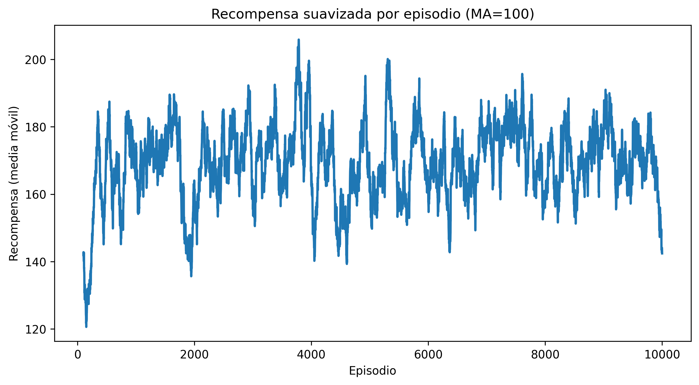
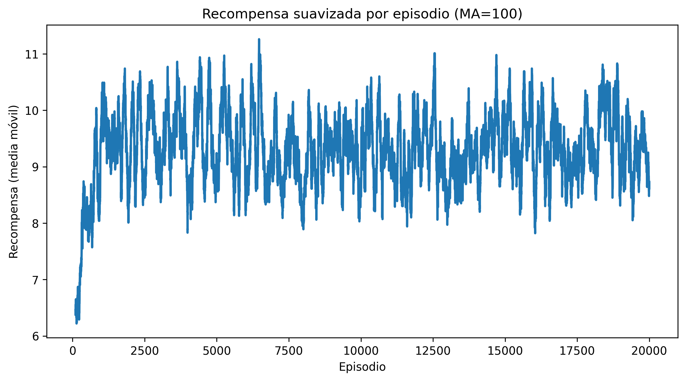
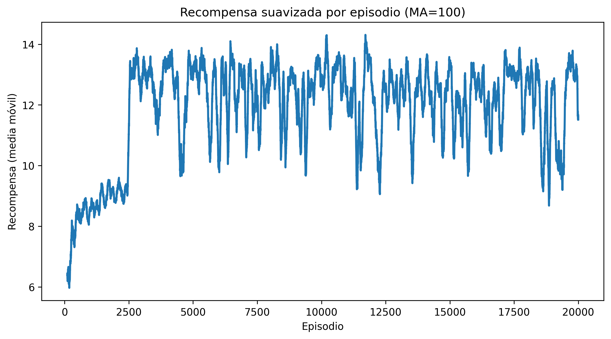

# Q learning
## Observaciones — Modelo 1
**Parámetros utilizados**
```
num_episodes = 10000
num_state_variables = 8
num_levels = 4
alpha = 0.1
gamma = 0.95
epsilon = 1.0
min_epsilon = 0.05
decay = 0.999
use_clipped = False
exploration_mode = "decay"
```
### Resultados
<figure style="text-align: center;">
  
  <figcaption><em>Figura 1. Promedio de recompensas obtenidas por el agente Q learning (modelo 1) durante el entrenamiento.</em></figcaption>
</figure>

### Análisis del comportamiento observado
El gráfico muestra que la recompensa suavizada (media móvil de 100 episodios) oscila en un rango muy amplio (aprox. 120–200).
No se observa una tendencia ascendente sostenida, ni una estabilización clara hacia un valor esperado.
Esto indica que el agente no está aprendiendo una política consistente, sino que a veces toma acciones que funcionan bien por azar pero no logra aprenderlas de manera consistente.

### Posible causa
**Espacio de estados extremadamente grande** 

El estado se representa como un vector de 8 strips, cada uno con 4 niveles.
El total de estados posibles es:
```
4^8 = 65.536 estados
```
Esto es demasiado grande para Q-learning tabular, que necesita visitar muchas veces cada estado para aprender valores estables.

En 10.000 episodios, con estados aleatorios por exploración, la mayoría no se visitan suficientes veces o simplemente nunca se visitan.

## Observaciones — Modelo 2
**Parámetros utilizados**
```
num_episodes=20000,
num_state_variables= 8,
num_levels= 4,
save_path="./results/",
alpha=0.1,
gamma=0.95,
epsilon=1.0,
min_epsilon = 0.2,
decay = 0.999,
use_clipped=True,
exploration_mode="decay"
```
### Resultados
<figure style="text-align: center;">
  
  <figcaption><em>Figura 2. Promedio de recompensas obtenidas por el agente Q learning (modelo 2) durante el entrenamiento.</em></figcaption>
</figure>

### Análisis del comportamiento observado
En este experimento se utilizó un reward shaping simplificado, donde:
- matar un enemigo da +1
- perder una vida da –1
- cualquier otra situación da 0

Este esquema reduce drásticamente la magnitud y variabilidad de las recompensas, lo que explica que la media móvil se mantenga dentro del rango 8–11 puntos, mucho más acotado que en el modelo anterior.

En la curva puede observarse que durante los primeros 1100 episodios aproximadamente, la recompensa promedio aumenta gradualmente, indicando que el agente aprende a disparar y sobrevivir un poco más; sin embargo, después de ese punto el aprendizaje se estanca, y la media móvil oscila entre los 8 y 11 puntos sin mostrar tendencia creciente.

### Posibles causas
**Espacio de estados extremadamente grande**

El mismo problema que teniamos en el modelo 1, ya que la cantidad de estados sigue siendo la misma.

**Tasa de aprendizaje alta (α = 0.1)**

Con un reward tan acotado, un alpha alto genera oscilaciones, lo que hace que cada actualización cambie demasiado los valores.

## Observaciones — Modelos 3 y 4 (Clipped Reward + variación de Learning Rate)
**Parámetros del Modelo 3**
```
num_episodes=20000,
num_state_variables= 8,
num_levels= 4,
save_path="./results/",
alpha=1e-4,
gamma=0.95,
epsilon=1.0,
min_epsilon = 0.2,
decay = 0.999,
use_clipped=True,
exploration_mode="decay"
```
**Parámetros del Modelo 4**
```
num_episodes=20000,
num_state_variables= 8,
num_levels= 4,
save_path="./results/",
alpha=1e-5,
gamma=0.95,
epsilon=1.0,
min_epsilon = 0.2,
decay = 0.999,
use_clipped=True,
exploration_mode="decay"
```

### Resultados
<figure style="text-align: center;">
  
  <figcaption><em>Figura 3. Promedio de recompensas obtenidas por el agente Q learning (modelo 3) durante el entrenamiento.</em></figcaption>
</figure>

<figure style="text-align: center;">
  
  <figcaption><em>Figura 4. Promedio de recompensas obtenidas por el agente Q learning (modelo 4) durante el entrenamiento.</em></figcaption>
</figure>

### Análisis del comportamiento observado
**Modelo 3 (α = 1e−4)**
- El agente muestra un crecimiento inicial en la recompensa entre los episodios 2000 y 2500.
- A partir de ese punto, se observa un estancamiento claro.
- La recompensa suavizada oscila de manera relativamente amplia entre 10 y 14 puntos.
- Este rango es algo mejor que el del modelo 2, pero sigue indicando falta de progreso adicional.

**Modelo 4 (α = 1e−5)**
- También presenta crecimiento inicial hasta aproximadamente el episodio 2500, aunque este es mas uniforme.
- Después de ese punto, la curva permanece más estable y menos ruidosa que en el modelo 3.
- La recompensa media se mantiene entre 12 y 14 puntos, mostrando menor variabilidad.
- La estabilidad aumentó significativamente, pero el agente tampoco logra seguir mejorando.

### Posible causa
El estancamiento observado alrededor del episodio 2500 en ambos modelos sugiere que el problema no está en la tasa de aprendizaje, sino en limitaciones estructurales del enfoque utilizado. En particular:

- Espacio de estados muy grande (65.536 combinaciones discretas): Q-learning tabular requiere visitar repetidamente cada estado para estimar valores estables, algo prácticamente imposible con esta cantidad de estados y solo 20.000 episodios.

- Representación del estado basada en strips: dividir la imagen en 8 tiras y discretizarlas en 4 niveles reduce demasiado la información espacial relevante (posición exacta del jugador, proyectiles, enemigos), dificultando que el agente distinga situaciones críticas.

- Limitaciones del método tabular: Q-learning tabular no escala bien a entornos visuales como Space Invaders, donde la dinámica es compleja y altamente dependiente del contexto visual. El agente aprende comportamientos básicos (disparar, evitar morir rápidamente), pero no puede refinar su política más allá de eso.