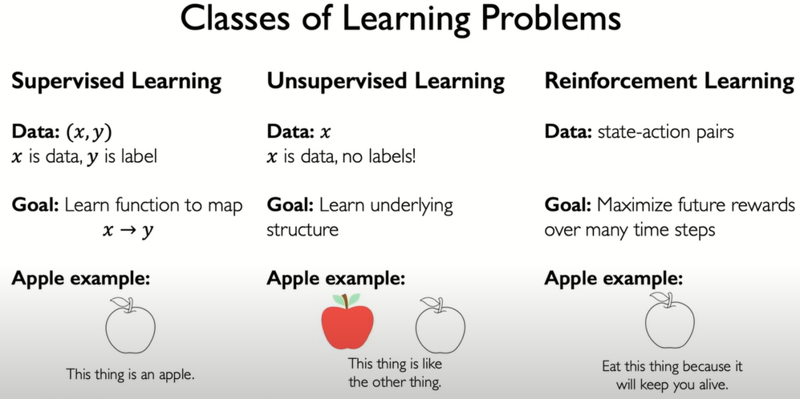
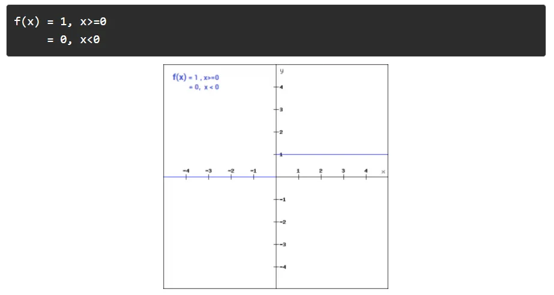
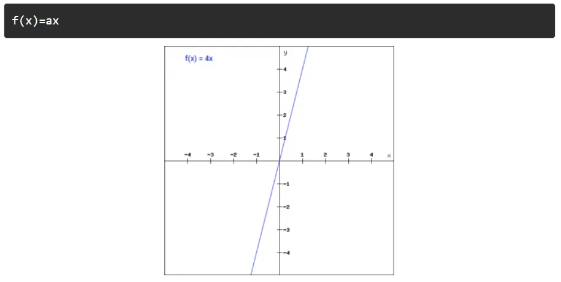
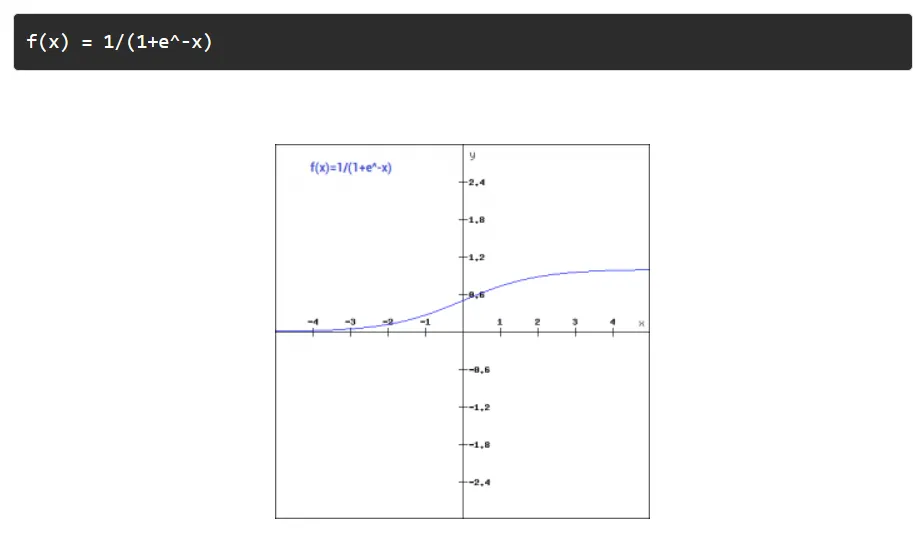
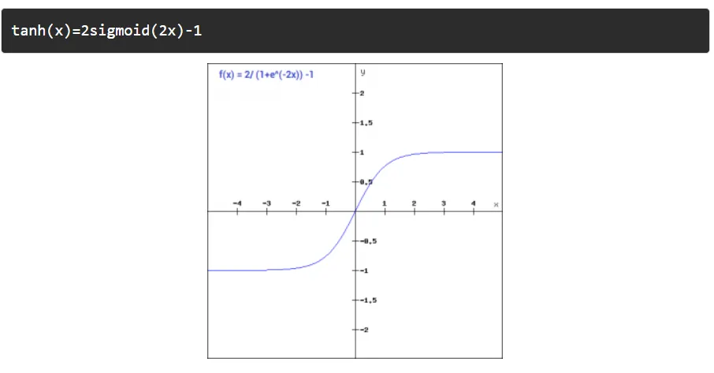
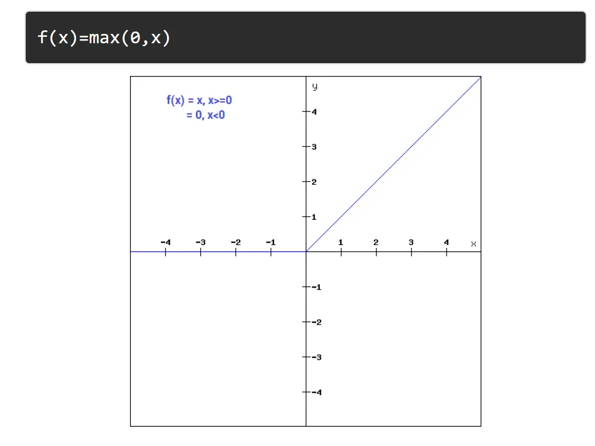
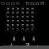

# Aprendizaje por refuerzo para ATARI - Space Invaders <!-- omit in toc -->
---
Código de proyecto: SPACEAI

---
## Índice <!-- omit in toc -->

- [Introducción](#introducción)
- [Marco teórico](#marco-teórico)
  - [Reinforcement Learning](#reinforcement-learning)
    - [Diferencia con Machine Learning](#diferencia-con-machine-learning)
  - [Q-learning](#q-learning)
  - [Redes neuronales](#redes-neuronales)
    - [Estructura de una red neuronal](#estructura-de-una-red-neuronal)
    - [Tipos de redes neuronales](#tipos-de-redes-neuronales)
      - [Redes Neuronales Convolucionales (CNN)](#redes-neuronales-convolucionales-cnn)
      - [Redes Neuronales Profundas (DNN)](#redes-neuronales-profundas-dnn)
  - [Funciones de activación](#funciones-de-activación)
    - [Tipos de funciones de activación](#tipos-de-funciones-de-activación)
  - [Deep Q-Network](#deep-q-network)
    - [Arquitectura de la Red Neuronal en DQN](#arquitectura-de-la-red-neuronal-en-dqn)
    - [Aprendizaje y Optimización](#aprendizaje-y-optimización)
  - [Justificación](#justificación)
- [Diseño experimental](#diseño-experimental)
  - [Herramientas](#herramientas)
    - [OpenAI Gymnasium API](#openai-gymnasium-api)
  - [Implementación](#implementación)
    - [Implementación con Q-learning](#implementación-con-q-learning)
      - [Reducción del Espacio de Estados y Acciones](#reducción-del-espacio-de-estados-y-acciones)
      - [Métodos de Entrenamiento y Exploración](#métodos-de-entrenamiento-y-exploración)
    - [Implementación con Deep Q-Network](#implementación-con-deep-q-network)
      - [Preprocesamiento de imágenes](#preprocesamiento-de-imágenes)
    - [Estructura de la red neuronal](#estructura-de-la-red-neuronal)
    - [Estrategia de aprendizaje](#estrategia-de-aprendizaje)
    - [Almacenamiento y muestreo de experiencias](#almacenamiento-y-muestreo-de-experiencias)
    - [**Entrenamiento**](#entrenamiento)
- [Bibliografía](#bibliografía)

## Introducción
En este proyecto se ha implementado un agente basado en aprendizaje por refuerzo utilizando los algoritmos de Q-Learning y Deep Q-Networks (DQN) para resolver el entorno de Space Invaders. El objetivo es entrenar un modelo capaz de maximizar su rendimiento en el juego, tomando decisiones de forma autónoma para mejorar su puntuación mediante una política de acción adecuada.

El uso de aprendizaje por refuerzo es una excelente opción para este tipo de problemas, ya que se enfoca en la capacidad de un agente para aprender a través de la interacción con su entorno, optimizando sus decisiones en función de las recompensas obtenidas. En el caso de Space Invaders, el agente aprende a seleccionar acciones basadas en el estado del entorno para maximizar su puntuación y sobrevivir el mayor tiempo posible.

A lo largo de este proyecto, se explicarán los fundamentos de Q-Learning y DQN, su implementación, y las métricas utilizadas para evaluar el desempeño del agente en el entorno de juego. Además, se presentarán las herramientas empleadas para la implementación, los experimentos realizados con ambos enfoques (Q-Learning y DQN), los resultados obtenidos y su análisis. Finalmente, se ofrecerán conclusiones sobre la efectividad del enfoque utilizado y las posibles direcciones para futuros trabajos en el campo del aprendizaje por refuerzo aplicado a juegos clásicos.

## Marco teórico

### Reinforcement Learning

El **Reinforcement Learning (RL)** o **aprendizaje por refuerzo** es un paradigma del aprendizaje automático en el que un agente aprende a tomar decisiones en un entorno para maximizar una recompensa acumulada. En RL, el agente interactúa con el entorno siguiendo un proceso de prueba y error, utilizando una política que define qué acción tomar en cada estado.  

Este enfoque está inspirado en cómo los animales aprenden mediante **ensayo y error**, utilizando **recompensas positivas y negativas**. Por ejemplo, al entrenar a un perro para realizar trucos, se le da un premio como refuerzo positivo cuando ejecuta correctamente una acción. De manera similar, un agente de RL aprende a comportarse de forma óptima en un entorno al recibir recompensas o penalizaciones según sus acciones.  

El aprendizaje en RL se basa en los siguientes elementos clave:  

- **Agente:** Es el sistema que toma acciones.
- **Entorno:** Es el espacio en el que opera el agente.
- **Estado (S):** Representa la situación actual del agente en el entorno.
- **Acciones (A):** Conjunto de decisiones que el agente puede tomar.
- **Recompensa (R):** Es un valor que recibe el agente al realizar una acción, nos indica que tan buena fue la decisión del agente.
- **Política (π):** Estrategia que define que acción tomar en cada estado.

El objetivo del agente es aprender una política óptima $π^*$ que maximice la suma de recompensas a lo largo del tiempo. Para lograrlo, se utilizan diferentes algoritmos de aprendizaje, como **Q-learning, Deep Q-Network (DQN) y Double Deep Q-Network (DDQN)**.

#### Diferencia con Machine Learning

Para entender mejor el enfoque de Reinforcement Learning, podemos hacer una pequeña comparación [[1]](#ref1) entre los distintos paradigmas:

**Supervised Learning:** El agente aprende a estimar valores o clasificar elementos a partir de un conjunto de datos etiquetados, donde cada entrada tiene una salida esperada (etiqueta). Ejemplo: identificar si la foto de un animal se trata de un gato o no.

**Unsupervised Leraning:** El agente trabaja con datos sin etiquetar, a partir de los datos proporcionados debe encontrar patrones, una "estructura oculta" en los datos. Ejemplo: identificar los distintos tipos de clientes en un e-commerce.

**Reinforcement Learning:** El agente aprende a interactuar con el entorno mediante la experiencia, la cual le proporcionará recompensas positivas o negativas, y su objetivo es obtener la mejor recompensa posible. Ejemplo: entrenamiento de vehículos autónomos.

| _[Figura 1] Comparación de paradigmas [[2]](#ref2)_ |
| :--------------------------------------------: |
|         |

### Q-learning
**Q-learning** es un algoritmo de aprendizaje por refuerzo basado en valores, cuyo objetivo es aprender una función de acción-valor **Q(s, a)** , que representa la recompensa esperada si el agente toma la acción **a** en el estado **s** y sigue la política óptima a partir de ahí.  

El algoritmo actualiza iterativamente la función **Q(s, a)** mediante la ecuación de Bellman: 

$
Q(s, a) \leftarrow Q(s, a) + α \left[ R + \gamma \max_{a'} Q(s', a')  - Q(s, a) \right]
$

Donde:  

- α es la tasa de aprendizaje (*learning rate*).  
- γ es el factor de descuento, que pondera la importancia de futuras recompensas.  
- R es la recompensa recibida al ejecutar la acción a.  
- s' es el nuevo estado tras la acción a .  
- $( max_{a'} Q(s', a') )$ representa el valor máximo esperado desde el nuevo estado.  

El algoritmo de Q-learning, bajo ciertas condiciones (como una tasa de aprendizaje adecuada y la exploración suficiente), converge a una **política óptima**. La política óptima es la que maximiza la recompensa esperada a largo plazo para el agente. Es importante notar que Q-learning es un algoritmo **off-policy**, lo que significa que el agente puede aprender la política óptima sin tener que seguir exactamente la política que está aprendiendo. 

En resumen, Q-learning es un algoritmo de aprendizaje por refuerzo eficiente que permite a un agente aprender una política óptima de acción para maximizar recompensas a largo plazo. Aunque es un algoritmo potente e **independiente del modelo**, lo que significa que no necesita conocer el entorno de antemano, su rendimiento puede ser limitado en entornos con espacios de estados grandes o continuos. La principal ventaja es su capacidad de aprender sin necesidad de un modelo explícito del entorno, pero su **lentitud de convergencia** en problemas complejos y la necesidad de adaptaciones, como las redes neuronales en **Deep Q-Learning**, son algunas de sus principales limitaciones. Además, Q-learning depende de un adecuado balance entre **exploración y explotación**, lo que puede ser un desafío en ciertos contextos.

### Redes neuronales
Las redes neuronales artificiales (o Artificial Neural Networks, ANN) son modelos computacionales inspirados en el funcionamiento del cerebro humano [[3](#ref3)]. Están compuestas por neuronas artificiales, organizadas en capas, que reciben entradas, las procesan y generan salidas. Son ampliamente utilizadas en aprendizaje por refuerzo (reinforcement learning) y aprendizaje profundo (deep learning), donde han demostrado ser efectivas en tareas como reconocimiento de imágenes, procesamiento de lenguaje natural y aprendizaje por refuerzo.

#### Estructura de una red neuronal
La estructura general de una red neuronal está compuesta de la siguiente forma [[4](#ref4)]:

- Capa de entrada: Recibe los datos sin procesar, como imágenes o valores numéricos.
- Capas ocultas: Procesan la información utilizando operaciones matemáticas y funciones de activación.
- Capa de salida: Genera la respuesta final, que puede ser una clasificación, una predicción numérica o valores Q en el caso del aprendizaje por refuerzo.

#### Tipos de redes neuronales
A continuación se explicarán los 2 tipos de redes neuronales que se utilizarán en el desarrollo de este proyecto:

##### Redes Neuronales Convolucionales (CNN)
Este tipo de red se utiliza para el procesamiento de imágenes y datos con estructura espacial (videos, datos geoespaciales, entre otros), la cual extrae características y patrones de los datos de entrada. [[3](#ref3)]

Las CNN utilizan kernels, que son pequeñas matrices que recorren la imagen aplicando convoluciones. En cada paso, el kernel multiplica sus valores con los de la región correspondiente de la imagen y suma los resultados, generando un nuevo valor en la salida. Esto permite detectar patrones como bordes, texturas y formas, que se combinan en capas más profundas para extraer características más complejas de los datos. [[5](#ref5)]

##### Redes Neuronales Profundas (DNN)
Las Redes Neuronales Profundas (DNN) están compuestas por múltiples capas de neuronas interconectadas, utilizadas para modelar relaciones complejas en los datos. Cada neurona aplica una transformación a su entrada mediante una función de activación, lo que permite capturar patrones no lineales y abstraer características de alto nivel. A medida que los datos pasan por las capas ocultas, la red aprende representaciones cada vez más complejas, facilitando la toma de decisiones o la predicción de valores. [[6](#ref6)]

### Funciones de activación
Las funciones de activación son componentes esenciales en las redes neuronales artificiales. Su principal propósito es introducir no linealidad en el modelo, permitiendo que la red neuronal pueda aprender patrones complejos y no lineales en los datos. Sin una función de activación, una red neuronal de múltiples capas no sería más que una combinación de transformaciones lineales, lo que limitaría significativamente su capacidad para resolver problemas complejos.

#### Tipos de funciones de activación

1. **Binary Step Function**
   La función de paso binario es un clasificador binario, lo que significa que no es útil cuando existen muchas clases en una variable objetivo. Una función de paso binario establece que si la entrada es menor que 0, el gradiente es 0, y si es mayor que 0, el gradiente es 1. Cuando el gradiente es 1, la siguiente neurona se activa.

    

    | _[Figura 2] Representación de Binary Step Function [[7]](#ref7)_ |
    | :--------------------------------------------: |
    |         |

    

2. **Linear Function**
   La función de paso binario era binaria porque no contenía un componente de \( x \). Las funciones lineales cambian esto, donde la activación es proporcional a la entrada. El gradiente, en lugar de volverse 0, es una constante que no depende únicamente de la entrada de \( x \).

       

    | _[Figura 3] Representación de Linear Function [[7]](#ref7)_ |
    | :--------------------------------------------: |
    |         |

    

3. **Sigmoid Function**
   La función sigmoide es una de las funciones de activación no lineales más comunes, ya que transforma los valores en un rango de 0 a 1. Dado que es no lineal, asignar múltiples nodos con la función sigmoide dará como resultado una salida no lineal, lo que permite detectar patrones complejos en los datos.

       

    | _[Figura 4] Representación de Sigmoid Function [[7]](#ref7)_ |
    | :--------------------------------------------: |
    |         |

    

4. **Tanh Function**
   La función tanh es similar a la sigmoide, pero es simétrica alrededor del origen y su rango es de -1 a 1. Esto también significa que las entradas a las siguientes capas no siempre serán positivas, ya que la salida siempre estará entre -1 y 1. Todas las demás propiedades de esta función son iguales a las de la sigmoide, siendo continua y diferenciable en todos los puntos.

       

    | _[Figura 5] Representación de Tanh Function [[7]](#ref7)_ |
    | :--------------------------------------------: |
    |         |

    

   

5. **ReLU (Rectified Linear Unit)**
   La ReLU es otra función de activación no lineal, pero tiene la ventaja de no activar todos los nodos al mismo tiempo. Los nodos se desactivan si la salida de la transformación lineal es menor que 0; así que para valores de entrada negativos, el resultado es 0 y el nodo no se activa.

       

    | _[Figura 6] Representación de ReLu [[7]](#ref7)_ |
    | :--------------------------------------------: |
    |         |

    

### Deep Q-Network 

El **Deep Q-Network** es una extensión del algoritmo clásico Q-learning que utiliza redes neuronales profundas para aproximar la función de valores **Q(s, a)** en entornos de alta dimensión y con espacios de estados complejos. A diferencia de Q-learning, que emplea una tabla explícita para almacenar los valores de Q, **Deep Q-Network** utiliza una red neuronal para predecir estos valores, lo que permite manejar escenarios donde los estados no son discretos o son demasiado numerosos para almacenar en una tabla.

El **Deep Q-Network (DQN)** es una implementación específica de **Deep Q-Network** que introduce mejoras clave para garantizar la estabilidad y eficiencia del aprendizaje. DQN incorpora técnicas como el **Replay Buffer**, que almacena experiencias pasadas para romper la correlación temporal entre las muestras y permitir una actualización más robusta de la red, y la **Target Network**, una red neuronal separada que se actualiza con menor frecuencia para evitar oscilaciones durante el entrenamiento.

DQN ha sido una de las innovaciones más importantes en **Reinforcement Learning**, permitiendo aplicar **Q-learning** en entornos con espacios de estados continuos y de alta dimensión.

#### Arquitectura de la Red Neuronal en DQN  

DQN emplea una **red neuronal artificial** con tres componentes principales:  

- **Capa de entrada**: Recibe la representación del estado actual del entorno s , que puede ser una imagen (como en juegos de Atari) o una serie de valores numéricos.  
- **Capas ocultas**: Son capas intermedias con múltiples neuronas que extraen características relevantes del estado. Utilizan funciones de activación no lineales, como **ReLU (Rectified Linear Unit)**, para capturar patrones complejos.  
- **Capa de salida**: Genera un conjunto de valores Q(s, a), donde cada neurona en esta capa representa el valor estimado de tomar una acción específica a en el estado s.  

#### Aprendizaje y Optimización

Para mejorar la precisión de los valores Q(s, a), DQN ajusta los **pesos** de las conexiones entre neuronas mediante el algoritmo de **backpropagation** y optimización por **descenso de gradiente estocástico (SGD)** o variantes como **Adam**.  

El entrenamiento de DQN incluye las siguientes técnicas clave:  

- **Replay Buffer**: Almacena experiencias pasadas (s, a, r, s') en un buffer y las reutiliza para entrenar la red, reduciendo la correlación entre muestras consecutivas.  
- **Target Network**: Utiliza una segunda red neuronal (red objetivo) para calcular los valores Q en la actualización, evitando oscilaciones inestables durante el entrenamiento.  
- **Exploración con  ϵ-greedy**: Equilibra la exploración y explotación ajustando la probabilidad de elegir acciones aleatorias a medida que el agente aprende.

### Justificación
Para la realización de este proyecto se ha optado por utilizar los algoritmos de Q-Learning y Deep Q-Learning ya que son muy efectivos en la resolución de problemas de aprendizaje por refuerzos en entornos discretos y continuos.

Primero se optó por Q-Learning debido a la falta de hardware necesario por parte del equipo, aunque luego se encontró la posibilidad de utilizar máquinas virtuales con el hardware necesario, lo que permitió la experimentación con Deep Q-Learning.

## Diseño experimental
### Herramientas

Para el desarrollo de este proyecto, se utilizó Pytorch[[8]](#ref8), la implementación se realizó en Kaggle por su disponibilidad de hardware[[9](#ref9), el entorno sobre el que se trabajó proviene de OpenAI Gymnasium [[10](#ref10)], con la emulación de ALE[[11](#ref11)]

#### OpenAI Gymnasium API

Gymnasium es una librería diseñada para desarrollar y evaluar algoritmos de aprendizaje por refuerzo (RL). Proporciona una interfaz estandarizada que facilita la creación de agentes de RL y su entrenamiento.

##### Características<!-- omit in toc -->
- **Interfaz unificada:** Proporciona una estructura estándar para interactuar con cualquier entorno con funciones como render(), step() y reset().
- **Variedad de entornos:** Da la posibilidad de interactuar con simulaciones físicas y también videojuegos clásicos de Atari como Space Invaders, el que vamos a tratar en este proyecto.
- **Compatibilidad con librerías:** No impone el uso de ninguna librería, por lo tanto se pueden usar librerías como Stable Baselines, TensorFlow y PyTorch, que es la que usaremos en este proyecto.

##### Funcionamiento<!-- omit in toc -->
Para la interacción con un entorno de Gymnasium, el proceso es el siguiente:

1. **Inicializar el entorno:** Se crea el entorno con gym.make('ALE/SpaceInvaders-v5'), lo que permite interactuar con el juego.
2. **Reiniciar el entorno:** Se usa env.reset(), lo que devuelve el estado inicial del juego.
3. **Tomar acciones:** En cada paso, se elige una acción:
    - Acción 0: No hace nada.
    - Acción 1: Dispara.
    - Acción 2: Se mueve a la derecha.
    - Acción 3: Se mueve a la izquierda.
    - Acción 4: Se mueve a la derecha disparando.
    - Acción 5: Se mueve a la izquierda disparando.

4. **Observar el resultado:** El entorno devuelve cuatro elementos clave:
    - Observación: Imagen del juego después de la acción.
    - Recompensa: Puntos obtenidos en ese paso.
    - Done: Indica si el juego terminó.
    - Info: Datos adicionales como puntaje acumulado.

### Implementación

#### Implementación con Q-learning
##### Reducción del Espacio de Estados y Acciones

El entorno de *Space Invaders* en Gymnasium proporciona una representación del estado en formato RAM con 128 valores, cada uno variando entre 0 y 255. Sin embargo, trabajar con la RAM sin procesar haría que la tabla Q fuera demasiado grande para manejarse eficientemente. Para reducir la dimensionalidad del problema, se implementaron varias estrategias en diferentes versiones.

La dimensión de la tabla Q en su forma general es:

$|Q \text{-table size}| = \text{Número de estados} \times \text{Número de acciones}$

Dado que cada valor de RAM puede tomar 256 valores y hay 128 valores en total, la dimensión inicial sin discretización sería:

$|Q \text{-table size}| = [256^{128} \times 6]$

lo cual es computacionalmente inviable. Se realizaron varias reducciones progresivas:

1. Primera Implementación
   - **Estados:** 80 valores de la RAM  
   - **Discretización:** 5 bins por valor  
   - **Acciones:** 6 posibles  
   - **Tamaño de la Q-table:**  
     
     $[5^{80} \times 6]$
     
   - **Problema:** La tabla Q era extremadamente grande y en solo 3,000 episodios ocupaba aproximadamente 2GB de almacenamiento, haciendo inviable su uso.

2. **Segunda Implementación**  
   - **Estados:** 80 valores de la RAM  
   - **Discretización:** 5 bins por valor  
   - **Acciones:** Reducidas a 2 (moverse a la izquierda y disparar, moverse a la derecha y disparar)  
   - **Tamaño de la Q-table:**  

     $[5^{80} \times 2]$

   - **Problema:** La reducción de acciones no impactó significativamente en el tamaño de la tabla, que seguía siendo demasiado grande para entrenamientos prolongados.

3. **Tercera Implementación**  
   - **Estados:** 47 valores de la RAM  
   - **Discretización:** 5 bins por valor  
   - **Acciones:** 2  
   - **Tamaño de la Q-table:**  

        $[5^{47} \times 2]$

   - **Problema:** Aunque la reducción de la RAM ayudó, la Q-table aún crecía demasiado con el tiempo. Se pudo entrenar hasta 5,000 episodios, pero cuando se intentó expandir el entrenamiento hasta 10,000 episodios, la tabla se volvió inmanejable.

##### Métodos de Entrenamiento y Exploración

Durante estas implementaciones, se probaron diferentes técnicas para mejorar el rendimiento del agente:

- **Política ε-greedy:**  
  - Se usó una tasa inicial de exploración $(\epsilon = 1.0)$ con una reducción de $(0.99)$ por episodio.
  - En versiones posteriores, se implementó una exploración periódica: cada 5,000 episodios, $(\epsilon)$ se reiniciaba a 0.5 para evitar mínimos locales.

- **Tasa de aprendizaje fija:**  
  - En las primeras versiones, se usó un valor fijo para la tasa de aprendizaje $(\alpha)$, pero esto resultó en convergencia prematura a soluciones subóptimas.

- **Limitaciones encontradas:**  
  - En todas las implementaciones, la recompensa promedio oscilaba entre 80 y 150, indicando que el agente se estancaba en mínimos locales.
  - Se encontró que priorizar recompensas a largo plazo proporcionaba mejores resultados que enfocarse en recompensas inmediatas.
  
#### Implementación con Deep Q-Network
Como el método de resolución propuesto anteriormente no es muy eficiente, la mejora del algoritmo de Q-Learning permite cambiar el enfoque: ahora se trabajará con imágenes en vez de valores de la RAM. El entorno es capaz de devolver imágenes del juego, lo que nos permite definir una red neuronal para procesar dichas imágenes y entrenar un modelo que pueda tener un buen desempeño en el juego.

##### Preprocesamiento de imágenes
Con el fin de entrenar un modelo de forma más eficiente, se ha decidido realizar un preprocesamiento a las imágenes antes de que entren en la red neuronal[[12](#ref12)]:

- Como primer paso, se preprocesa la imagen devuelta por el entorno convirtiéndola de RGB a escala de grises. Esto reduce la dimensionalidad del input de la red neuronal al pasar de tres canales de color a uno solo, lo que disminuye la complejidad del modelo sin perder información relevante para la toma de decisiones.
- Luego, la imagen se redimensiona a 84x84 píxeles para reducir la carga computacional del modelo, manteniendo la información necesaria para la toma de decisiones del agente.
- Finalmente, la imagen se normaliza dividiendo sus valores por 255, asegurando que los píxeles estén en un rango entre 0 y 1. Por último, se convierte en un tensor de PyTorch y se reestructura para que tenga las dimensiones adecuadas para la red neuronal, permitiendo su procesamiento eficiente en la GPU.
  

| _[Figura 7]  Ejemplo de visualización de entorno preprocesado_ |
| :--------------------------------------------: |
|  |

#### Estructura de la red neuronal
La red está compuesta por:
- Entrada: Una imagen de 84x84 en escala de grises (1 canal).
- Tres capas convolucionales con kernel (filtros) de dimensión 8, 4 y 3 respectivamente:
  - Conv1: 32 filtros, kernel 8x8, stride 4, activación ReLU.
  - Conv2: 64 filtros, kernel 4x4, stride 2, activación ReLU.
  - Conv3: 64 filtros, kernel 3x3, stride 1, activación ReLU.
- Aplanamiento de la salida de las capas convolucionales para convertir la salida 3D en un vector 1D.
- Capas completamente conectadas:
  - FC1: 512 neuronas, activación ReLU.
  - FC2: n_actions neuronas (sin activación, ya que representa los valores Q correspondientes a cada acción posible en el entorno de Space Invaders).

#### Estrategia de aprendizaje
Con el objetivo de lograr un balance entre exploración y explotación, se ha elegido una estrategia ε-greedy donde:
- Con probabilidad ε, se elige una acción aleatoria (exploración)
- Con probabilidad 1-ε, se elige la acción con el mayor valor Q (explotación).
- ε decae exponencialmente con los pasos de entrenamiento.
  
#### Almacenamiento y muestreo de experiencias
Se implementó un buffer de memoria (Replay Memory), donde se almacenan las experiencias con la estructura (estado, acción, nuevo estado, recompensa). En el proceso del entrenamiento, se muestran lotes aleatorios de la memoria para reducir la correlación entre las muestras y mejorar la estabilidad del entrenamiento. [[13](#ref13)]

#### **Entrenamiento**
El proceso de entrenamiento sigue los siguientes pasos:

1. **Inicialización:**
   - Se inicializa el entorno y se obtiene un estado inicial.

2. **Pasos del entrenamiento:**
   - En cada paso:
     - Se elige una acción utilizando la política ε-greedy.
     - La acción se ejecuta en el entorno y se recibe una recompensa.
     - La transición (estado, acción, nuevo estado, recompensa) se almacena en la memoria de experiencia.
     - Se actualizan los pesos de la red neuronal mediante el proceso de retropropagación.

3. **Finalización del entrenamiento:**
   - El entrenamiento se detiene al alcanzar una cantidad predefinida de 1500 episodios , un límite establecido debido a restricciones de hardware.
   - Debido a que el equipo disponible no cuenta con los recursos necesarios para un entrenamiento prolongado, el proceso se realiza en un *Notebook* de Kaggle. Esta plataforma permite ejecutar máquinas virtuales durante un máximo de 12 horas continuas, después de lo cual es necesario reiniciar la máquina para continuar con la ejecución.

4. **Reinicio y continuación del entrenamiento:**
   - Al finalizar un ciclo de entrenamiento, el modelo se guarda, se reinicia la máquina virtual y se retoma el entrenamiento desde donde se dejó.

## Bibliografía
---
 [1] R. S. Sutton & A. G. Barto. (2020). Reinforcement Learning: An Introduction, Second Edition. The MIT Press.
 [2] Alexander Amini. (2024). MIT 6.S191: Reinforcement Learning. Disponible en: https://youtu.be/8JVRbHAVCws. Ultima vez accedido: Febrero de 2025.
 [3] M. Volman. (2023). Análisis e Implementación de Herramientas Inteligentes para la Detección de Cáncer en Imágenes Médicas. FING UNCuyo.
 [4] 3Blue1Brown. (2020). ¿Qué es una Red Neuronal? | Aprendizaje Profundo Capítulo 1. Disponible en: https://www.youtube.com/watch?v=jKCQsndqEGQ.
 [5] Image Kernels explained visually. (2015). Setosa Project. Disponible en: https://setosa.io/ev/image-kernels. Última vez accedido: Marzo 2025.
 [6] ¿Qué es una red neuronal profunda?. (2025). Botpress. Disponible en: https://botpress.com/es/blog/deep-neural-network. Última vez accedido: Marzo 2025.
 [7] A Look Into Neural Networks and Deep Reinforcement Learning. (2021). Medium. Disponible en: https://chloeewang.medium.com/a-look-into-neural-networks-and-deep-reinforcement-learning-2d5a9baef3e3. Última vez accedido: Marzo de 2025.
 [8] PyTorch framework. Disponible en: https://pytorch.org/
 [9] B. Consolvo. (2024). Hardware Available on Kaggle. Disponible en: https://www.kaggle.com/code/bconsolvo/hardware-available-on-kaggle. Última vez accedido: Marzo de 2025.
 [10] Farama Foundation. (2025). Gymnasium Documentation. Disponible en: https://gymnasium.farama.org/index.html. Última vez accedido: Febrero de 2025.
 [11] Farama Foundation. (2023). ALE Documentation. Disponible en: https://ale.farama.org/index.html. Última vez accedido: Febrero de 2025.
 [12] V. Mnih & K. Kavukcuoglu & D. Silver & A. Graves & I. Antonoglou
D. Wierstra & M. Riedmiller. (2013). Playing Atari with Deep Reinforcement Learning. Deepmind.
 [13] Deeplizard. (2018). Replay Memory Explained - Experience For Deep Q-Network Training. Disponible en: https://deeplizard.com/learn/video/Bcuj2fTH4_4. Última vez accedido: Marzo de 2025.