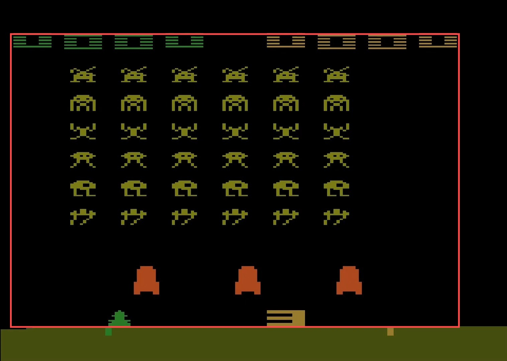
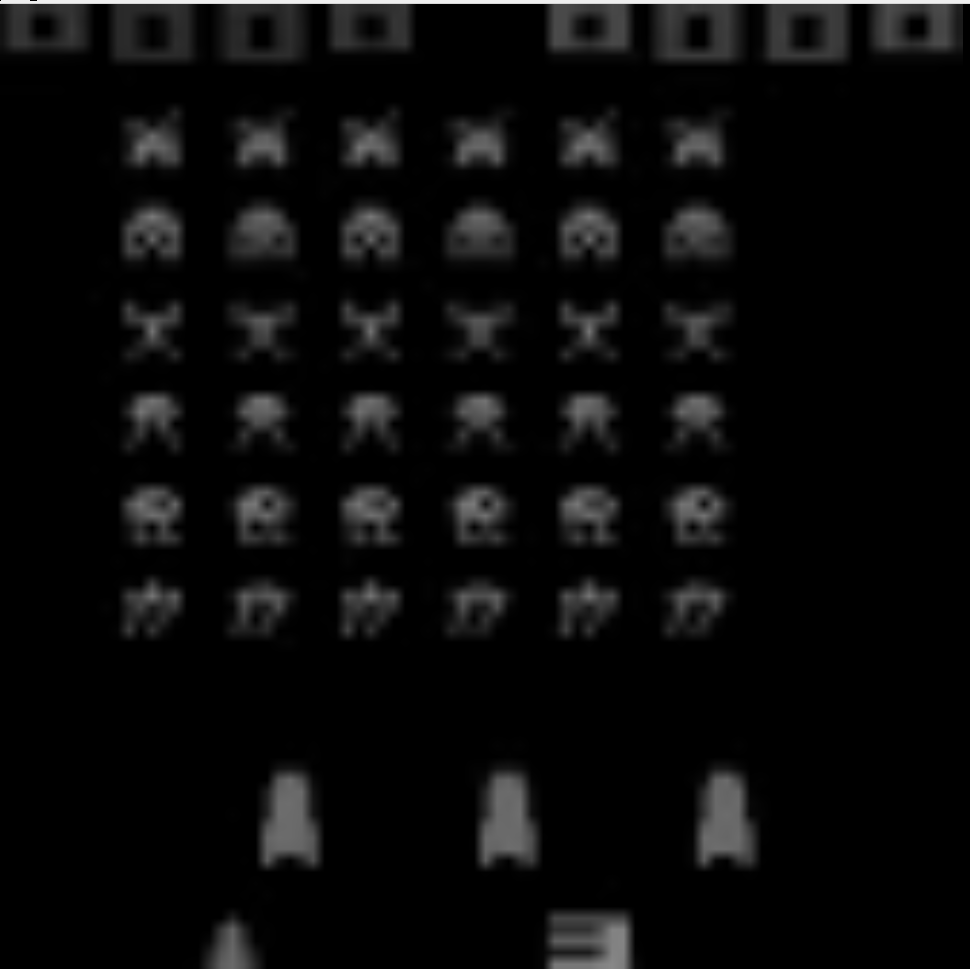

# Aprendizaje por refuerzo para ATARI - Space Invaders <!-- omit in toc -->
---
Código de proyecto: SPACEAI

---
## Índice <!-- omit in toc -->
- [Introducción](#introducción)
- [Marco teórico](#marco-teórico)
  - [Reinforcement Learning](#reinforcement-learning)
  - [Q-learning](#q-learning)
  - [Deep Q-Network](#deep-q-network)
  - [Proximal Policy Optimization (PPO)](#proximal-policy-optimization-ppo)
  - [Justificación](#justificación)
- [Diseño experimental](#diseño-experimental)
  - [Métricas](#métricas)
  - [Herramientas](#herramientas)
    - [OpenAI Gymnasium API](#openai-gymnasium-api)
      - [Modos y dificultades](#modos-y-dificultades)
    - [Stable Baselines 3](#stable-baselines-3)
  - [Implementación](#implementación)
    - [Preprocesamiento de entorno](#preprocesamiento-de-entorno)
    - [Implementación con Q-learning](#implementación-con-q-learning)
      - [Reducción del Espacio de Estados y Acciones](#reducción-del-espacio-de-estados-y-acciones)
      - [Representación Discreta del Estado](#representación-discreta-del-estado)
      - [Tamaño final de la Q table](#tamaño-final-de-la-q-table)
    - [Implementación con Deep Q-Network](#implementación-con-deep-q-network)
    - [Estructura de la red neuronal](#estructura-de-la-red-neuronal)
      - [Estrategia de aprendizaje](#estrategia-de-aprendizaje)
    - [Almacenamiento y muestreo de experiencias](#almacenamiento-y-muestreo-de-experiencias)
    - [Implementación con PPO](#implementación-con-ppo)
      - [Estructura de la red neuronal](#estructura-de-la-red-neuronal-1)
  - [Experimentos](#experimentos)
- [Bibliografía](#bibliografía)

## Introducción
En el videojuego Space Invaders, versión de Atari 2600, lanzado en 1978, el jugador controla un cañón que debe desplazarse horizontalmente para destruir oleadas de enemigos que descienden gradualmente. El entorno plantea un escenario de acción en tiempo real donde cada disparo, movimiento y cobertura detrás de los escudos debe gestionarse con precisión. 

Gymnasium, una biblioteca de python, ofrece una réplica de este juego [[1](#ref1)], aportándo un entorno y la posibilidad de editar el mismo con distintos "flavours" y otras opciones para personalizarlo. El hecho de resolver este juego de forma automática implica enfrentar distintos desafíos como anticipar los proyectiles enemigos, adaptarse al incremento de velocidad de los invasores a medida que disminuye su número y optimizar la posición del cañón para maximizar los puntos mientras se minimiza el riesgo (perder vidas). 

El uso de aprendizaje por refuerzo es una excelente opción para este tipo de problemas, ya que se enfoca en la capacidad de un agente para aprender a través de la interacción con su entorno, optimizando sus decisiones en función de las recompensas obtenidas. En el caso de Space Invaders, el agente aprende a seleccionar acciones basadas en el estado del entorno para maximizar su puntuación y sobrevivir el mayor tiempo posible.

A lo largo de este proyecto, se explicarán los fundamentos de los algoritmos Q-Learning, Deep Q-Network (DQN), y Proximal Policy Optimization (PPO) su implementación, y las métricas utilizadas para evaluar el desempeño del agente en el entorno de juego. Además, se presentarán las herramientas empleadas para la implementación, los experimentos realizados, los resultados obtenidos y su análisis. Finalmente, se ofrecerán conclusiones sobre la efectividad del enfoque utilizado y las posibles direcciones para futuros trabajos en el campo del aprendizaje por refuerzo aplicado a juegos clásicos.

## Marco teórico

### Reinforcement Learning

El **Reinforcement Learning (RL)** o **aprendizaje por refuerzo** es un paradigma del aprendizaje automático en el que un agente aprende a tomar decisiones en un entorno para maximizar una recompensa acumulada. En RL, el agente interactúa con el entorno siguiendo un proceso de prueba y error, utilizando una política que define qué acción tomar en cada estado.  

El aprendizaje en RL se basa en los siguientes elementos clave:  

- **Agente:** Es el sistema que toma acciones.
- **Entorno:** Es el espacio en el que opera el agente.
- **Estado (S):** Representa la situación actual del agente en el entorno.
- **Acciones (A):** Conjunto de decisiones que el agente puede tomar.
- **Recompensa (R):** Es un valor que recibe el agente al realizar una acción, nos indica que tan buena fue la decisión del agente.
- **Política (π):** Estrategia que define que acción tomar en cada estado.

El objetivo del agente es aprender una política óptima $π^*$ que maximice la suma de recompensas a lo largo del tiempo. Para lograrlo, se utilizan diferentes algoritmos de aprendizaje, como **Q-learning, DQN y PPO**.

### Q-learning
**Q-learning** es un algoritmo de aprendizaje por refuerzo basado en valores, cuyo objetivo es aprender una función de acción-valor **Q(s, a)** , que representa la recompensa esperada si el agente toma la acción **a** en el estado **s** y sigue la política óptima a partir de ahí.  

El algoritmo actualiza iterativamente la función **Q(s, a)** mediante la ecuación de Bellman: 

$
Q(s, a) \leftarrow Q(s, a) + α \left[ R + \gamma \max_{a'} Q(s', a')  - Q(s, a) \right]
$

Donde:  

- α es la tasa de aprendizaje (*learning rate*).  
- γ es el factor de descuento, que pondera la importancia de futuras recompensas.  
- R es la recompensa recibida al ejecutar la acción a.  
- s' es el nuevo estado tras la acción a .  
- $( max_{a'} Q(s', a') )$ representa el valor máximo esperado desde el nuevo estado.  

El algoritmo de Q-learning, bajo ciertas condiciones (como una tasa de aprendizaje adecuada y la exploración suficiente), converge a una **política óptima**. La política óptima es la que maximiza la recompensa esperada a largo plazo para el agente. Es importante notar que Q-learning es un algoritmo **off-policy**, lo que significa que el agente puede aprender la política óptima sin tener que seguir exactamente la política que está aprendiendo. 

### Deep Q-Network 

El **Deep Q-Network** es una extensión del algoritmo clásico Q-learning que utiliza redes neuronales profundas para aproximar la función de valores **Q(s, a)** en entornos de alta dimensión y con espacios de estados complejos. A diferencia de Q-learning, que emplea una tabla explícita para almacenar los valores de Q, **Deep Q-Network** utiliza una red neuronal para predecir estos valores, lo que permite manejar escenarios donde los estados no son discretos o son demasiado numerosos para almacenar en una tabla.

El **Deep Q-Network (DQN)** es una implementación específica de **Deep Q-Learning** que introduce mejoras clave para garantizar la estabilidad y eficiencia del aprendizaje.

DQN ha sido una de las innovaciones más importantes en **Reinforcement Learning**, permitiendo aplicar **Q-learning** en entornos con espacios de estados continuos y de alta dimensión.

### Proximal Policy Optimization (PPO)

**Proximal Policy Optimization (PPO)** es un algoritmo de aprendizaje por refuerzo basado en políticas (*policy-based*) que optimiza directamente la política del agente sin recurrir a una tabla de valores Q. A diferencia de Q-Learning o DQN, PPO utiliza una red neuronal que produce una distribución de acciones para cada estado.

PPO pertenece a la familia de métodos **actor–critic**, donde dos redes trabajan en conjunto:

- **Actor**: genera la política π(a|s), es decir, la probabilidad de ejecutar cada acción.  
- **Critic**: estima el valor V(s), que se utiliza para calcular la *ventaja* y guiar la actualización del actor.

La principal innovación de PPO es la función objetivo **clipped surrogate objective**, diseñada para evitar cambios bruscos en la política y mantener el entrenamiento estable. El algoritmo controla cuánto puede cambiar la política nueva respecto a la anterior mediante el ratio.

Este mecanismo impide actualizaciones inestables, PPO utiliza **batches** de experiencias y realiza varias épocas de optimización por cada batch para maximizar eficiencia.

### Justificación
Para la realización de este proyecto se optó por utilizar los algoritmos de Q-Learning, Deep Q-Learning y PPO por los siguientes motivos:

- En primer lugar, se empleó Q-Learning por su simplicidad y facilidad a la hora de entender el algoritmo. Si bien presenta baja eficiencia en entornos con una gran cantidad de estados, resulta útil para comprender los conceptos fundamentales de estado, acción y recompensa, así como la dinámica entre exploración y explotación. Además, sirve como punto de referencia para contrastar posteriormente los resultados con algoritmos más avanzados como DQN y PPO.

- Por su parte, DQN se incorporó como una extensión natural de Q-Learning para manejar observaciones de alta dimensionalidad, como las imágenes del juego. Al utilizar redes neuronales profundas para aproximar la función Q, evita la necesidad de discretizar el entorno y ofrece un rendimiento significativamente superior en escenarios complejos.

- Por último, PPO también tiene la ventaja de poder manejar observaciones continuas o de muchas dimensiones sin necesidad de discretizar, además, el entrenamiento es muy estable ya que aprende políticas de forma suave, y consistente. Tiene también la propiedad de converger más rápido y con mayor robustez.

## Diseño experimental

### Métricas

Para evaluar el rendimiento de los algoritmos Q-learning, DQN y PPO se utilizaron varias métricas clave que permiten comparar su desempeño frente a un agente aleatorio. Las métricas seleccionadas son las siguientes:

1. **Recompensa Promedio**  
   Se calculó la recompensa promedio en intervalos regulares de episodios para analizar la evolución del aprendizaje del agente. Este análisis permite observar si el agente mejora con el tiempo y si su desempeño se estabiliza en valores óptimos.

2. **Pasos Promedio**  
   Se registró la cantidad promedio de pasos tomados por el agente en distintos intervalos de episodios. Esta métrica ayuda a evaluar si el agente está aprendiendo estrategias más eficientes para completar la tarea en menos tiempo.

3. **Winrate**  
   Se midió el porcentaje de episodios en los que el agente logró una recompensa superior a 630, umbral necesario para pasar el primer nivel. Este indicador refleja la capacidad del agente para alcanzar su objetivo de manera consistente.

4. **Gráfico de Frecuencia**  
   Se construyó un histograma de frecuencias que muestra con qué frecuencia el agente alcanzó determinadas recompensas dentro de intervalos predefinidos. Este análisis permite identificar patrones en la distribución de las recompensas y evaluar la estabilidad del agente en la obtención de buenos resultados. Una distribución sesgada hacia valores más altos indicaría un agente con un rendimiento más consistente y efectivo.

### Herramientas

Para el desarrollo de este proyecto, se utilizó Stable Baselines 3, el entorno sobre el que se trabajó proviene de OpenAI Gymnasium [[2](#ref2)], con la emulación de ALE[[3](#ref3)].

Con respecto a hardware, se utilizó una computadora del equipo de trabajo y entornos de Google Colab:
- Computadora:
  - GPU: RTX 3080 ti
  - Memoria RAM: 32GB  DDR5
  - Almacenamiento: 1TB SSD
  - Procesador: AMD Ryzen 7 7700X
- Google Colab:
  - Memoria RAM: ~13 GB
  - Almacenamiento: ~108 GB
  - Procesador: Intel Xeon E5-26xx v4 (Broadwell, virtualizado – Google Colab)

#### OpenAI Gymnasium API

Gymnasium es una librería diseñada para desarrollar y evaluar algoritmos de aprendizaje por refuerzo (RL). Proporciona una interfaz estandarizada que facilita la creación de agentes de RL y su entrenamiento.

Gymnasium incluye una variedad de entornos predefinidos, como tareas clásicas de control, simulaciones físicas, y escenarios similares a videojuegos. También permite crear entornos personalizados para aplicaciones específicas, manteniendo la misma estructura API. Se utilizará para obtener el entorno de Space Invaders.

##### Modos y dificultades
Para el caso del entorno a trabajar, la librería ofrece modos y dificultades [[4](#ref4)]. Ofrece 16 modos distintos y 2 dificultades distintas, en cuanto a la dificultad, simplemente agranda o achica el cañón, por defecto empieza con el cañón más chico (menos probabilidad de ser golpeado). Con respecto a los modos, hay distintas posibilidades como escudos que se mueven, balas que se mueven horizontalmente, invisibilidad de enemigos, entre otros (ejemplos completos en [[8](#ref8)]).

#### Stable Baselines 3

Stable Baselines 3 (SB3) es un conjunto de implementaciones confiables y estandarizadas de algoritmos de aprendizaje profundo, desarrollado sobre PyTorch. Está orientado a la reproducibilidad, la estabilidad del entrenamiento y la facilidad de uso.

### Implementación

#### Preprocesamiento de entorno
El espacio de observación que posee Gymnasium en el juego Space Invaders es Box(0, 255, (210, 160, 3), uint8) [[1](#ref1)],
es decir, son observaciones de 3 canales (RGB), de 210 x 160 píxeles, con valores entre 0 y 255.

Se recomienda simplificar el entorno para tener un entrenamiento más estable y que las relaciones sean menos complejas, para lograr esto se sugiere achicar las imágenes y reducir la cantidad de canales [[5](#ref5)].

Siguiendo las recomendaciones, se recortan las secciones de la imagen que no aportan información (ver Figura 1). Después del recorte, la imagen se redimensiona a 84×84 píxeles y, finalmente, se convierte a escala de grises (ver figura 2).

  
   
  <em>[Figura 1] Área visible para el modelo (recuadrada en rojo)</em>
   
   

  
   
  <em>[Figura 2] Imagen luego del preprocesamiento</em>

#### Implementación con Q-learning
##### Reducción del Espacio de Estados y Acciones

El entorno Space Invaders en Gymnasium entrega observaciones en formato de imagen RGB de tamaño 210×160×3, lo cual resulta impracticable para Q-learning tabular debido a la dimensionalidad extremadamente alta del espacio de estados.
Para que la tabla Q fuera manejable, se implementó un proceso de reducción, compresión y discretización de los fotogramas del juego.

La dimensión general de una Q-table es:

$|Q \text{-table size}| = \text{Número de estados} \times \text{Número de acciones}$

Si se utilizara la imagen completa sin procesamiento, el número de estados sería:

$|Q \text{-table size}| = [256^{210*160*3} \times 6]$

lo cual es computacionalmente inviable.\
Por ello, se desarrolló un pipeline de reducción progresiva del estado visual, introduciendo recorte, escalado y discretización en tiras verticales.

##### Representación Discreta del Estado
A partir de la imagen ya preprocesada (recortada, redimensionada y convertida a escala de grises), se aplica un esquema de agregación y discretización que transforma cada frame en un vector pequeño y manejable:
1. **División de la imagen en N columnas**\
  Cada columna representa una franja vertical del entorno de juego.

2. **Extracción de una característica por columna**  
  Se calcula la media de intensidad de los píxeles dentro de cada columna.

3. **Discretización en K niveles**  
  Cada valor de media se asigna a uno de K bins, obteniendo así un vector discreto de tamaño N.

Este vector captura información esencial sobre la distribución visual en pantalla, pero en una forma suficientemente reducida como para permitir su uso en una Q-table.

##### Tamaño final de la Q table
Tras el preprocesamiento y discretización, el número total de estados posibles pasa a ser:

$\text{Número de estados} = K^{N}$

Por lo tanto, la dimensión final de la Q-table queda:

$|Q \text{-table size}| = [K^{N} \times 6]$
donde:
- N = número de columnas en que se divide la imagen,
- K = número de niveles de discretización,

  
#### Implementación con Deep Q-Network
La propuesta anterior no es muy eficiente ya que la tabla de decisión se hace muy grande debido a la cantidad de estados y acciones. Con este algoritmo (DQN) podemos definir una red neuronal para procesar el entorno y entrenar un modelo que pueda tener un buen desempeño en el juego.

#### Estructura de la red neuronal

La red está compuesta por un extractor convolucional de características y una cabeza final que predice los valores Q [[6](#ref6)].

**1. Extractor convolucional (NatureCNN)**  
La entrada del modelo consiste en un stack de **n_stack** de tamaño **84×84**. El extractor convolucional se compone de:

- **Conv1:** 32 filtros, kernel 8×8, stride 4, activación ReLU.  
- **Conv2:** 64 filtros, kernel 4×4, stride 2, activación ReLU.  
- **Conv3:** 64 filtros, kernel 3×3, stride 1, activación ReLU.  
- **Flatten:** conversión de la salida tridimensional a un vector unidimensional.  
- **Linear:** capa completamente conectada de **3136 → 512**, activación ReLU.

**2. Cabeza de valores Q (Q-Network)**  
Tras el extractor de características, la red final que produce los valores Q está formada por:

- **Capa final:** lineal de **512 → n_actions**, sin activación, que genera los valores Q para cada acción posible en el entorno.

La misma arquitectura se replica tanto en la red principal (*q_net*) como en la red objetivo (*q_net_target*).

##### Estrategia de aprendizaje
Con el objetivo de lograr un balance entre exploración y explotación, se ha elegido una estrategia ε-greedy donde:
- Con probabilidad ε, se elige una acción aleatoria (exploración)
- Con probabilidad 1-ε, se elige la acción con el mayor valor Q (explotación).
- ε decae exponencialmente con los pasos de entrenamiento.
  
#### Almacenamiento y muestreo de experiencias
El entorno se vectoriza y se aplica un apilado de frames, por lo que cada estado observado por el agente está compuesto por una secuencia de n imágenes consecutivas. Esto permite que la red neuronal disponga de información temporal, que es muy importante para este entorno ya que el movimiento de los objetos no puede inferirse a partir de un solo frame.

Cada transición generada durante la interacción con el entorno (que incluye el estado apilado actual, la acción ejecutada, la recompensa recibida, el siguiente estado apilado y la señal de finalización) se almacena en un buffer de memoria.

Durante el entrenamiento, se extraen lotes aleatorios desde este buffer. Este muestreo aleatorio rompe la correlación temporal entre transiciones consecutivas y utiliza de forma más eficiente la experiencia almacenada, mejorando la estabilidad del aprendizaje y la convergencia del modelo.

#### Implementación con PPO
A diferencia de DQN que utiliza Q-learning, PPO es un algoritmo de gradiente de política que optimiza directamente la política del agente. Este enfoque es más estable y eficiente para muchos entornos.

##### Estructura de la red neuronal
PPO utiliza una arquitectura de Actor-Crítico con extractores de características separados para la política (actor) y la función de valor (crítico). Esta separación permite que cada componente aprenda representaciones especializadas de manera independiente, optimizando tanto la selección de acciones como la estimación de valores [[7](#ref7)].

**1. Extractores convolucionales independientes (NatureCNN)**  
La arquitectura implementa tres extractores NatureCNN con pesos independientes:

- **features_extractor:** Extractor base de respaldo.
- **pi_features_extractor:** Extractor dedicado para la red de política (actor).
- **vf_features_extractor:** Extractor dedicado para la red de valor (crítico).

La entrada de cada extractor consiste en un stack de **n_stack** frames de tamaño 84×84. Cada NatureCNN se compone de:

- **Conv1:** 32 filtros, kernel 8×8, stride 4, activación ReLU.
- **Conv2:** 64 filtros, kernel 4×4, stride 2, activación ReLU.
- **Conv3:** 64 filtros, kernel 3×3, stride 1, activación ReLU.
- **Flatten:** conversión de la salida tridimensional a un vector unidimensional.
- **Linear:** capa completamente conectada de 3136 → 512, activación ReLU.

**2. Extractor MLP (MlpExtractor)**  
Después de los extractores convolucionales, existe un componente MlpExtractor que contiene dos ramas:

- **policy_net:** Sequential vacío (las características de 512 dimensiones van directamente a la cabeza de acción).
- **value_net:** Sequential vacío (las características de 512 dimensiones van directamente a la cabeza de valor).

En esta configuración, el MlpExtractor no agrega capas adicionales, funcionando como un pass-through que mantiene la separación entre las dos ramas.

**3. Cabezas de salida**

Finalmente, cada rama tiene su propia cabeza de salida:

- **action_net (Actor):** capa lineal de 512 → 6, que genera logits para la distribución de probabilidad sobre las 6 acciones posibles del entorno. Durante la inferencia, estos logits se convierten en probabilidades mediante softmax.
- **value_net (Crítico):** capa lineal de 512 → 1, sin activación, que estima el valor del estado actual V(s). Esta estimación se utiliza para calcular las ventajas durante el entrenamiento.

### Experimentos
Como se mencionó anteriormente, se utilizaron 3 algoritmos para explorar el entorno, además de un algoritmo random, además, se entrenaron con el modo y dificultad por defecto que ofrece el entorno (modo 0 y dificultad 0). A continuación se especifica cuánto se dedicó en entrenamiento para cada modelo de cada algoritmo.

| Algoritmo  | Cantidad de entrenamiento por modelo |
| ---------- | ------------------------- |
| Random     | –                         |
| Q-Learning | 20000 episodios (Aproximadamente 4 horas)            |
| DQN        | 10 millones de pasos (Aproximadamente 7 horas)      |
| PPO        | 10 millones de pasos (Aproximadamente 7 horas)      |

## Bibliografía
---
 [1] Farama Foundation. (2025). Space Invaders Environment. Disponible en: https://ale.farama.org/environments/space_invaders/. Última vez accedido: Noviembre de 2025.

 [2] Farama Foundation. (2025). Gymnasium Documentation. Disponible en: https://gymnasium.farama.org/index.html. Última vez accedido: Febrero de 2025.

 [3] Farama Foundation. (2023). ALE Documentation. Disponible en: https://ale.farama.org/index.html. Última vez accedido: Febrero de 2025.

 [4] Farama Foundation. (2025). Flavors. Disponible en: https://gymnasium.farama.org/v0.28.0/environments/atari/#flavors. Última vez accedido: Noviembre de 2025.

 [5] V. Mnih & K. Kavukcuoglu & D. Silver & A. Graves & I. Antonoglou D. Wierstra & M. Riedmiller. (2013). Playing Atari with Deep Reinforcement Learning. Deepmind.

 [6] Estructura de la red DQN. Disponible en: .\code\dqn\network_structure.md. Última vez accedido: Noviembre de 2025.

 [7] Estructura de la red PPO. Disponible en: .\code\ppo\network_structure.md. Última vez accedido: Noviembre de 2025.

 [8] Modos de space invaders. Disponible en: .\modos_de_juego. Última vez accedido: Diciembre de 2025.
