# Aprendizaje por refuerzo para ATARI - Space Invaders <!-- omit in toc -->
---
Código de proyecto: SPACEAI


---
## Índice <!-- omit in toc -->
- [Introducción](#introducción)
- [Marco teórico](#marco-teórico)
  - [Reinforcement Learning](#reinforcement-learning)
  - [Q-learning](#q-learning)
  - [Deep Q-Network](#deep-q-network)
  - [Proximal Policy Optimization (PPO)](#proximal-policy-optimization-ppo)
  - [Justificación](#justificación)
- [Diseño experimental](#diseño-experimental)
  - [Métricas](#métricas)
  - [Herramientas](#herramientas)
    - [OpenAI Gymnasium API](#openai-gymnasium-api)
      - [Modos y dificultades](#modos-y-dificultades)
    - [Stable Baselines 3](#stable-baselines-3)
  - [Implementación](#implementación)
    - [Reducción del Espacio de Estados y Acciones](#reducción-del-espacio-de-estados-y-acciones)
    - [Preprocesamiento de entorno](#preprocesamiento-de-entorno)
    - [Implementación con Q-learning](#implementación-con-q-learning)
      - [Representación Discreta del Estado](#representación-discreta-del-estado)
      - [Tamaño final de la Q table](#tamaño-final-de-la-q-table)
    - [Implementación con Deep Q-Network](#implementación-con-deep-q-network)
    - [Estructura de la red neuronal](#estructura-de-la-red-neuronal)
      - [Estrategia de aprendizaje](#estrategia-de-aprendizaje)
    - [Almacenamiento y muestreo de experiencias](#almacenamiento-y-muestreo-de-experiencias)
    - [Implementación con PPO](#implementación-con-ppo)
      - [Estructura de la red neuronal](#estructura-de-la-red-neuronal-1)
  - [Experimentos](#experimentos)
    - [Resultados](#resultados)
- [Análisis y Discusión de Resultados](#análisis-y-discusión-de-resultados)
  - [Random](#random)
    - [Desempeño general](#desempeño-general)
    - [Desempeño por modo](#desempeño-por-modo)
    - [Winrate](#winrate)
    - [Conclusión](#conclusión)
  - [Q-learning](#q-learning-1)
    - [Desempeño general](#desempeño-general-1)
    - [Desempeño por modo](#desempeño-por-modo-1)
    - [Winrate](#winrate-1)
    - [Conclusión](#conclusión-1)
  - [DQN](#dqn)
    - [Desempeño general](#desempeño-general-2)
    - [Desempeño por modo](#desempeño-por-modo-2)
    - [Winrate](#winrate-2)
  - [PPO](#ppo)
    - [Desempeño general](#desempeño-general-3)
    - [Desempeño por modo](#desempeño-por-modo-3)
    - [Winrate](#winrate-3)
    - [Conclusión](#conclusión-2)
- [Conclusiones finales](#conclusiones-finales)
- [Bibliografía](#bibliografía)


## Introducción
En el videojuego Space Invaders, versión de Atari 2600, lanzado en 1978, el jugador controla un cañón que debe desplazarse horizontalmente para destruir oleadas de enemigos que descienden gradualmente. El entorno plantea un escenario de acción en tiempo real donde cada disparo, movimiento y cobertura detrás de los escudos debe gestionarse con precisión. 

Gymnasium, una biblioteca de python, ofrece una réplica de este juego [[1](#ref1)], aportándo un entorno y la posibilidad de editar el mismo con distintos "flavours" y otras opciones para personalizarlo. El hecho de resolver este juego de forma automática implica enfrentar distintos desafíos como anticipar los proyectiles enemigos, adaptarse al incremento de velocidad de los invasores a medida que disminuye su número y optimizar la posición del cañón para maximizar los puntos mientras se minimiza el riesgo (perder vidas). 

El uso de aprendizaje por refuerzo es una excelente opción para este tipo de problemas, ya que se enfoca en la capacidad de un agente para aprender a través de la interacción con su entorno, optimizando sus decisiones en función de las recompensas obtenidas. En el caso de Space Invaders, el agente aprende a seleccionar acciones basadas en el estado del entorno para maximizar su puntuación y sobrevivir el mayor tiempo posible.

A lo largo de este proyecto, se explicarán los fundamentos de los algoritmos Q-Learning, Deep Q-Network (DQN), y Proximal Policy Optimization (PPO) su implementación, y las métricas utilizadas para evaluar el desempeño del agente en el entorno de juego. Además, se presentarán las herramientas empleadas para la implementación, los experimentos realizados, los resultados obtenidos y su análisis. Finalmente, se ofrecerán conclusiones sobre la efectividad del enfoque utilizado y las posibles direcciones para futuros trabajos en el campo del aprendizaje por refuerzo aplicado a juegos clásicos.

## Marco teórico

### Reinforcement Learning

El **Reinforcement Learning (RL)** o **aprendizaje por refuerzo** es un paradigma del aprendizaje automático en el que un agente aprende a tomar decisiones en un entorno para maximizar una recompensa acumulada. En RL, el agente interactúa con el entorno siguiendo un proceso de prueba y error, utilizando una política que define qué acción tomar en cada estado. [[2](#ref2)] [[3](#ref3)] 

El aprendizaje en RL se basa en los siguientes elementos clave:  

- **Agente:** Es el sistema que toma acciones.
- **Entorno:** Es el espacio en el que opera el agente.
- **Estado (S):** Representa la situación actual del agente en el entorno.
- **Acciones (A):** Conjunto de decisiones que el agente puede tomar.
- **Recompensa (R):** Es un valor que recibe el agente al realizar una acción, nos indica que tan buena fue la decisión del agente.
- **Política (π):** Estrategia que define que acción tomar en cada estado.

El objetivo del agente es aprender una política óptima $π^*$ que maximice la suma de recompensas a lo largo del tiempo. Para lograrlo, se utilizan diferentes algoritmos de aprendizaje, como **Q-learning, DQN y PPO**.

### Q-learning
**Q-learning** es un algoritmo de aprendizaje por refuerzo basado en valores, cuyo objetivo es aprender una función de acción-valor **Q(s, a)** , que representa la recompensa esperada si el agente toma la acción **a** en el estado **s** y sigue la política óptima a partir de ahí. [[4](#ref4)] 

El algoritmo actualiza iterativamente la función **Q(s, a)** mediante la ecuación de Bellman: 

Q(s, a) ← Q(s, a) + α [ R + γ max_{a'} Q(s', a') − Q(s, a) ] [[4](#ref4)] 


Donde:  

- α es la tasa de aprendizaje (*learning rate*).  
- γ es el factor de descuento, que pondera la importancia de futuras recompensas.  
- R es la recompensa recibida al ejecutar la acción a.  
- s' es el nuevo estado tras la acción a .  
- $( max_{a'} Q(s', a') )$ representa el valor máximo esperado desde el nuevo estado.  


El algoritmo de Q-learning, bajo ciertas condiciones (como una tasa de aprendizaje adecuada y la exploración suficiente), converge a una **política óptima**. La política óptima es la que maximiza la recompensa esperada a largo plazo para el agente. Es importante notar que Q-learning es un algoritmo **off-policy**, lo que significa que el agente puede aprender la política óptima sin tener que seguir exactamente la política que está aprendiendo. 

### Deep Q-Network 

El **Deep Q-Network** es una extensión del algoritmo clásico Q-learning que utiliza redes neuronales profundas para aproximar la función de valores **Q(s, a)** en entornos de alta dimensión y con espacios de estados complejos. A diferencia de Q-learning, que emplea una tabla explícita para almacenar los valores de Q, **Deep Q-Network** utiliza una red neuronal para predecir estos valores, lo que permite manejar escenarios donde los estados no son discretos o son demasiado numerosos para almacenar en una tabla.

El **Deep Q-Network (DQN)** es una implementación específica de **Q-Learning** que introduce mejoras clave para garantizar la estabilidad y eficiencia del aprendizaje. [[3](#ref3)] 

DQN ha sido una de las innovaciones más importantes en **Reinforcement Learning**, permitiendo aplicar **Q-learning** en entornos con espacios de estados continuos y de alta dimensión.

### Proximal Policy Optimization (PPO)

**Proximal Policy Optimization (PPO)** es un algoritmo de aprendizaje por refuerzo basado en políticas (*policy-based*) que optimiza directamente la política del agente (policy gradient [[5](#ref5)] ) sin recurrir a una tabla de valores Q. A diferencia de Q-Learning o DQN, PPO utiliza una red neuronal que produce una distribución de acciones para cada estado.

PPO pertenece a la familia de métodos **actor–critic**, donde dos redes trabajan en conjunto:

- **Actor**: genera la política π(a|s), es decir, la probabilidad de ejecutar cada acción.  
- **Critic**: estima el valor V(s), que se utiliza para calcular la *ventaja* y guiar la actualización del actor.

La principal innovación de PPO es la función objetivo **clipped surrogate objective**, diseñada para evitar cambios bruscos en la política y mantener el entrenamiento estable. El algoritmo controla cuánto puede cambiar la política nueva respecto a la anterior mediante el ratio.

Este mecanismo impide actualizaciones inestables, PPO utiliza **batches** de experiencias y realiza varias épocas de optimización por cada batch para maximizar eficiencia.

### Justificación
Para la realización de este proyecto se optó por utilizar los algoritmos de Q-Learning, Deep Q-Learning y PPO por los siguientes motivos:

- En primer lugar, se empleó Q-Learning por su simplicidad y facilidad a la hora de entender el algoritmo. Si bien presenta baja eficiencia en entornos con una gran cantidad de estados, resulta útil para comprender los conceptos fundamentales de estado, acción y recompensa, así como la dinámica entre exploración y explotación. Además, sirve como punto de referencia para contrastar posteriormente los resultados con algoritmos más avanzados como DQN y PPO.

- Por su parte, DQN se incorporó como una extensión natural de Q-Learning para manejar observaciones de alta dimensionalidad, como las imágenes del juego. Al utilizar redes neuronales profundas para aproximar la función Q, evita la necesidad de discretizar el entorno y ofrece un rendimiento significativamente superior en escenarios complejos.

- Por último, PPO también tiene la ventaja de poder manejar observaciones continuas o de muchas dimensiones sin necesidad de discretizar, además, el entrenamiento es muy estable ya que aprende políticas de forma suave, y consistente. Tiene también la propiedad de converger más rápido y con mayor robustez.

## Diseño experimental

### Métricas

Para evaluar el rendimiento de los algoritmos Q-learning, DQN y PPO se utilizaron varias métricas clave que permiten comparar su desempeño frente a un agente aleatorio. Las métricas seleccionadas son las siguientes:

1. **Recompensa Promedio**  
   Se calculó la recompensa promedio en intervalos regulares de episodios para analizar la evolución del aprendizaje del agente. Este análisis permite observar si el agente mejora con el tiempo y si su desempeño se estabiliza en valores óptimos.

2. **Pasos Promedio**  
   Se registró la cantidad promedio de pasos tomados por el agente en distintos intervalos de episodios. Esta métrica ayuda a evaluar si el agente está aprendiendo estrategias más eficientes para completar la tarea en menos tiempo.

3. **Winrate**  
   Se midió el porcentaje de episodios en los que el agente logró una recompensa igual superior a 630, umbral necesario para pasar el primer nivel. Este indicador refleja la capacidad del agente para alcanzar su objetivo de manera consistente.

4. **Gráfico de Frecuencia**  
   Se construyó un histograma de frecuencias que muestra con qué frecuencia el agente alcanzó determinadas recompensas dentro de intervalos predefinidos. Este análisis permite identificar patrones en la distribución de las recompensas y evaluar la estabilidad del agente en la obtención de buenos resultados. Una distribución sesgada hacia valores más altos indicaría un agente con un rendimiento más consistente y efectivo.

### Herramientas

Para el desarrollo de este proyecto, se utilizó Stable Baselines 3, el entorno sobre el que se trabajó proviene de OpenAI Gymnasium [[1](#ref1)], con la emulación de ALE[[7](#ref7)].

Con respecto a hardware, se utilizó una computadora del equipo de trabajo y entornos de Google Colab:
- Computadora:
  - GPU: RTX 3080 ti
  - Memoria RAM: 32GB  DDR5
  - Almacenamiento: 1TB SSD
  - Procesador: AMD Ryzen 7 7700X
- Google Colab:
  - Memoria RAM: ~13 GB
  - Almacenamiento: ~108 GB
  - Procesador: Intel Xeon E5-26xx v4 (Broadwell, virtualizado – Google Colab)

#### OpenAI Gymnasium API

Gymnasium es una librería diseñada para desarrollar y evaluar algoritmos de aprendizaje por refuerzo (RL). Proporciona una interfaz estandarizada que facilita la creación de agentes de RL y su entrenamiento.

Gymnasium incluye una variedad de entornos predefinidos, como tareas clásicas de control, simulaciones físicas, y escenarios similares a videojuegos. También permite crear entornos personalizados para aplicaciones específicas, manteniendo la misma estructura API. Se utilizará para obtener el entorno de Space Invaders.

##### Modos y dificultades

El entorno Space Invaders permite configurar distintos *modos* (16 en total) y *dificultades* (2 niveles) [[8](#ref8)].  
Las dificultades modifican el tamaño del cañón del jugador, mientras que los modos alteran el comportamiento del entorno, como el movimiento de las barreras, la trayectoria de las balas o la visibilidad de los enemigos (ver ejemplos en [[12](#ref12)]).

#### Stable Baselines 3

Stable Baselines 3 (SB3) [[13](#ref13)] es un conjunto de implementaciones confiables y estandarizadas de algoritmos de aprendizaje profundo, desarrollado sobre PyTorch. Está orientado a la reproducibilidad, la estabilidad del entrenamiento y la facilidad de uso.

Además de proporcionar las bases de los algoritmos a implementar en el proyecto, también proporcionan herramientas que son necesarias para este trabajo como las de vectorización y stacking de entornos.

### Implementación

#### Reducción del Espacio de Estados y Acciones

El entorno Space Invaders en Gymnasium entrega observaciones en formato de imagen RGB de tamaño 210×160 píxeles con 3 canales, lo que genera un espacio de estados extremadamente grande. Utilizar estas observaciones directamente en una Q-table sería impracticable, ya que la cantidad de estados posibles crece exponencialmente con el número de píxeles.

La dimensión general de una Q-table es:

$|Q\text{-table size}| = \text{Número de estados} × \text{Número de acciones}$


Si se trabajara con la imagen completa, el número de estados sería:

$|Q\text{-table size}| = 256^{(210×160×3)} × 6$


lo cual es computacionalmente inviable.\
Por ello, es necesario reducir el espacio de estados mediante un preprocesamiento visual que simplifique la observación sin perder información relevante para la toma de decisiones.

#### Preprocesamiento de entorno
El espacio de observación que posee Gymnasium en el juego Space Invaders es Box(0, 255, (210, 160, 3), uint8) [[1](#ref1)],
es decir, son observaciones de 3 canales (RGB), de 210 x 160 píxeles, con valores entre 0 y 255.

Se recomienda simplificar el entorno para tener un entrenamiento más estable y que las relaciones sean menos complejas, para lograr esto se sugiere achicar las imágenes y reducir la cantidad de canales [[9](#ref9)].

Siguiendo las recomendaciones, se recortan las secciones de la imagen que no aportan información (ver Figura 1). Después del recorte, la imagen se redimensiona a 84×84 píxeles y, finalmente, se convierte a escala de grises (ver figura 2).

<table align="center">
  <tr>
    <td align="center">
      <br>
      <em>[Figura 1] Área visible para el modelo</em>
    </td>
    <td align="center">
      <br>
      <em>[Figura 2] Imagen luego del preprocesamiento</em>
    </td>
  </tr>
</table>


#### Implementación con Q-learning

##### Representación Discreta del Estado
A partir de la imagen ya preprocesada (recortada, redimensionada y convertida a escala de grises), se aplica un esquema de agregación y discretización que transforma cada frame en un vector pequeño y manejable:
1. **División de la imagen en N columnas**\
  Cada columna representa una franja vertical del entorno de juego.

2. **Extracción de una característica por columna**  
  Se calcula la media de intensidad de los píxeles dentro de cada columna.

3. **Discretización en K niveles**  
  Cada valor de media se asigna a uno de K bins, obteniendo así un vector discreto de tamaño N.

Este vector captura información esencial sobre la distribución visual en pantalla, pero en una forma suficientemente reducida como para permitir su uso en una Q-table.

##### Tamaño final de la Q table
Tras el preprocesamiento y discretización, el número total de estados posibles pasa a ser:

$\text{Número de estados} = K^{N}$

Por lo tanto, la dimensión final de la Q-table queda:

$|Q \text{-table size}| = [K^{N} \times 6]$
donde:
- N = número de columnas en que se divide la imagen,
- K = número de niveles de discretización,

  
#### Implementación con Deep Q-Network
La propuesta anterior no es muy eficiente ya que la tabla de decisión se hace muy grande debido a la cantidad de estados y acciones. Con este algoritmo (DQN) podemos definir una red neuronal para procesar el entorno y entrenar un modelo que pueda tener un buen desempeño en el juego.

#### Estructura de la red neuronal

La red está compuesta por un extractor convolucional de características y una cabeza final que predice los valores Q [[10](#ref10)].

**1. Extractor convolucional (NatureCNN)**  
La entrada del modelo consiste en un stack de **n_stack** de tamaño **84×84**. El extractor convolucional se compone de:

- **Conv1:** 32 filtros, kernel 8×8, stride 4, activación ReLU.  
- **Conv2:** 64 filtros, kernel 4×4, stride 2, activación ReLU.  
- **Conv3:** 64 filtros, kernel 3×3, stride 1, activación ReLU.  
- **Flatten:** conversión de la salida tridimensional a un vector unidimensional.  
- **Linear:** capa completamente conectada de **3136 → 512**, activación ReLU.

**2. Cabeza de valores Q (Q-Network)**  
Tras el extractor de características, la red final que produce los valores Q está formada por:

- **Capa final:** lineal de **512 → n_actions**, sin activación, que genera los valores Q para cada acción posible en el entorno.

La misma arquitectura se replica tanto en la red principal (*q_net*) como en la red objetivo (*q_net_target*).

##### Estrategia de aprendizaje
Con el objetivo de lograr un balance entre exploración y explotación, se ha elegido una estrategia ε-greedy donde:
- Con probabilidad ε, se elige una acción aleatoria (exploración)
- Con probabilidad 1-ε, se elige la acción con el mayor valor Q (explotación).
- ε decae exponencialmente con los pasos de entrenamiento.
  
#### Almacenamiento y muestreo de experiencias
El entorno se vectoriza y se aplica un apilado de frames, por lo que cada estado observado por el agente está compuesto por una secuencia de n imágenes consecutivas. Esto permite que la red neuronal disponga de información temporal, que es muy importante para este entorno ya que el movimiento de los objetos no puede inferirse a partir de un solo frame.

Cada transición generada durante la interacción con el entorno (que incluye el estado apilado actual, la acción ejecutada, la recompensa recibida, el siguiente estado apilado y la señal de finalización) se almacena en un buffer de memoria.

Durante el entrenamiento, se extraen lotes aleatorios desde este buffer. Este muestreo aleatorio rompe la correlación temporal entre transiciones consecutivas y utiliza de forma más eficiente la experiencia almacenada, mejorando la estabilidad del aprendizaje y la convergencia del modelo.

#### Implementación con PPO
A diferencia de DQN que utiliza Q-learning, PPO es un algoritmo de gradiente de política que optimiza directamente la política del agente. Este enfoque es más estable y eficiente para muchos entornos.

##### Estructura de la red neuronal
PPO utiliza una arquitectura de Actor-Crítico con extractores de características separados para la política (actor) y la función de valor (crítico). Esta separación permite que cada componente aprenda representaciones especializadas de manera independiente, optimizando tanto la selección de acciones como la estimación de valores [[11](#ref11)].

**1. Extractores convolucionales independientes (NatureCNN)**  
La arquitectura implementa tres extractores NatureCNN con pesos independientes:

- **features_extractor:** Extractor base de respaldo.
- **pi_features_extractor:** Extractor dedicado para la red de política (actor).
- **vf_features_extractor:** Extractor dedicado para la red de valor (crítico).

La entrada de cada extractor consiste en un stack de **n_stack** frames de tamaño 84×84. Cada NatureCNN se compone de:

- **Conv1:** 32 filtros, kernel 8×8, stride 4, activación ReLU.
- **Conv2:** 64 filtros, kernel 4×4, stride 2, activación ReLU.
- **Conv3:** 64 filtros, kernel 3×3, stride 1, activación ReLU.
- **Flatten:** conversión de la salida tridimensional a un vector unidimensional.
- **Linear:** capa completamente conectada de 3136 → 512, activación ReLU.

**2. Extractor MLP (MlpExtractor)**  
Después de los extractores convolucionales, existe un componente MlpExtractor que contiene dos ramas:

- **policy_net:** Sequential vacío (las características de 512 dimensiones van directamente a la cabeza de acción).
- **value_net:** Sequential vacío (las características de 512 dimensiones van directamente a la cabeza de valor).

En esta configuración, el MlpExtractor no agrega capas adicionales, funcionando como un pass-through que mantiene la separación entre las dos ramas.

**3. Cabezas de salida**

Finalmente, cada rama tiene su propia cabeza de salida:

- **action_net (Actor):** capa lineal de 512 → 6, que genera logits para la distribución de probabilidad sobre las 6 acciones posibles del entorno. Durante la inferencia, estos logits se convierten en probabilidades mediante softmax.
- **value_net (Crítico):** capa lineal de 512 → 1, sin activación, que estima el valor del estado actual V(s). Esta estimación se utiliza para calcular las ventajas durante el entrenamiento.

### Experimentos
Se realizaron experimentos empleando cuatro enfoques: un agente con comportamiento aleatorio y tres algoritmos de aprendizaje por refuerzo (Q-Learning, DQN y PPO). Todos los modelos fueron entrenados utilizando la configuración por defecto del entorno, correspondiente al modo 0 y dificultad 0.

El modo 0 es el entorno base del juego: las barreras están fijas, las balas enemigas tienen trayectoria recta y los enemigos mantienen un comportamiento estándar. La dificultad 0 utiliza el cañón pequeño (menor probabilidad de ser golpeado).

<div align="center">

| Algoritmo  | Cantidad de entrenamiento por modelo |
| ---------- | ------------------------- |
| Random     | –                         |
| Q-Learning | 20000 episodios (Aproximadamente 4 horas)            |
| DQN        | 10 millones de pasos (Aproximadamente 7 horas)      |
| PPO        | 10 millones de pasos (Aproximadamente 7 horas)      |
</div>

Con el fin identificar los modelos entrenados, se asignó a cada uno un identificador secuencial (por ejemplo, DQN1), de esta manera se facilita la referencia a los modelos y se mantiene un registro claro de sus parámetros, pruebas y métricas. Estos identificadores, utilizados en los resultados (DQN1–DQN9 y PPO1–PPO5), corresponden a diferentes instancias de los algoritmos DQN y PPO generadas durante el estudio. Cada número representa un modelo entrenado con un conjunto específico de hiperparámetros. Su función es únicamente distinguir las variantes evaluadas, sin implicar cambios en la definición del algoritmo.

A continuación se especificarán los hiperparámetros utilizados para los modelos cuyos resultados se encuentran expuestos en la siguiente sección:
- DQN2:
```
policy="CnnPolicy",
env=env,
learning_rate=1e-4,
buffer_size=100_000,
learning_starts=10_000,
batch_size=128,
tau=1.0,
gamma=0.99,
train_freq=4,
gradient_steps=1,
target_update_interval=10_000,
exploration_fraction=0.15,
exploration_final_eps=0.05,
verbose=1
```
- DQN9:
```
policy="CnnPolicy",
env=env,
learning_rate=1e-5,
buffer_size=100_000,
learning_starts=100_000,
batch_size=132,
tau=1.0,
gamma=0.99,
train_freq=4,
gradient_steps=1,
target_update_interval=10_000,
exploration_fraction=0.3,
exploration_final_eps=0.05,
verbose=1
```
- PPO5:
```
policy="CnnPolicy",
env=env,
verbose=1,
tensorboard_log=tensorboard_log,
learning_rate=1e-6,
n_steps=512,
batch_size=256,
n_epochs=4,
gamma=0.99,
ent_coef=0.01,
device="cuda"
```

Algunos de estos modelos son resultado de una continuación de entrenamiento, es decir, se tomó el modelo ya entrenado con los mismos pesos y se retomó el entrenamiento con 10 millones de pasos para observar si seguía aprendiendo o se estancaba. Como los resultados fueron satisfactorios, se decidieron dejar estos modelos como modelos aparte, por ejemplo el modelo DQN9 surge de haber continuado el entrenamiento del modelo DQN5.

Para evaluar la capacidad de generalización de los agentes, además del modo visto en entrenamiento, se realizaron pruebas en los *modos 3, 4 y 8* (todos con dificultad 0), que introducen variaciones significativas en el entorno:

- *Modo 0:* entorno base (igual al utilizado durante el entrenamiento).
- *Modo 3:* las balas enemigas presentan desviaciones y las barreras de protección se mueven.
- *Modo 4:* las balas enemigas son más rápidas.
- *Modo 8:* los enemigos se vuelven invisibles durante intervalos de tiempo.

Estos modos adicionales permiten evaluar cómo se adapta cada algoritmo frente a dinámicas nuevas que no fueron observadas durante el entrenamiento.

En cuanto a la metodología de evaluación, para cada algoritmo se entrenaron varios modelos y cada uno fue evaluado mediante 1000 episodios por modo. Sin embargo, para cada configuración de hiperparámetros se realizó un único entrenamiento por algoritmo; es decir, no se repitió el proceso de entrenamiento varias veces para promediar resultados, sino que se evaluó directamente el modelo obtenido en esa única ejecución.

Para garantizar reproducibilidad sin reutilizar exactamente las mismas condiciones aleatorias, se utilizó una semilla base fija (123) al reiniciar el entorno. En cada episodio, la semilla se actualizó siguiendo:

$\text{seed}_{\text{episodio}} = 123 + \text{índice del episodio}$

Si bien en Space Invaders tanto la posición inicial del jugador como la disposición inicial de enemigos y barreras se mantienen fijas —tal como ocurre en el juego original—, la semilla sí afecta todos los eventos no deterministas del entorno. Entre ellos se encuentran los patrones de disparo de los enemigos, la selección de qué enemigo dispara, variaciones internas asociadas al frame-skip y otros comportamientos aleatorios propios de ciertos modos. Esto permite que cada episodio sea distinto aun cuando las posiciones iniciales no cambien. De este modo, todos los agentes fueron evaluados bajo una misma secuencia de variaciones controladas, manteniendo comparabilidad entre algoritmos sin repetir episodios idénticos.

Al observar inestabilidad (rangos de recompensas muy variados, que podían ir de 0 a alrededor de 1000) a la hora de entrenar agentes de Q-learning y DQN, se decidió implementar Wrappers [[14](#ref14)] de recompensa para fijar 2 reglas más al entorno:
- Si pierde una vida, pierde puntaje.
- Puntos uniformes:
  - Si obtiene recompensa positiva, sólo se suma un punto (ya sea que el agente gane 10 o 200 puntos por una acción).
  - Si obtiene recompensa negativa, sólo pierde un punto.

Para PPO se intentó entrenar sin los wrappers mencionados, pero debido a la gran inestabilidad, los valores de pérdida también eran muy inestables y a partir de unos pocos episodios de entrenamiento se estancaba en valores muy pequeños. Por lo que se decidió sólo entrenar con los wrappers de recompensa ya implementados.

#### Resultados

**Agente Random**

<div align="center">
<h2> Resumen de resultados de tests (1000 episodios por test)</h2>

| Modo | Winrate | Puntaje mínimo | Puntaje máximo | Media   | Desviación Estándar |
|------|---------|----------------|----------------|---------|----------------------|
| 0    | 0.001       | 0.00           | 640.00         | 154.12  | 99.50               |
| 3    | 0.002       | 0.00           | 715.00         | 122.89  | 98.27               |
| 4    | 0       | 5.00           | 460.00         | 88.52   | 59.04               |
| 8    | 0.001       | 5.00           | 685.00         | 148.53  | 101.74              |

</div>

<table align="center">
  <tr>
    <td align="center">
      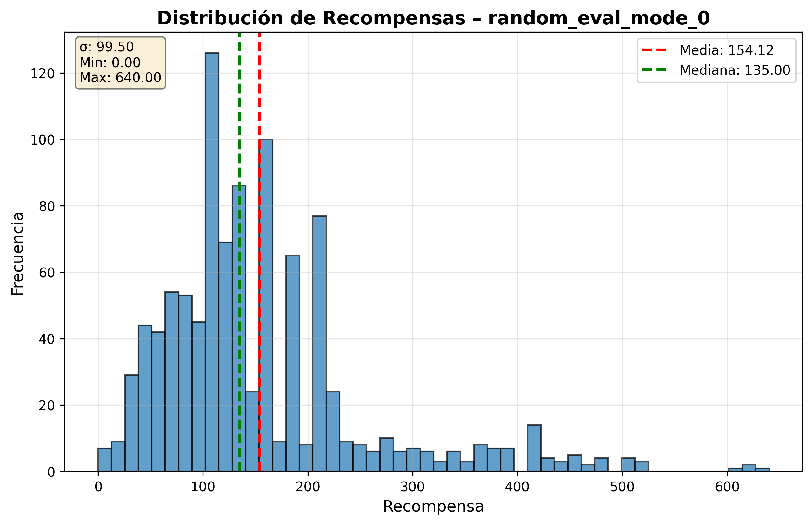<br>
      <em>[Figura 3] Histograma de frecuencia para modo 0</em>
    </td>
    <td align="center">
      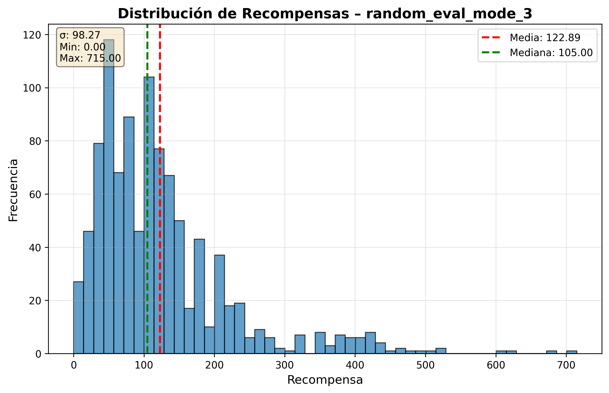<br>
      <em>[Figura 4] Histograma de frecuencia para modo 3</em>
    </td>
  </tr>
  <tr>  
    <td align="center">
      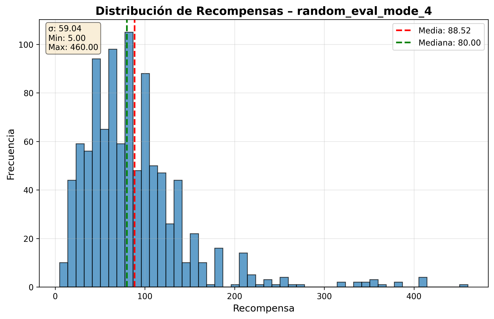<br>
      <em>[Figura 5] Histograma de frecuencia para modo 4</em>
    </td>
    <td align="center">
      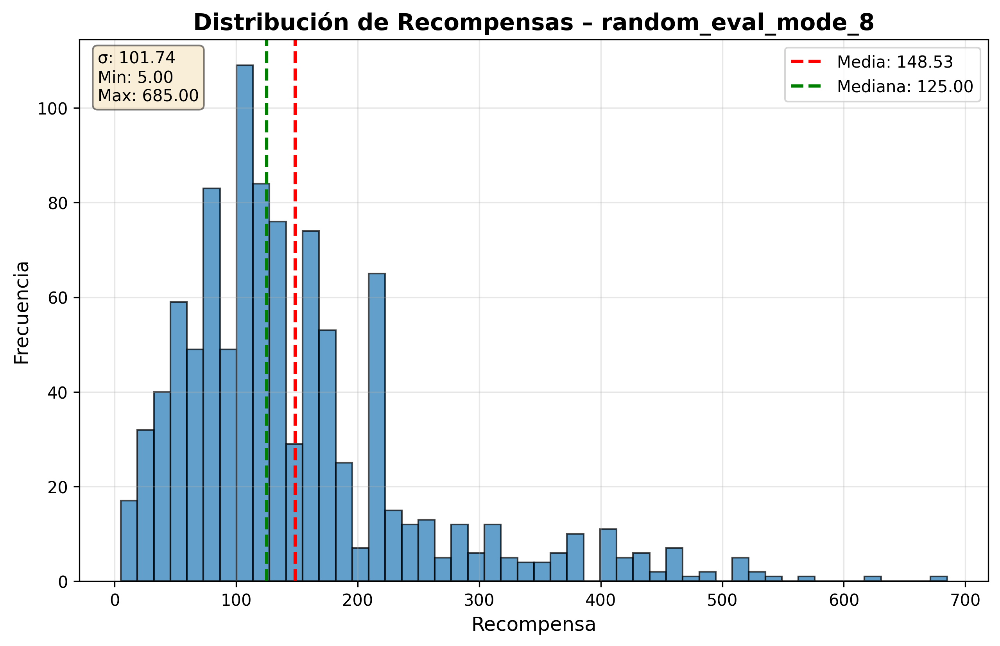<br>
      <em>[Figura 6] Histograma de frecuencia para modo 8</em>
    </td>
  </tr>
</table>

**Q-learning**

**Mejor modelo con Reward Shaping Personalizado**
<table align="center">
  <tr>
    <td align="center">
      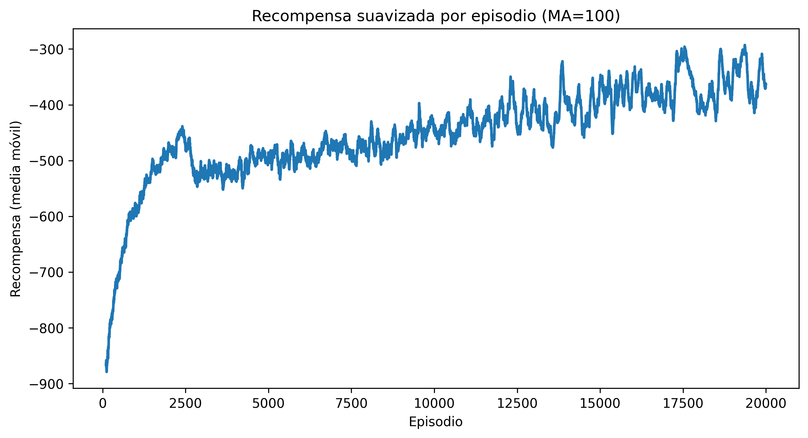<br>
      <em>[Figura 7] Promedio de recompensas en 20 mil episodios</em>
    </td>
    <td align="center">
      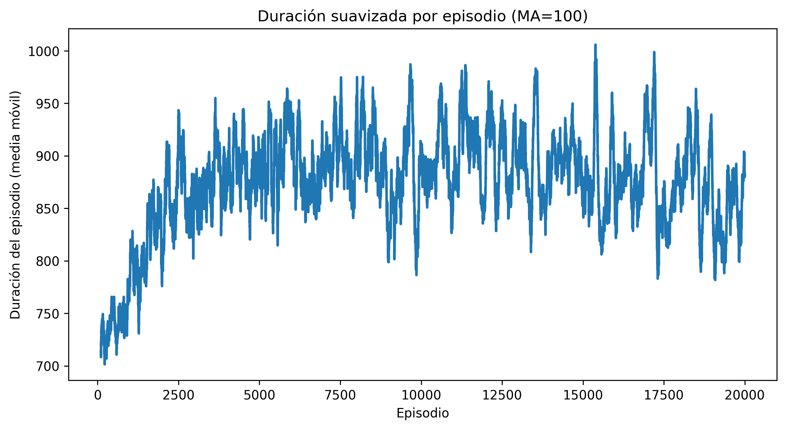<br>
      <em>[Figura 8] Promedio de pasos en 20 mil episodios</em>
    </td>
  </tr>
</table>

<div align="center">
<h2> Resumen de resultados de tests (1000 episodios por test)</h2>

| Modo | Winrate | Puntaje mínimo | Puntaje máximo | Media   | Desviación Estándar |
|------|---------|----------------|----------------|---------|----------------------|
| 0    | 0.013      | 90.00          | 800.00         | 270.32  | 92.08               |
| 3    | 0.001       | 25.00          | 735.00         | 175.91  | 89.78               |
| 4    | 0       | 0.00           | 430.00         | 62.91   | 51.82               |
| 8    | 0.011      | 55.00          | 820.00         | 282.76  | 103.19              |

</div>

<table align="center">
  <tr>
    <td align="center">
      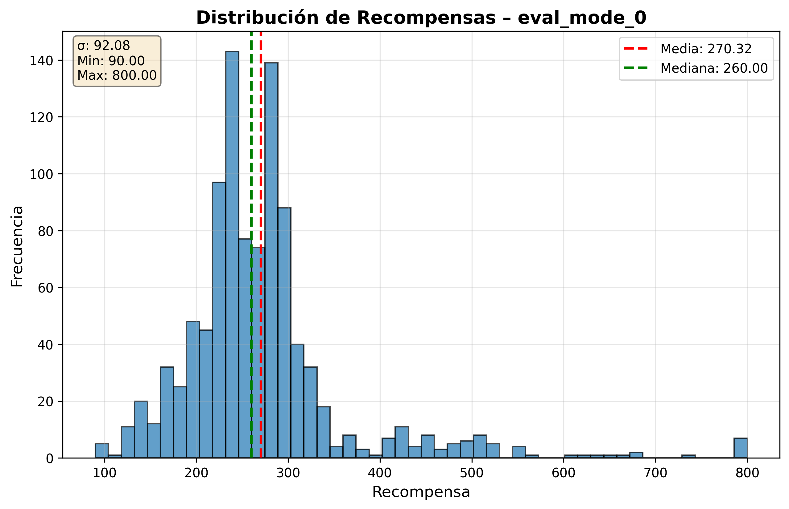<br>
      <em>[Figura 9] Histograma de frecuencia para modo 0</em>
    </td>
    <td align="center">
      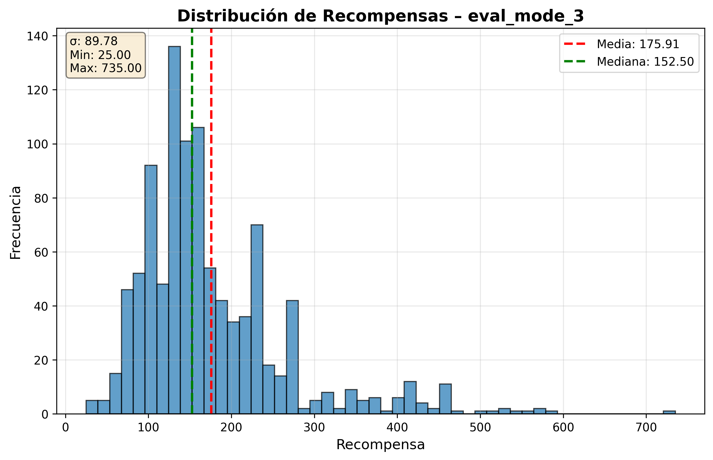<br>
      <em>[Figura 10] Histograma de frecuencia para modo 3</em>
    </td>
  </tr>
  <tr>  
    <td align="center">
      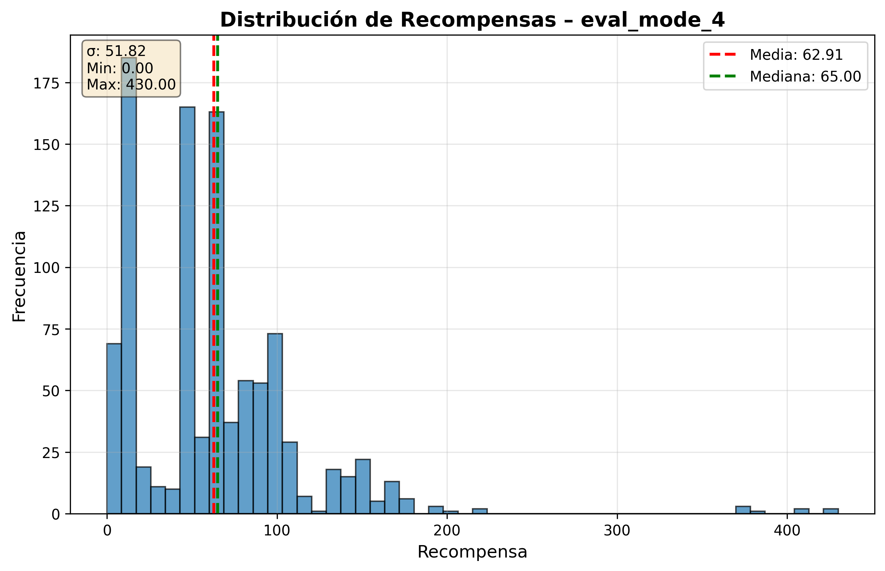<br>
      <em>[Figura 11] Histograma de frecuencia para modo 4</em>
    </td>
    <td align="center">
      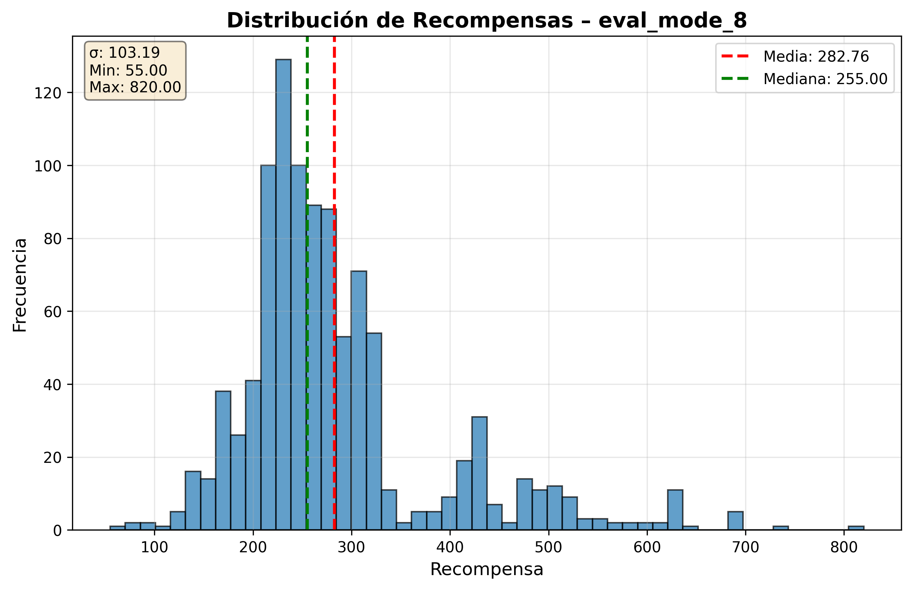<br>
      <em>[Figura 12] Histograma de frecuencia para modo 8</em>
    </td>
  </tr>
</table>


**Mejor modelo con Reward Clipping**
<table align="center">
  <tr>
    <td align="center">
      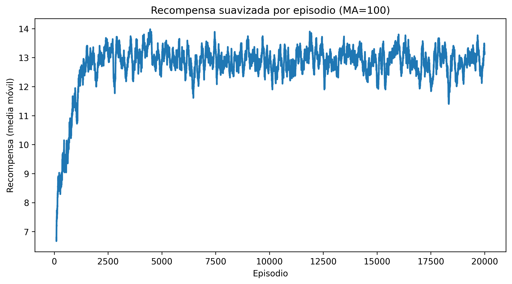<br>
      <em>[Figura 13] Promedio de recompensas en 20 mil episodios</em>
    </td>
    <td align="center">
      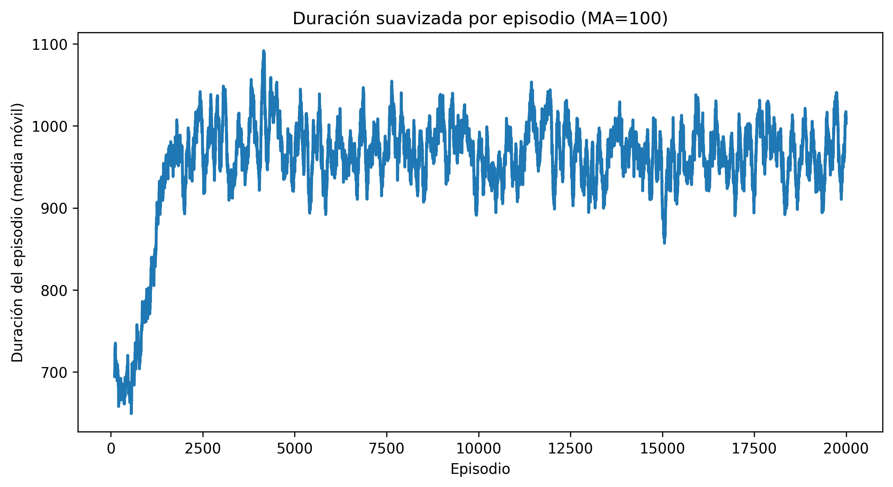<br>
      <em>[Figura 14] Promedio de pasos en 20 mil episodios</em>
    </td>
  </tr>
</table>

<div align="center">
<h2> Resumen de resultados de tests (1000 episodios por test)</h2>

| Modo | Winrate | Puntaje mínimo | Puntaje máximo | Media | Desviación Estándar |
|------|---------|----------------|----------------|--------|----------------------|
| 0    | 0.013      | 80.00          | 800.00         | 268.37 | 89.49               |
| 3    | 0.003       | 25.00          | 670.00         | 179.43 | 94.52               |
| 4    | 0       | 0.00           | 610.00         | 61.75  | 55.11               |
| 8    | 0.011      | 5.00           | 750.00         | 281.51 | 103.75              |

</div>
<table align="center">
  <tr>
    <td align="center">
      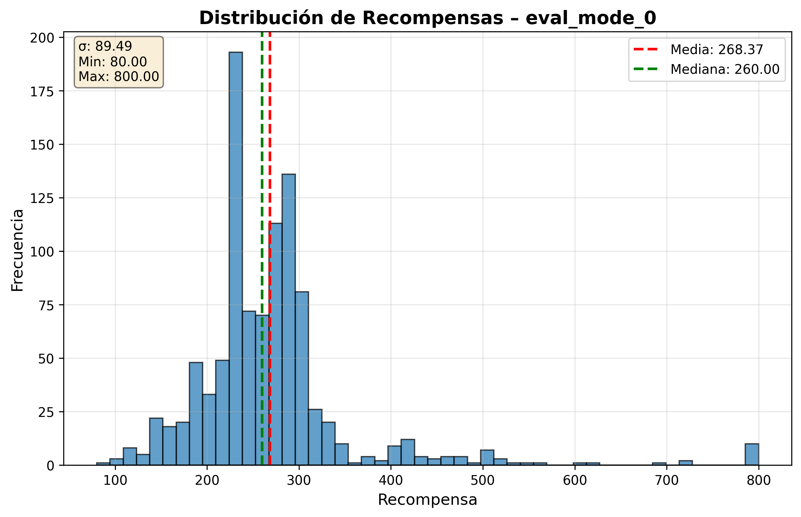<br>
      <em>[Figura 15] Histograma de frecuencia para modo 0</em>
    </td>
    <td align="center">
      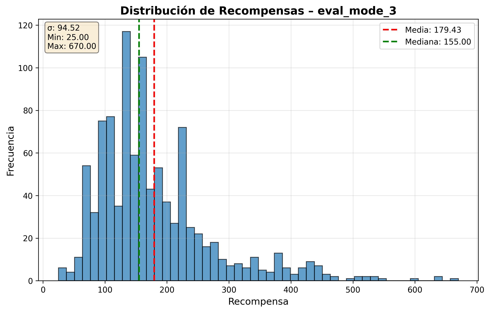<br>
      <em>[Figura 16] Histograma de frecuencia para modo 3</em>
    </td>
  </tr>
  <tr>  
    <td align="center">
      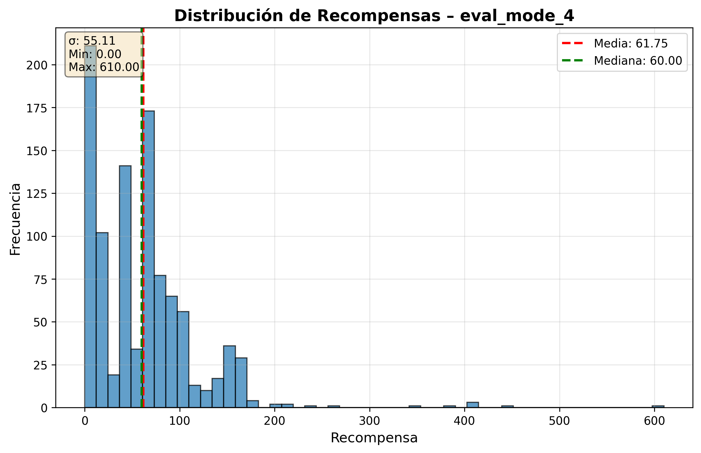<br>
      <em>[Figura 17] Histograma de frecuencia para modo 4</em>
    </td>
    <td align="center">
      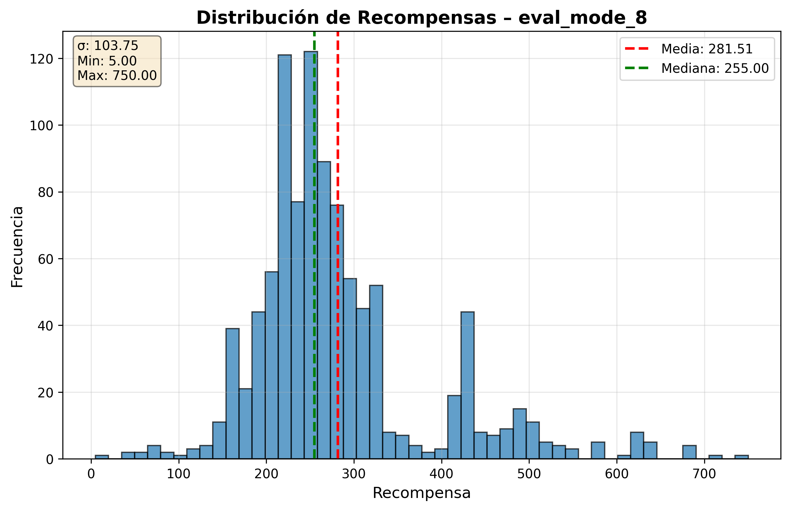<br>
      <em>[Figura 18] Histograma de frecuencia para modo 8</em>
    </td>
  </tr>
</table>

**DQN**

Al haber entrenado con y sin Wrapper de recompensa, a continuación se mostrarán los resultados de los tests de los mejores agentes de cada enfoque.

**Mejor modelo sin Wrapper de recompensa (agente DQN2)**

<table align="center">
  <tr>
    <td align="center">
      <br>
      <em>[Figura 19] Promedio de recompensas en 10 millones de pasos para DQN2</em>
    </td>
    <td align="center">
      <br>
      <em>[Figura 20] Promedio de pasos por episodio en 10 millones de pasos para DQN2</em>
    </td>
  </tr>
</table>

<div align="center">
<h2> Resumen de resultados de tests (1000 episodios por test)</h2>

| Modo  | Winrate | Puntaje mínimo | Puntaje máximo | Media | Desviación Estándar | Video de ejemplo |
| ----- | ------- | -------------- | -------------- | ----- | ------------------- | ---------------- |
| 0     |  0,050  |      120       |      1005      |406.03 |       112.08        | [DQN2_MODO0](https://drive.google.com/file/d/1JSmCvx1zgXEkoMQ578XnchLg-dyd7kT9/view?usp=sharing) |
| 3     |  0,001  |      5         |       685      |135.34 |       98.95        | [DQN2_MODO3](https://drive.google.com/file/d/1IijHQN9J9SwuiSW6cGdNXKCykKVWkJKW/view?usp=sharing) |
| 4     |  0.001  |      35        |       630      |213.91 |       93.12        | [DQN2_MODO4](https://drive.google.com/file/d/15QS_VutP0w5fmF3A1ykYPSSqLiIwyqyG/view?usp=sharing) |
| 8     |  0.0    |      0         |       440      |20.36  |       29.54        | [DQN2_MODO8](https://drive.google.com/file/d/1Uhm7H_1mZfCNqX-MrMRh8-3P2YKKQqkc/view?usp=sharing) |

</div>

<table align="center">
  <tr>
    <td align="center">
      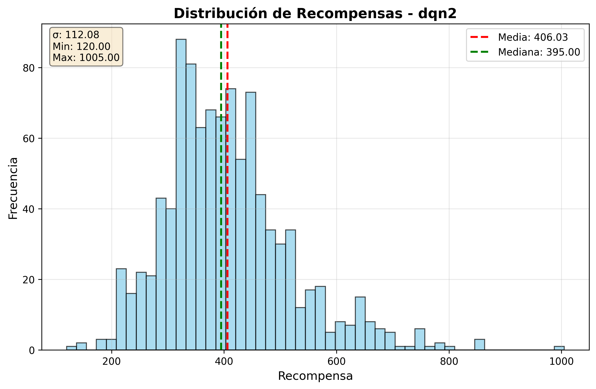<br>
      <em>[Figura 21] Histograma de frecuencia para modo 0</em>
    </td>
    <td align="center">
      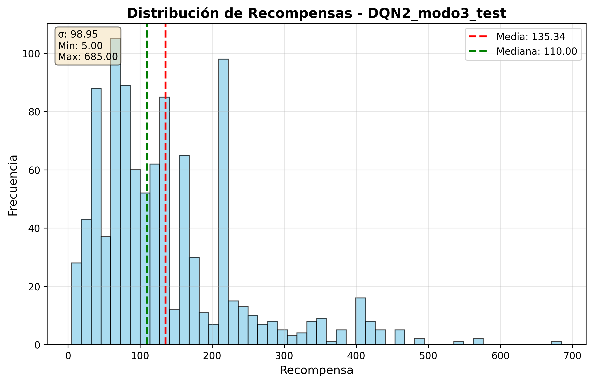<br>
      <em>[Figura 22] Histograma de frecuencia para modo 3</em>
    </td>
  </tr>
  <tr>  
    <td align="center">
      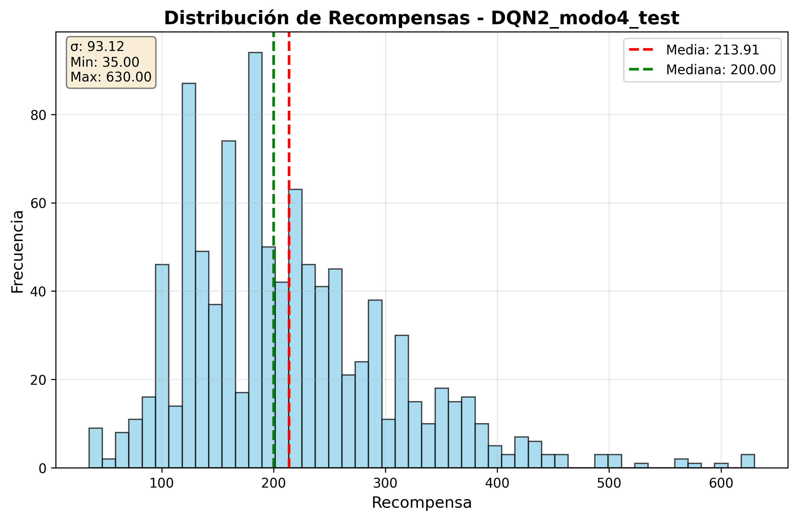<br>
      <em>[Figura 23] Histograma de frecuencia para modo 4</em>
    </td>
    <td align="center">
      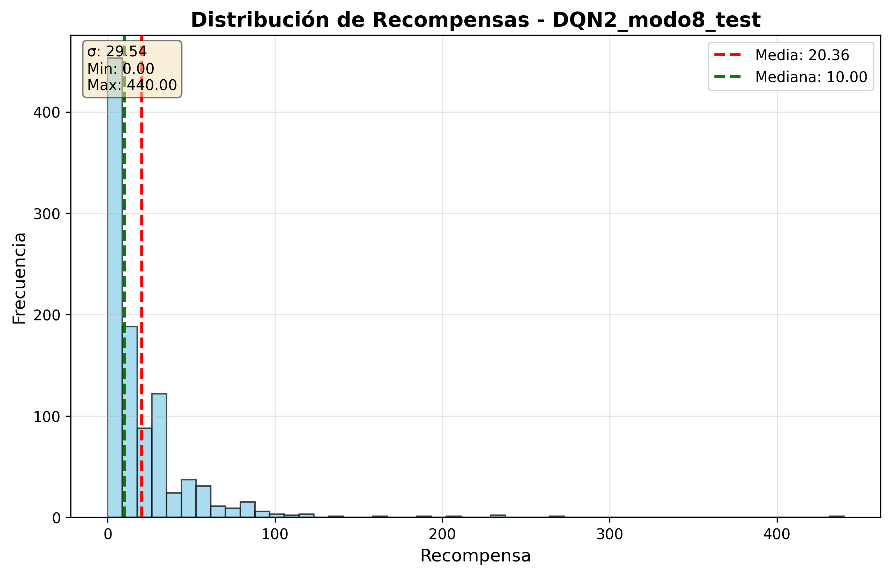<br>
      <em>[Figura 24] Histograma de frecuencia para modo 8</em>
    </td>
  </tr>
</table>

---

**Mejor modelo con Wrapper de recompensa (agente DQN9)**

<table align="center">
  <tr>
    <td align="center">
      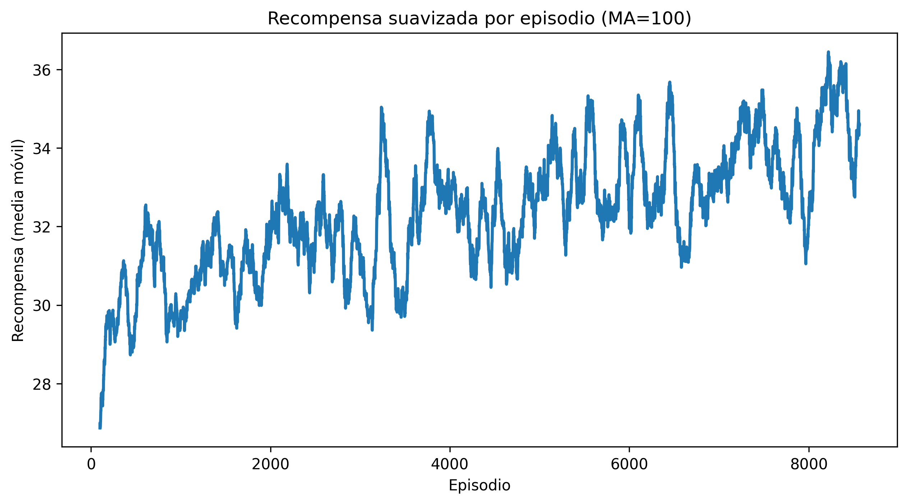<br>
      <em>[Figura 25] Promedio de recompensas en 10 millones de pasos para DQN9</em>
    </td>
    <td align="center">
      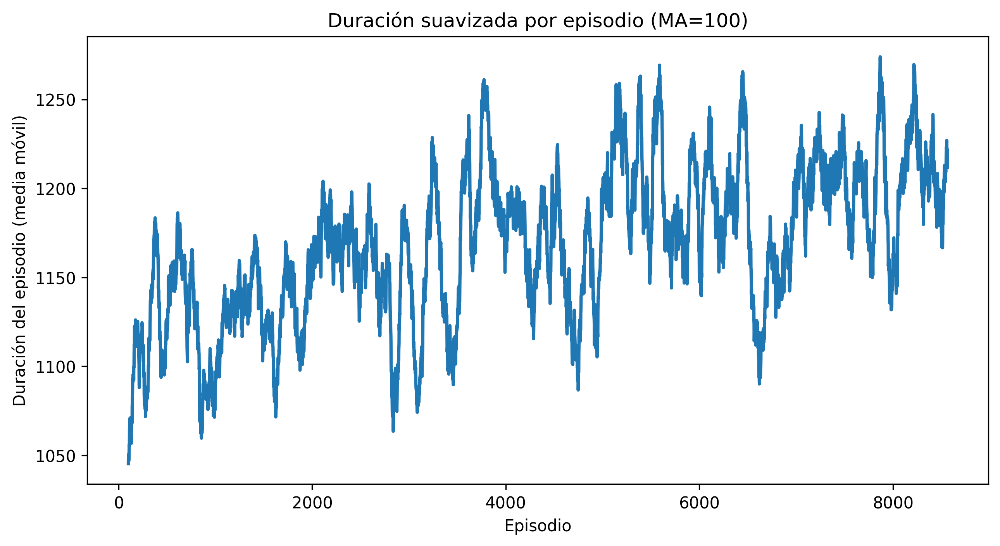<br>
      <em>[Figura 26] Promedio de pasos por episodio en 10 millones de pasos para DQN9</em>
    </td>
  </tr>
</table>

<div align="center">
<h2> Resumen de resultados de tests (1000 episodios por test)</h2>

| Modo  | Winrate | Puntaje mínimo | Puntaje máximo | Media | Desviación Estándar | Video de ejemplo |
| ----- | ------- | -------------- | -------------- | ----- | ------------------- | ---------------- |
| 0     |  0,269  |      280       |      1555      |646.41 |       166.34        | [DQN9_MODO0](https://drive.google.com/file/d/1UlGfo6eKGTnzr2wtIhh2A_ky9octcHd8/view?usp=sharing) |
| 3     |  0,024  |      0         |       985      |222.725|       170.52        | [DQN9_MODO3](https://drive.google.com/file/d/1IijHQN9J9SwuiSW6cGdNXKCykKVWkJKW/view?usp=sharing) |
| 4     |  0.057  |      30        |       905      |392.66 |       152.43        | [DQN9_MODO4](https://drive.google.com/file/d/1VG_M7-tSZpeLfGrcuzuwNAfJZDeSNfx-/view?usp=sharing) |
| 8     |  0.076  |      10        |       1025     |350.44 |       170.06        | [DQN9_MODO8](https://drive.google.com/file/d/1HQOnbnM38JoxFz6A_8pvNpe7K7D1XkkM/view?usp=sharing) |

</div>

<table align="center">
  <tr>
    <td align="center">
      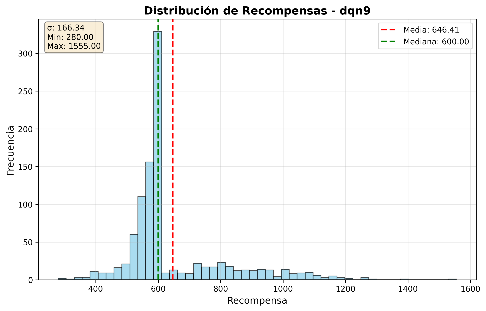<br>
      <em>[Figura 27] Histograma de frecuencia para modo 0</em>
    </td>
    <td align="center">
      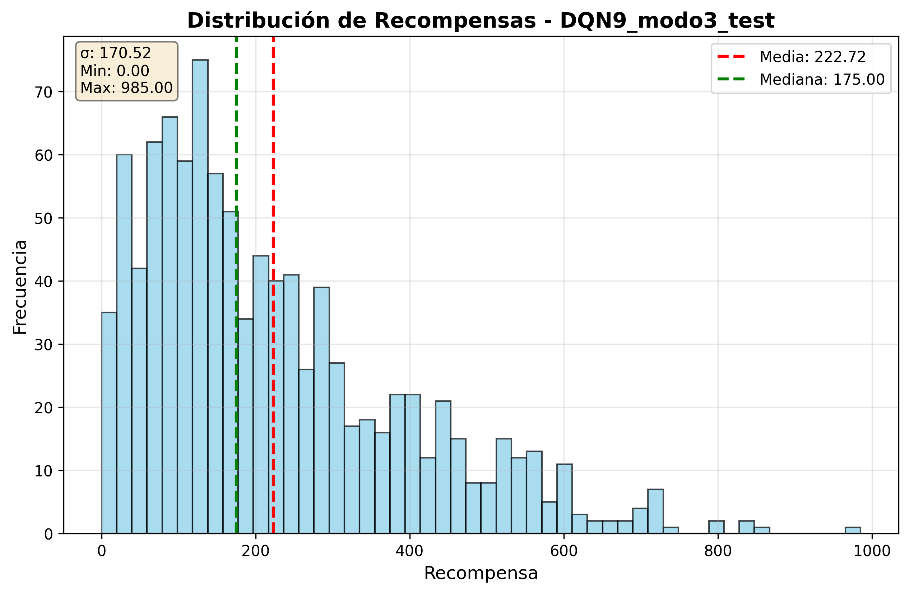<br>
      <em>[Figura 28] Histograma de frecuencia para modo 3</em>
    </td>
  </tr>
  <tr>  
    <td align="center">
      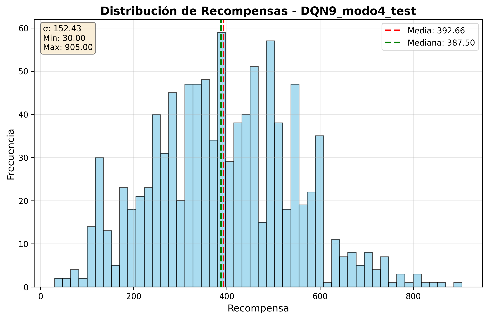<br>
      <em>[Figura 29] Histograma de frecuencia para modo 4</em>
    </td>
    <td align="center">
      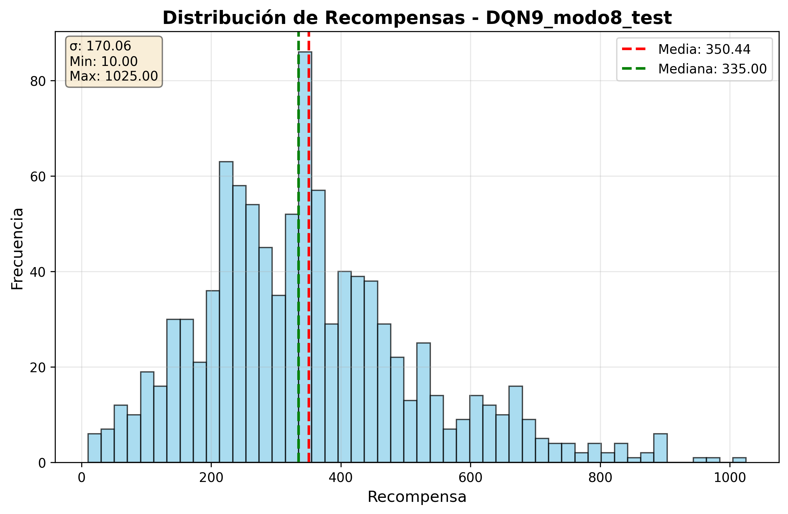<br>
      <em>[Figura 30] Histograma de frecuencia para modo 8</em>
    </td>
  </tr>
</table>

**PPO**

Como se mencionó al inicio de la sección de experimentos, sólo se entrenó con Wrapper de recompensas ya que sin Wrapper no entrenaba adecuadamente y a los pocos episodios se estancaba en una política que utilizaría durante el resto de los 10 millones de pasos.

**Mejor modelo (agente PPO5)**

<table align="center">
  <tr>
    <td align="center">
      <br>
      <em>[Figura 31] Promedio de recompensas en 10 millones de pasos para PPO5</em>
    </td>
    <td align="center">
      <br>
      <em>[Figura 32] Promedio de pasos por episodio en 10 millones de pasos para PPO5</em>
    </td>
  </tr>
</table>

<div align="center">
<h2> Resumen de resultados de tests (1000 episodios por test)</h2>

| Modo  | Winrate | Puntaje mínimo | Puntaje máximo | Media | Desviación Estándar | Video de ejemplo |
| ----- | ------- | -------------- | -------------- | ----- | ------------------- | ---------------- |
| 0     |  0,850  |      245       |      2660      |1304.23|       500.74        | [PPO5_MODO0](https://drive.google.com/file/d/1sA3cDy1DR3tplbaYk6dyQSpOZHj_UV5P/view?usp=sharing) |
| 3     |  0,123  |      35         |     1835      |341.94 |       264.17        | [PPO5_MODO3](https://drive.google.com/file/d/1FVBgHBGrE2HUO0T0h0hKwUR4GAPxkPZX/view?usp=sharing) |
| 4     |  0.004  |      15        |       840      |43.34  |       67.69         | [PPO5_MODO4](https://drive.google.com/file/d/1Yu1ndn6tffvat56VQ-z2xQn-ydIEklN9/view?usp=sharing) |
| 8     |  0.0    |      0        |       140       |0.9    |       7.35        | [PPO5_MODO8](https://drive.google.com/file/d/15IDOVXpsruXjhgEo84UOmT30yL-gFPA3/view?usp=sharing) |

</div>


<table align="center">
  <tr>
    <td align="center">
      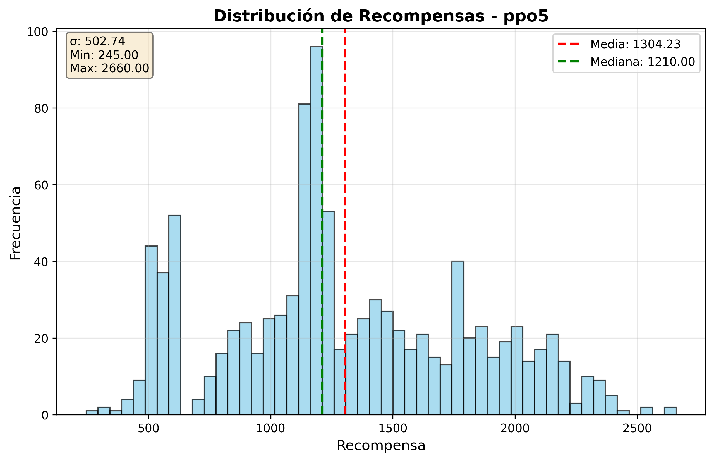<br>
      <em>[Figura 33] Histograma de frecuencia para modo 0</em>
    </td>
    <td align="center">
      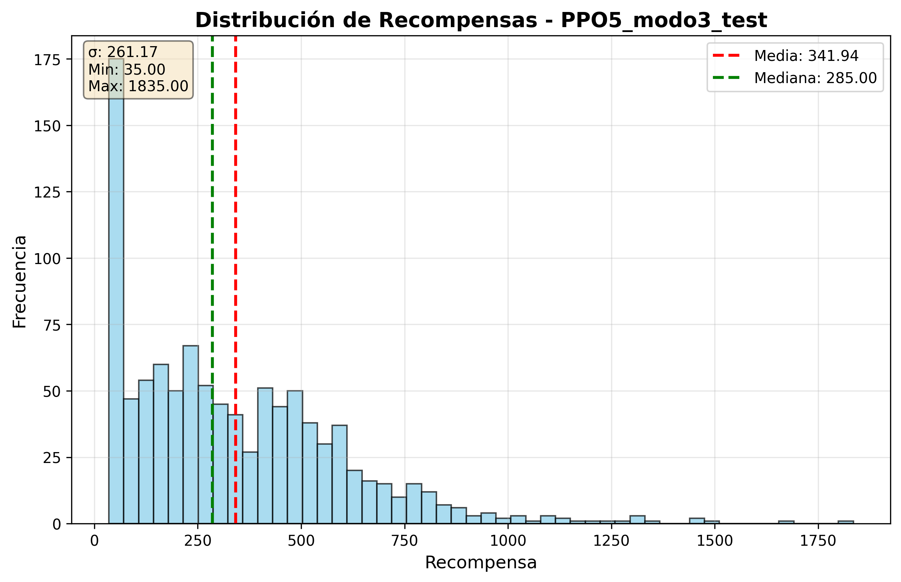<br>
      <em>[Figura 34] Histograma de frecuencia para modo 3</em>
    </td>
  </tr>
  <tr>  
    <td align="center">
      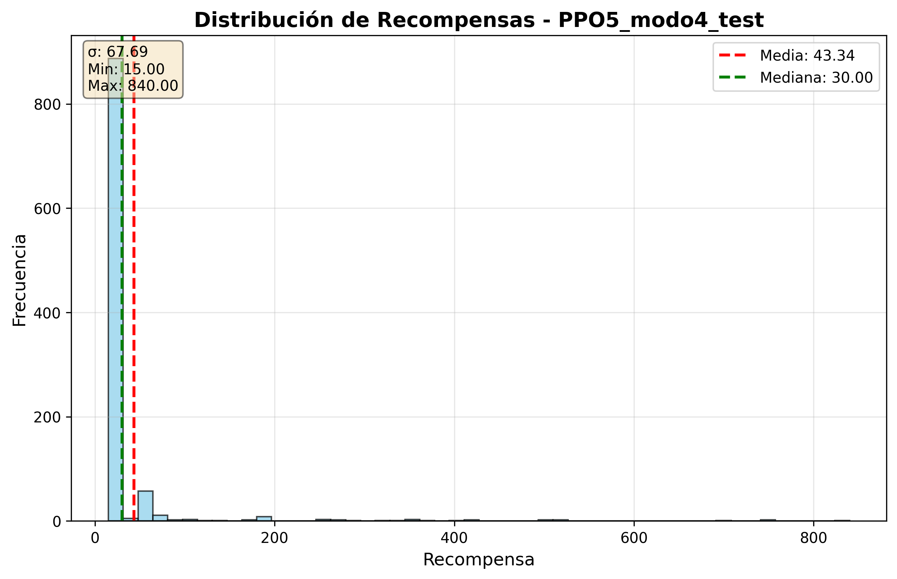<br>
      <em>[Figura 35] Histograma de frecuencia para modo 4</em>
    </td>
    <td align="center">
      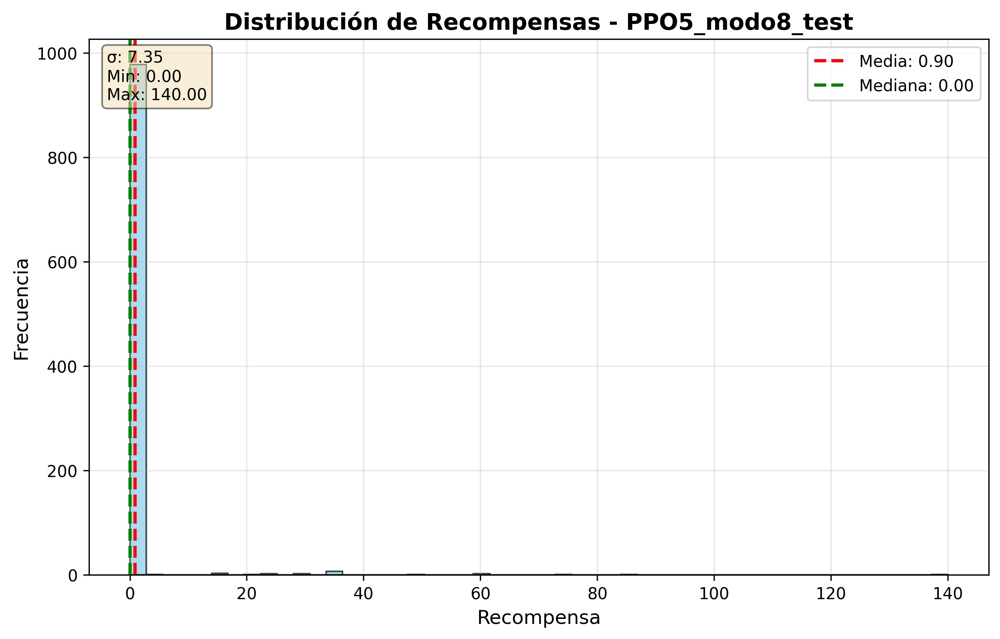<br>
      <em>[Figura 36] Histograma de frecuencia para modo 8</em>
    </td>
  </tr>
</table>

## Análisis y Discusión de Resultados
### Random
#### Desempeño general

El desempeño promedio es bajo en todos los modos, con valores entre 88.52 (modo 4) y 154.12 (modo 0), reflejando que la mayor parte del tiempo el agente muere rápidamente sin destruir una cantidad relevante de enemigos. Además los máximos puntajes que se alcanzan no reflejan un patrón en el comportamiento, sino simplemente episodios afortunados donde los disparos aleatorios conectan contra los enemigos y el agente sobrevive un poco mas de tiempo.

#### Desempeño por modo

En términos generales, el modo normal (modo 0) y el modo con enemigos que se hacen invisibles (modo 8) presentan los mejores promedios, aunque esto no implica un desempeño sólido, sino simplemente que en esos contextos el azar le permite sobrevivir ligeramente más y conectar algunos disparos. Los modos 3 y 4, que introducen dinámicas más complejas como paredes móviles, disparos que no son rectos o un mayor volumen de disparos enemigos, muestran peores resultados, evidenciando que cualquier incremento en la dificultad afecta negativamente al agente, ya que este no aprende a sobrevivir mientras elimina a los enemigos.

#### Winrate

El winrate del agente random es prácticamente insignificante, con menos del 0,2% de victorias en todos los modos. Las pocas partidas ganadas son producto del azar y no reflejan ningún tipo de estrategia ni comportamiento intencional por parte del agente.

#### Conclusión
El agente random presenta un comportamiento totalmente limitado y sin capacidad de adaptación. Sus acciones carecen de propósito, por lo que su desempeño depende únicamente del azar. Aunque ocasionalmente obtiene buenos puntajes, estos episodios aislados no se deben a una estrategia, sino coincidencias estadísticas.

### Q-learning
#### Desempeño general

Los modelos entrenados con Q-learning muestran un desempeño considerablemente superior al del agente aleatorio. En los modos más simples (0 y 8), ambos modelos alcanzan promedios de recompensa que superan los 260–280 puntos, lo que evidencia que lograron aprender patrones de supervivencia y ataque más estables. Si bien los puntajes máximos no difieren demasiado de los obtenidos por el agente random, los puntajes mínimos son más altos en los modos 0, 3 y 4 (especialmente en el modelo con reward shaping) indican que el agente aprendió a garantizar un nivel mínimo de efectividad, eliminando al menos algunos enemigos antes de morir incluso en sus peores episodios.

Una diferencia clave entre los dos modelos aparece en la evolución del aprendizaje: el agente con Reward Shaping continúa mejorando su recompensa hasta los 20 000 episodios, mientras que el modelo con Reward Clipping se estanca alrededor del episodio 2000, mostrando poca progresión posterior. Esto sugiere que el shaping ofrece señales de entrenamiento más útiles que el clipping.

En cuanto a la duración de los episodios, el shaping presenta un crecimiento inicial coherente con la mejora en la recompensa, mientras que en el clipping los episodios se vuelven más largos sin que eso se traduzca en un desempeño ofensivo mejor. Esto indica que el clipping permite sobrevivir más tiempo, pero no fomenta decisiones más efectivas, en parte por la pérdida de información que provoca la acotación de recompensas.

Finalmente, las desviaciones estándar relativamente altas en ambos modelos reflejan la presencia de variabilidad considerable entre episodios, especialmente en los modos más exigentes. Esto es coherente con la naturaleza del entorno, donde el ruido y la aleatoriedad de los disparos enemigos afectan significativamente la estabilidad del desempeño.

#### Desempeño por modo

En general, ambos modelos de Q-learning muestran un desempeño significativamente mejor que el agente aleatorio en todos los modos evaluados. Los modos 0 y 8 presentan las mayores recompensas promedio, lo que sugiere que el agente logra adaptarse mejor a configuraciones donde las dinámicas del entorno son más predecibles o estables. El modo 8, aun con enemigos invisibles, ofrece un entorno donde las posiciones de los enemigos y la estructura del nivel permiten que el agente desarrolle patrones útiles sin depender exclusivamente de la visibilidad.

A diferencia del resto de los modos, el modo 4 muestra un comportamiento particular: el agente aleatorio obtiene un promedio de recompensa (88.52) superior al de ambos modelos de Q-learning (62.91 con reward shaping y 61.75 con reward clipping). Esto sugiere que las dinámicas propias de este modo, donde los enemigos generan una mayor cantidad o frecuencia de disparos, producen un entorno tan caótico que la supervivencia depende más del azar que de una estrategia aprendida. En estas condiciones, las políticas derivadas de Q-learning no logran generalizar correctamente y, al seguir patrones más estructurados, pueden quedar más expuestas a los ataques enemigos que un comportamiento completamente aleatorio.

#### Winrate

El winrate de ambos modelos se mantiene bajo, con valores que no superan el 1–1.3% según el modo. Si bien esto representa una mejora real frente al agente aleatorio, sigue siendo insuficiente para considerar que el agente domine el juego. Las victorias obtenidas indican que el agente es capaz de completar una partida ocasionalmente, pero la baja frecuencia evidencia que el comportamiento aprendido no es lo suficientemente sólido ni consistente como para garantizar un desempeño robusto en escenarios complejos.

#### Conclusión

Los modelos entrenados con Q-learning muestran una mejora clara respecto del agente aleatorio, logrando promedios de recompensa más altos y un comportamiento más estable en todos los modos. Ambos agentes aprenden patrones básicos de supervivencia y ataque, pero el modelo con Reward Shaping Personalizado destaca por presentar un progreso sostenido a lo largo del entrenamiento y por alcanzar mejores mínimos y mayor consistencia entre episodios. En contraste, el modelo con Reward Clipping tiende a estancarse de forma prematura, lo que sugiere que las recompensas acotadas limitan la capacidad del agente para seguir refinando su estrategia.

A pesar de estas mejoras, el algoritmo mantiene un winrate bajo y su desempeño disminuye en modos más complejos, reflejando las limitaciones propias de Q-learning tabular en entornos de alta variabilidad y gran espacio de estados. En conjunto, los resultados muestran que Q-learning permite superar ampliamente al agente random, pero no es suficiente para dominar el juego, dejando margen para utilizar métodos más sofisticados en etapas posteriores.

### DQN
#### Desempeño general

Si comparamos los modelos entrenados con este algoritmo y los de Q-Learning, podemos determinar que DQN es mejor en varios aspectos: eficiencia, desempeño y complejidad espacial, pero a costo de mayor potencia de hardware. 

En ambos enfoques planteados durante los experimentos (con y sin Wrapper de recompensas) supera ampliamente al algoritmo anterior, pudiendo ganar más episodios, teniendo mejores recompensas y mejor estabilidad.

Ambos modelos muestran un buen desempeño, aunque el superador es el modelo con Reward Clipping ya que el entrenamiento es más estable y el agente puede aprender una regla muy importante: todos los enemigos tienen la misma importancia.

Bajo esta regla, el agente trata a todos por igual, por lo tanto no se centra en los enemigos de más alto nivel (que dan mayor puntaje) y es menos probable que los enemigos de menor nivel lleguen a la base provocando la finalización del episodio.

#### Desempeño por modo

En ambos casos, el mejor desempeño lo tuvieron en el modo 0, que es el modo predeterminado del entorno y con el que se los entrenó, por lo tanto tiene sentido que su desempeño sea significativamente mejor que en los demás modos.

En los otros modos el desempeño se reduce significativamente, es curioso que en el modo 8, donde los enemigos son invisibles la mayor parte del tiempo, tuvo mejor desempeño que en los modos 3 y 4, que los enemigos sí son visibles.

De igual forma tiene sentido ya que el modo 8, aunque no pueda ver a los enemigos la mayor parte del tiempo, es el más parecido al modo 0 porque no se alteran los disparos ni los escudos que ofrecen el entorno. Mientras que en los otros dos, los disparos cambian, entonces las reglas aprendidas sobre disparos no se asemejan a los disparos de estos modos.

#### Winrate

El winrate en ambos modelos es bueno, aunque con el segundo enfoque es mejor, esto se debe a que, al tener más estabilidad, se pudo continuar el entrenamiento del modelo con más pasos, por lo que tuvo oportunidad a aprender mejores políticas. 

El modelo con Wrapper de recompensa tuvo 5 veces más winrate en el modo 0 que el otro modelo sin Wrapper, y en los otros modos tuvo un rendimiento significativamente mayor.

### PPO
#### Desempeño general

Como se mencionó anteriormente, se entrenaron modelos con este algoritmo sólo con los Wrapper de recompensas ya que sin ellos, el entrenamiento era inestable y no valía la pena continuarlo porque se quedaba estancado en una política muy inferior y no se movía más allá de ella.

Con respecto al desempeño, en general superó ampliamente a todos los modelos anteriores, salvo en algunos modos que ya se discutirá sobre eso en la sección siguiente.

El entrenamiento fue más estable, lo que permitió agarrar modelos entrenados y continuar su entrenamiento para que siga evolucionando, gracias a esto se logró incrementar el winrate.

Con respecto a las políticas, aprendió mejores políticas que los modelos anteriores, ya que esquiva mejor los disparos y sólo dispara si hay enemigos: no dispara por disparar.

#### Desempeño por modo

En donde mejor tuvo desempeño fue en el modo 0, ganando en un 85% de los tests aplicados, donde la media de puntos fue 1304.23, cuando el puntaje mínimo para ganar es de 630. Por lo tanto, en promedio ganaba la partida.

En el modo 3 bajó el desempeño, pero aún así fue mejor que en los otros algoritmos, esto se debe a lo mencionado con los disparos ya que los esquiva bien y ataca exitosamente a los enemigos.

Donde bajó significativamente el desempeño fue en los modos 4 y 8. Con respecto al modo 4, se puede explicar por la velocidad de disparos del enemigo, el agente no alcanza a esquivarlos y pierde vidas rápidamente, teniendo una recompensa promedio inferior a la del agente random y a los modelos de Q-learning, aunque alcanza puntajes máximos más altos en algunos episodios.

Por último, en el modo 8, es entendible que no haya ganado partidas y no haya tenido un buen puntaje, esto se debe a lo mencionado anteriormente: no dispara si no ve enemigos. En este caso esta regla le juega en contra ya que prácticamente todo el episodio es así, los enemigos no son visibles. Por lo tanto, en estos episodios lo que más hacía era esquivar disparos en lugar de intentar alcanzar enemigos, haciendo que sea el algoritmo con peor desempeño para este modo.

#### Winrate

En este caso, fue superador el winrate, por lo menos en los modos 0 y 3. El hecho que haya ganado 850 partidas de 1000 es muy positivo, si comparamos el modo 0 de los algoritmos anteriores, supera hasta 16 veces esta métrica en algunos casos.

#### Conclusión

Los modelos implementados con PPO fueron mejores que los modelos con los algoritmos anteriores con respecto al modo 0 y 3. La estabilidad de entrenamiento fue mucho mayor y la continuación del entrenamiento fue más eficiente, permitiendo mejorar significativamente el modelo. Se considera que si se sigue entrenando, puede superar el 85% de winrate en el modo 0.

## Conclusiones finales
Tras comparar los resultados de testeo entre los distintos modos y teniendo en cuenta los datos obtenidos durante los entrenamientos, se puede concluir que los algoritmos DQN y PPO son superiores a Q-learning y definitivamente mejores que el algoritmo aleatorio. Ambos algoritmos tuvieron un desempeño superior y un entrenamiento mucho más estable, lo que permitió que ganasen más episodios y tuvieran recompensas mayores.

Aunque los 2 algoritmos superiores fueron superadores, valió la pena implementar tanto Q-learning como el algoritmo aleatorio, ya que permitió tener mejor entendimiento del entorno y tener un punto de comparación de qué era bueno y qué no.

Con respecto a Q-Learning, es bastante fácil de entender, lo que sirve de base para comprender DQN, el principal problema de este algoritmo es que no sirve para espacios continuos ni para entornos con un número elevado de estados o acciones, por lo que no se logró un modelo superior a los obtenidos.

Si nos basamos sólo en el modo (modo 0) en que se entrenó, se puede decir que el mejor algoritmo fue PPO, ya que el winrate superó casi 4 veces a DQN en el mismo modo. Pero si se cambia el entorno, su rendimiento baja, esto quiere decir que si el entorno de prueba se aleja con respecto al que se entrenó, el rendimiento baja. Luego, DQN, con modos distintos al default, tuvo un mejor rendimiento que PPO, por lo que se podría decir que en entornos distintos al que se entrenó tiene un mejor rendimiento al PPO.

Algunas mejoras que se podrían realizar son variantes de los algoritmos implementados como Double DQN o Rainbow DQN para mejorar el desempeño. Pero de igual forma se obtuvieron buenos resultados tanto en DQN y PPO, por lo que no se indagó en variantes.

Por último, se concluye que el hecho de haber elegido DQN y PPO para resolver el problema fue una buena elección, ya que tuvieron un muy buen rendimiento y los tests fueron muy satisfactorios. Aunque toman bastante tiempo para entrenar y se requiere un mayor poder de cómputo, sobre todo disponibilidad de una GPU.

## Bibliografía
---

<a id="ref1"></a> [1] Farama Foundation. (2025). Space Invaders Environment. Disponible en: https://ale.farama.org/environments/space_invaders/. Última vez accedido: Noviembre de 2025.

<a id="ref2"></a> [2] R. S. Sutton & A. G. Barto. (2020). Reinforcement Learning: An Introduction, Second Edition. The MIT Press. Última vez accedido: Noviembre de 2025.
 
<a id="ref3"></a> [3] Alexander Amini. (2024). MIT 6.S191: Reinforcement Learning. Disponible en: https://youtu.be/8JVRbHAVCws. Ultima vez accedido: Febrero de 2025.
 
<a id="ref4"></a> [4] DataCamp. (2024). Introducción al Q-Learning: Tutorial para principiantes. Disponible en: https://www.datacamp.com/es/tutorial/introduction-q-learning-beginner-tutorial. Última vez accedido: Noviembre de 2025. 

<a id="ref5"></a> [5] GeeksforGeeks. (2025). A Brief Introduction to Proximal Policy Optimization. Disponible en: https://www.geeksforgeeks.org/machine-learning/a-brief-introduction-to-proximal-policy-optimization/. Última vez accedido: Noviembre de 2025. 

<a id="ref6"></a> [6] Farama Foundation. (2025). Gymnasium Documentation. Disponible en: https://gymnasium.farama.org/index.html. Última vez accedido: Febrero de 2025.

<a id="ref7"></a> [7] Farama Foundation. (2023). ALE Documentation. Disponible en: https://ale.farama.org/index.html. Última vez accedido: Febrero de 2025.

<a id="ref8"></a> [8] Farama Foundation. (2025). Flavors. Disponible en: https://gymnasium.farama.org/v0.28.0/environments/atari/#flavors. Última vez accedido: Noviembre de 2025.

<a id="ref9"></a> [9] V. Mnih & K. Kavukcuoglu & D. Silver & A. Graves & I. Antonoglou D. Wierstra & M. Riedmiller. (2013). Playing Atari with Deep Reinforcement Learning. Deepmind.

<a id="ref10"></a> [10] Estructura de la red DQN. Disponible en: .\code\dqn\network_structure.md. Última vez accedido: Noviembre de 2025.

<a id="ref11"></a> [11] Estructura de la red PPO. Disponible en: .\code\ppo\network_structure.md. Última vez accedido: Noviembre de 2025.

<a id="ref12"></a> [12] Modos de space invaders. Disponible en: .\code\modos_de_juego. Última vez accedido: Diciembre de 2025.

<a id="ref13"></a> [13] Hill, A., Raffin, A., Ernestus, M., Gleave, A., Kanervisto, A., & Dormann, N. (2025). Stable Baselines3: Reliable Reinforcement Learning Implementations. Disponible en: https://stable-baselines3.readthedocs.io/. Última vez accedido: Diciembre de 2025.

<a id="ref14"></a> [14] Farama Foundation. (2023). Wrappers. Disponible en: https://gymnasium.farama.org/api/wrappers/. Última vez accedido: Noviembre de 2025.
