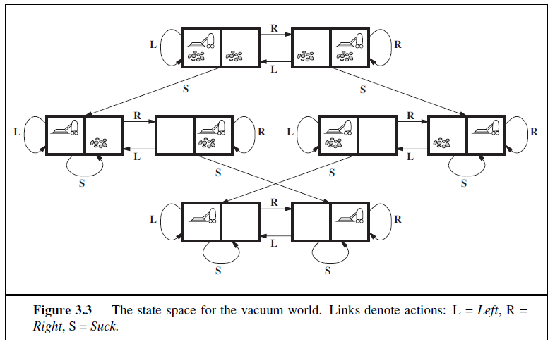

# Introducción

La búsqueda en inteligencia artificial es un proceso que se basa en encontrar soluciones o respuestas a problemas dentro de un espacio. Esto implica explorar estados dentro del espacio de estados hasta encontrar uno que cumpla con el objetivo.

En este informe se busca explorar algunos los distintos métodos de búsqueda de soluciones frente al problema del "Lago congelado" (FrozenLake) de Gymnasium. OpenAI Gym (conocido como Gymnasium) es una herramienta desarrollada por OpenAI para la investigación y el desarrollo en el campo de la inteligencia artificial, específicamente en el aprendizaje por refuerzo (Reinforcement Learning, RL).

Como se mencionó anteriormente, se explorará el entorno de FrozenLake con el objetivo de aplicar distintas técnicas de búsqueda y comparar su rendimiento y eficiencia a la hora de recorrer este entorno.

## Marco teórico
## Problema
Un problema se divide en 5 componentes:
 **Estado inicial
- **Acciones**: descripción de posibles acciones disponibles al agente, dado un estado s, ACTIONS(s) devolverá el conjunto de acciones que pueden ser ejecutadas en s. Cada acción de dicho conjunto es **aplicable** en s.
  `In(Arad) = {Go(Sibiu), Go(Timisoara), Go(Zerind)}`
- **Modelo de transición**: descripción de qué es lo que hace cada acción. Una función RESULT(s, a) retorna el estado resultante de realizar una acción a en el estado s. Se utiliza el término **sucesor** para referirse a cualquier estado alcanzable desde un estado por una sola acción, por ejemplo:
  `RESULT(In(Arad), Go(Zerind)) = In(Zerind)`
  El estado inicial, las acciones y el modelo de transición definen de forma implícita el **estado espacial** del problema (conjunto de todos los estados alcanzables desde el estado inicial por cualquier secuencia de acciones). El estado espacial forma un grafo en el cual los nodos son estados y las aristas son acciones.    
- **Goal test**: determina si un estado es un estado meta, a veces hay un conjunto explícito de posibles estados meta, y el test determina, dado un estado, si pertenece a este conjunto.
- **Path cost**: asigna un costo numérico a cada arista, el costo de la acción de *a* en el estado *s* para llegar a *s'* se denota como *c(s,a,s')*.
## Buscando soluciones
### Árbol de búsqueda
- **Root**: estado inicial.
- **Nodos**: estados del espacio de estados.
- **Ramas**: acciones
Se expande el estado actual, es decir, se aplica alguna acción legal del estado actual, se genera un nuevo conjunto de estados. En el caso del root `In(Arad)`, se generan 3 nodos hijos nuevos: `{In(Sibiu), In(Timisoara), In(Zerind)}`. A medida que se llega a un nodo, se realiza el test goal, en caso de no ser una meta, se expande y se obtienen más nodos hijos (incluyendo el padre). Se pueden elegir los nuevos nodos o tomar un paso atrás para elegir los nodos hijos anteriores.
Si hay estados repetidos en el árbol de búsqueda, es decir, un camino en bucle, se dice que el árbol de búsqueda es infinito porque no hay límites de cuánto puede atravesar el bucle.

Los caminos en bucle son un caso especial del concepto de pasos redundantes, donde existen en cualquier caso donde haya más de un camino para llegar de un estado a otro Para evitar explorar caminos redundantes hay que crear un conjunto de nodos explorados.
### Infraestructura de algoritmos de búsqueda
- **n.STATE**: estado en el espacio de estados al cual corresponde el nodo.
- **n.PARENT**: nodo en el árbol de búsqueda que generó este nodo.
- **n.ACTION**: acción que fue ejecutada al nodo padre para generar el nodo actual.
- **n.PATH-COST**: denotado por g(n), costo del camino desde el estado inicial hasta el nodo actual.  
### Estrategias de búsqueda no informadas
Las estrategias de búsqueda no informadas, también llamada búsqueda ciega, son aquellas que no contienen información adicional sobre los estados más allá de los otorgados en la definición del problema.
#### Búsqueda a lo ancho
- El nodo raíz es el primero en expandirse, luego todos los sucesores de la raíz se expanden, luego sus sucesores, y así sucesivamente.
- Se utiliza la estructura FIFO (cola).
- Es óptimo si el path cost es una función que no decrece según la profundidad del nodo, el escenario más común es aquel en el que todas las acciones tienen el mismo costo.  
#### Búsqueda de costo uniforme
  La [búsqueda de costo uniforme](https://youtu.be/dRMvK76xQJI), en vez de expandir el nodo menos profundo, como en búsqueda a la ancho, este algoritmo expande el nodo n con el menor path cost g(n). Esto se logra guardando la frontera como una cola de prioridad ordenada por g.
  - Utiliza una cola de prioridad (basada en el costo acumulado) para realizar un seguimiento de los nodos que debe visitar.
  - Asegura que siempre encuentre la solución de menor costo, si todos los costos son positivos.  
#### Búsqueda en profundidad
- Siempre expande el nodo más profundo del árbol de búsqueda.
- Utiliza la estructura FIFO (pila)

#### Búsqueda por profundidad limitada
- Igual que búsqueda por profundidad, pero cuando se llega a una profundidad *l*, los nodos de ese nivel se tratan como si no tuvieran sucesores.
- Resuelve el problema del camino infinito.
- Introduce una fuente de incompletitud.
### Estrategias de búsqueda informadas (heurísticas)
Las estrategias de búsqueda informadas, también conocidas como búsquedas heurísticas, utilizan información adicional, llamada heurística, para guiar la búsqueda hacia la meta de manera más eficiente que las búsquedas no informadas. Una heurística es una estimación o "regla de dedo" que ayuda a decidir cuál es el siguiente nodo a explorar, basándose en un cálculo del costo estimado desde el nodo actual hasta el objetivo
#### Búsqueda A*
El algoritmo **A*** es un algoritmo de búsqueda informada utilizado para encontrar el camino más corto entre un nodo inicial y un nodo objetivo en un grafo. Combina las características de búsqueda por costo uniforme y búsqueda voraz, utilizando una función de evaluación que equilibra el costo acumulado y la estimación del costo restante. Este algoritmo de búsqueda es tanto completo como óptimo.

La función de evaluación en A se define como:

$f(n)=g(n)+h(n)$

- **g(n)**: Representa el costo acumulado del camino desde el nodo inicial hasta el nodo n.
- **h(n)**: Es una función heurística que estima el costo desde n hasta el nodo objetivo.

##### Heurística: Distancia de Manhattan
La distancia de Manhattan es una medida utilizada para calcular la distancia entre dos puntos en un espacio cuadriculado, como un tablero de ajedrez o una cuadrícula de calles en una ciudad. Esta distancia también es conocida como **distancia en L** o **distancia de taxista** porque se asemeja al camino que un taxi tendría que seguir en una ciudad con calles dispuestas en una cuadrícula.

La distancia de Manhattan entre dos puntos `A(x1, y1)` y `B(x2, y2)` en un plano bidimensional se calcula sumando las diferencias absolutas de sus coordenadas:
$$d_{\text{Manhattan}}(A, B) = |x_2 - x_1| + |y_2 - y_1|$$
## Entorno
### Descripción
El entorno consta de 3 componentes:
- Hielo sólido: es el espacio en el que el agente puede moverse
- Agujeros: son "hoyos con agua" los cuales deben evitarse, ya que si el agente cae en ellos significa que ya no puede moverse.
- Objetivo: lugar donde se desea o se busca que el agente llegue.

### Funcionamiento
Este entorno puede tener distintos tamaños y tasas de agujeros, también se puede optar porque el entorno sea determinista o no, es decir, que la acción que tome el agente se cumpla el 100% de las veces o no. 
## Diseño experimental
Para elaborar este informe, se realizaron experimentos con algoritmos de búsqueda no informada e informada:

- **Entornos Utilizados**: Se experimentó con **30 entornos diferentes**, cada uno generado de manera determinista.
- **Características del Entorno**:
    - **Tamaño del Entorno**: Cada entorno tenía un tamaño de **100x100 casillas**.
    - **Tasa de Agujeros**: Se estableció una tasa de agujeros del **8%**. Es decir, el 8% de las casillas en el espacio contienen agujeros que el agente debe evitar para llegar a su objetivo.
- **Escenarios**: Por cada entorno se simularon 2 escenarios:
	- **Primer escenario**: cada acción tiene costo 1.
	- **Segundo escenario**: moverse a la izquierda tiene costo 1, moverse hacia abajo tiene costo 2, moverse a la derecha tiene costo 3, y moverse hacia arriba tiene costo 4.
- **Objetivo del Experimento**: Evaluar el rendimiento de los algoritmos de búsqueda en términos de:
    - **Eficiencia**: Medido en función del tiempo de ejecución.
    - **Número de Nodos Explorados**: Para determinar la cantidad de estados que el algoritmo revisa antes de encontrar una solución.
    - **Costo del Camino Encontrado**: Para comparar la calidad de las soluciones en términos del camino más corto o más seguro encontrado por cada algoritmo.
## Análisis y discusión de resultados

A continuación se presentará el promedio de los resultados obtenidos al computar 30 veces los algoritmos de búsqueda por profundidad, búsqueda a lo ancho, búsqueda de costo uniforme y búsqueda A estrella. Sólo se visualizarán los datos de aquellas búsquedas que resultaron exitosas, es decir, en las cuales el agente llegó al objetivo.
### Costo

Se puede observar que en ambos escenarios la búsqueda por profundidad es la más costosa, mientras que los otros algoritmos mantienen en promedio el mismo costo con la misma distribución. 

Otra observación que se puede resaltar del gráfico es que en el escenario 2, los algoritmos cuestan el doble o más que en el escenario 1.

![[costGraphBoxNWhiskers.png]]

Con estos gráficos podemos observar que la búsqueda por profundidad tiene aproximadamente el triple de costo que los otros algoritmos.
### Estados explorados

![[statesGraph.png]]

Al igual que en el análisis anterior, el algoritmo de búsqueda por profundidad es el menos eficiente: la cantidad de estados que necesita explorar, en promedio, es el doble o más que lo que le toma a los demás algoritmos.
![[statesExpliredBoxNWhiskers.png]]

### Tiempo

![[timeGraph.png]]
Aquí también se puede observar que el algoritmo DFS es el que más tiempo le toma llegar a una solución, mientras que los otros son bastante similares.

![[Pasted image 20240909202545.png]]

## Conclusiones
El análisis comparativo de los algoritmos de búsqueda aplicado al entorno FrozenLake de Gymnasium reveló algunas diferencias en términos de costo, eficiencia y número de estados explorados. A partir de los experimentos realizados, se puede concluir que:

1. **Eficiencia del Algoritmo**: La búsqueda en profundidad (DFS) se demostró como la menos eficiente en todos los escenarios. Aunque es capaz de encontrar una solución, el costo asociado, el tiempo de ejecución, y el número de nodos explorados fueron mayores en comparación con otros algoritmos.
2. **Efectividad de A***: El algoritmo A* puede llegar a una solución explorando una menor cantidad de estados que UCS y BFS, aunque tome un poco más de tiempo.
3. **Impacto de los Costos Variables**: La introducción de costos variables para las acciones influyó significativamente en el rendimiento de los algoritmos. En escenarios con costos distintos, el costo del camino encontrado fue considerablemente mayor.