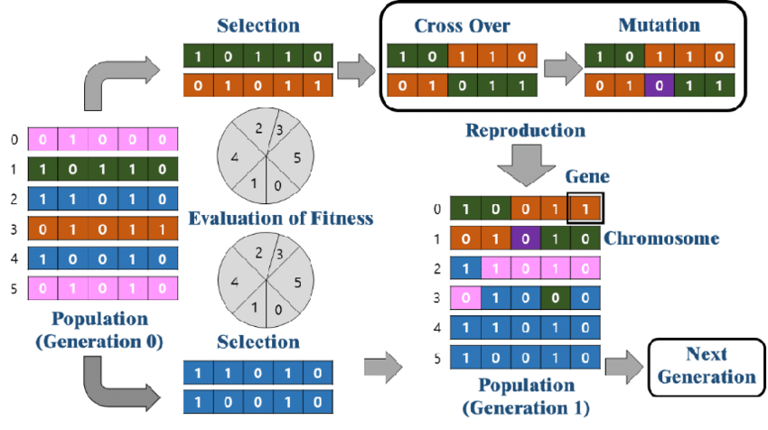

### **Introducción**

El problema de las N-Reinas consiste en colocar N reinas en un tablero de ajedrez de tamaño N x N de forma que ninguna de ellas se ataque entre sí, es decir, que no haya dos reinas en la misma fila, columna o diagonal. La complejidad de este problema aumenta exponencialmente con el número N, haciendo que la búsqueda exhaustiva sea inviable para valores altos de N. 

El propósito de este informe es comparar la eficiencia de tres algoritmos de búsqueda local para resolver el problema de las N-Reinas: **Hill Climbing**, **Simulated Annealing** y **Algoritmo Genético**. Se analizará el rendimiento de cada algoritmo en términos de tiempo de ejecución, iteraciones necesarias y éxito en encontrar soluciones óptimas.

---
### **Marco Teórico**
#### Hill Climbing

Hill Climbing es un algoritmo de búsqueda que se basa en mover desde una solución actual a una mejor solución vecina, en función de una medida de calidad o “fitness”. En el contexto del problema de las N-Reinas, el algoritmo se ejecuta de manera que, en cada paso, trata de reducir el número de conflictos entre reinas. Hill Climbing es simple y rápido, pero puede quedarse atrapado en óptimos locales, lo cual limita su capacidad para encontrar soluciones globales óptimas en problemas complejos.

#### Simulated Annealing

Simulated Annealing es un algoritmo que simula el proceso de enfriamiento gradual de materiales, donde la temperatura permite movimientos hacia estados de menor calidad al principio (permitiendo escapar de óptimos locales), y luego disminuye para enfocarse en las soluciones más cercanas al óptimo. En este algoritmo, se acepta una solución peor con cierta probabilidad que depende de la temperatura actual, y esta probabilidad disminuye con el tiempo. Esta técnica es útil en problemas donde el espacio de búsqueda es extenso y con múltiples óptimos locales.

#### Algoritmo Genético

Los Algoritmos Genéticos se inspiran en la evolución natural, utilizando una población de soluciones que evoluciona a través de la selección, cruza y mutación. Para el problema de las N-Reinas, cada “individuo” en la población representa una configuración del tablero. En cada generación, se seleccionan individuos más prometedores para la reproducción, con el fin de mejorar las siguientes generaciones. Los Algoritmos Genéticos son efectivos para la búsqueda global, pero su desempeño depende en gran medida de la configuración de parámetros como tamaño de la población, tasa de mutación y de cruza.

---

### **Diseño Experimental**

#### Configuración de Experimentos
- **Hill Climbing**: Se configuró para realizar hasta 1,000 iteraciones por ejecución.
- **Simulated Annealing**: Se utilizó una temperatura inicial de 100, un modo de enfriamiento geométrico y un límite de 1000 iteraciones.
- **Algoritmo Genético**: Se estableció una población inicial de 100 individuos y una probabilidad de mutación del 0.05. Se configuraron 1000 generaciones como máximo. La forma de selección de individuos es por "torneo", del cual de una muestra de tamaño k, se eligen los 2 mejores.

#### Métrica de Evaluación
Para evaluar cada algoritmo, se consideraron:
- **Conflictos restantes**: La cantidad de reinas que están en conflicto como medida de la calidad de cada solución.
- **Tiempo de ejecución**: El tiempo requerido para llegar a una solución.
- **Iteraciones**: Cantidad de iteraciones que le tomó al algoritmo llegar a la mejor solución.
- **Tasa de éxito**: Porcentaje de veces que el algoritmo encuentra una solución válida.

#### Número de Experimentos
Cada algoritmo se ejecutó 30 veces para valores de N = {4, 8, 10, 12, 15}, donde N es la cantidad de reinas y el tamaño del tablero (N xN).

---

### **Análisis y Discusión de Resultados**

Los resultados obtenidos de los experimentos se presentan en las siguientes tablas y gráficos.

En este último gráfico, el valor de fitness (fitness function) representa qué tan buena es la solución en cada iteración, en los primeros algoritmos, mientras más bajo sea el valor, mejor es, en el tercer algoritmo, mientras más se acerque a 1, mejor es.
#### Interpretación
- **Hill Climbing**: mostró un buen rendimiento en tiempo de ejecución y pocas iteraciones para valores bajos de N. De igual forma muy pocas veces encontró la solución óptima, es decir, cuando ninguna reina se ataca entre sí, y esto empeora a medida que N aumenta.
- **Simulated Annealing**: presentó una mejora significativa en la tasa de éxito, aunque requiere más tiempo y iteraciones que Hill Climbing. Es el que mejor tasa de éxito presenta en los 5 escenarios.
- **Algoritmo Genético**: encontró soluciones óptimas más lento en cuestión de tiempo, pero le requirió menos iteraciones, a medida que subía N le costaba encontrar soluciones.

#### Discusión de Resultados
En general, Hill Climbing es una opción rápida, pero menos fiable para valores altos de N, mientras que Simulated Annealing y el Algoritmo Genético ofrecen mejores tasas de éxito. Probablemente el algoritmo genético podría funcionar mejor, se probaron distintos parámetros y técnicas como elitismo y criterio de convergencia. Tal vez aumentando el criterio de convergencia se consigue mayor éxito, pero a coste de un mayor tiempo de ejecución.

---
### **Conclusiones**

Los experimentos muestran que, para el problema de las N-Reinas, el algoritmo de Simulated Annealing es el más eficaz en encontrar soluciones válidas, ya que es el que más rápido, en tiempo, encuentra óptimas soluciones. Por motivos de eficiencia, se optimizó y se limitó el algoritmo genético, se experimentó dándole más libertad y encontraba más soluciones, pero a cambio de un tiempo mucho mayor. Si se busca eficiencia, el algoritmo más adecuado, según la implementación lograda, sería simulated annealing.