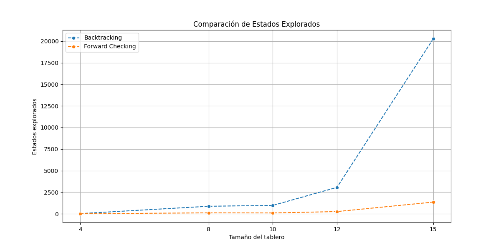
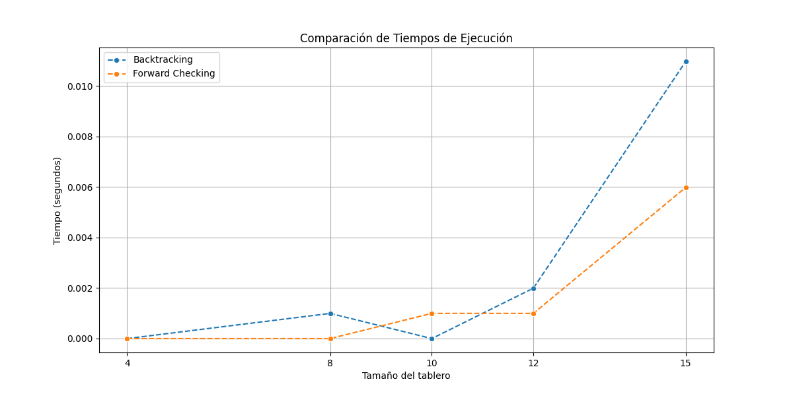

# 1. Describir en detalle un formulación CSP para el Sudoku

Un CSP consta de 3 componentes:
- X: conjunto de variables: {X1, ..., Xn}.
- D: conjunto de dominios {D1, ..., Dn} para cada variable.
- C: conjunto de restricciones que especifican cuáles son las combinaciones permitidas.

Entonces, en el caso de Sudoku:
- X: un conjunto de 81 elementos {X$_1$$_,$$_1$, ..., X$_i$$_,$$_j$, ..., X$_9$$_,$$_9$}, donde i, j ∈ {1, 2, ..., 9}. 
- D: D(X$_i$$_,$$_j$) = {1,2,3,4,5,6,7,8,9}
- C: {X$_i$$_,$$_j$ ≠ X$_k$$_,$$_l$ , siendo (i,j) y (k,l) pertenecientes al mismo cuadro; X$_i$$_,$$_j$ ≠ X$_i$$_,$$_n$ , siendo n ≠ j; X$_i$$_,$$_j$ ≠ X$_n$$_,$$_j$ , siendo n ≠ i}
# 2. Utilizar el algoritmo AC-3 para demostrar que la arco consistencia puede detectar la inconsistencia de la asignación parcial WA=red, V=blue para el problema de colorear el mapa de Australia

## Planteamiento del problema
- X: {WA, NT, SA, Q, NSQ, V, T}
- D: Dom(X) = {red, green, blue}
- C: 
	- Forma implícita:
		- WA ≠ {NT, SA}
		- NT ≠ {WA, Q, SA}
		- SA ≠ {WA, NT, Q}
		- Q ≠ {NT, SA, NSW}
		- NSW ≠ {Q, SA, V}
		- V ≠ {SA, NSW}
	- Forma explícita:
		- {(red, green), (red, blue), (green, red), (green, blue), (blue, red), (blue, green)}
## Algoritmo
- Cola:  {(WA, NT), (WA, SA), (NT, WA), (NT, Q), (NT, SA), (SA, WA), (SA, Q), (SA, NT), (Q, NT), (Q, SA), (Q, NSW), (NSW, Q), (NSW, V), (NSW, Q), (V, NSW), (V, SA)}
- Mientras la cola no esté vacía:
	- Deque primer elemento
	- Revisar el elemento:
		- Para cada color  x del dominio, si no hay ningún color y del dominio tal que (x, y) satisfaga la restricción entre X$_i$ y X$_j$ entonces elimino x del dominio 
	- Si se eliminó un elemento del dominio:
		- Si el tamaño del dominio se reduce a 0 (no quedan colores), entonces no se puede resolver el problema
		- Si el tamaño del dominio es mayor a 0, entonces se agregan a la cola los vecinos de Xi del elemento actual de la cola.
- En este caso se revisará cada arco de la cola y no habrá inconsistencia, pero al llegar a los últimos elementos (V, NSW) o (V, SA) habrá inconsistencia, y aunque añade nuevamente a la cola los vecinos de V (NSW, o SA) reduciendo el dominio (colores disponibles), no encontrará consistencia. Por lo tanto se puede concluir que con la asignación parcial WA=red, V=blue el problema es inconsistente.
# 3.
Cuando el algoritmo AC-3 se ejecuta en un árbol estructurado CSP, el peor caso es O(ED), donde E es el número de aristas y D el tamaño del dominio más grande, ya que ningún arco será considerado más de una vez.
# 4. 
Hay que analizar las restricciones para que para cada valor de Xi tengamos un seguimiento de las variables Xk tales que un archo entre ambos es satisfecho por un valor particular de Xi.
- Ejemplo: Si Xi puede tomar los valores {1, 2, 3} y tenemos una restricción como Xi > Xk, vamos a guardar cuáles son los valores Xk válidos para cada valor de Xi.
Entonces, cuando un valor de Xi es eliminado, se reduce la cantidad de valores disponibles para cada arco (Xk, Xi).

# 5. 
### Demostrar la correctitud del algoritmo CSP para árboles estructurados

La 2-consistencia nos dice que para cada par de variables Xi , Xj conectadas por una restricción, entonces para cada valor del dominio de Xi existe al menos un valor en el dominio Xj que satisface la restricción entre estos.

En un árbol, la propiedad que nos interesa es que no tiene ciclos. Esto significa que una vez que asignamos valores a las variables no vamos a tener caminos "cíclicos" que nos provoquen una inconsistencia. Entonces, una vez que una variable sea consistente con su vecino (nodo hijo), esa consistencia no se verá afectada por la asignaciones posteriores.

Entonces, para demostrar la n-consistencia en un árbol vamos a elegir un nodo "raíz" y vamos a realizar un recorrido hacia abajo, aplicando la 2-consistencia en cada nodo, lo que garantiza que para cualquier valor asignado a una variable, existe al menos un valor compatible en sus nodos hijos. Como el grafo no tiene ciclos, no necesitamos preocuparnos de que las asignaciones en otros subárboles interfieran con las consistencias previamente establecidas. Esto implica que la 2-consistencia es **suficiente** para garantizar la n-consistencia en un CSP basado en árboles.
# 6 y 7.

Para resolver el problema de las N reinas se implementaron los algoritmos de Backtracking y Forward Checking en tableros de tamaño N = {4, 8, 10, 12, 15}, siendo el tablero de N x N.

Como se puede observar en la imagen anterior, la cantidad de estados que explora Forward Checking es mucho menor ya que reduce los posibles dominios de las distintas variables (columnas del tablero). Y backtracking prueba todas las combinaciones posibles hasta llegar a una solución.

Forward Checking también consume menos tiempo, como se observa en la imagen anterior ya que explora menos combinaciones.

Comparando el algoritmo Forward Checking con el de Backtracking podemos concluir que el primero es mejor en términos de eficiencia y tiempo ya que consume menos recursos y tiempo para llegar a la mejor solución.