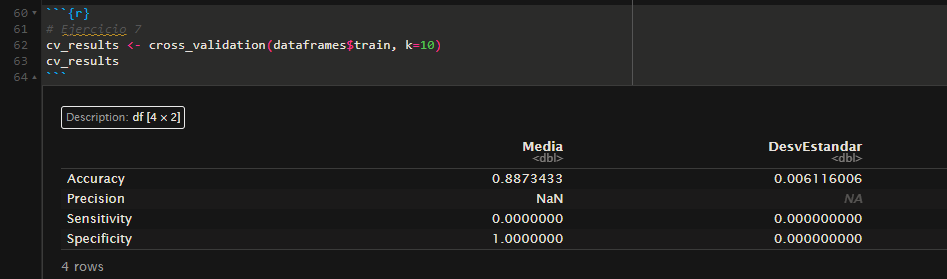
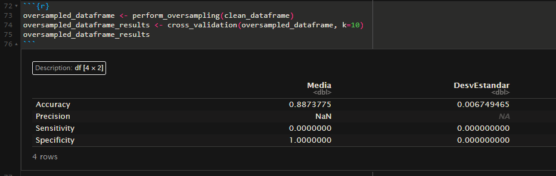
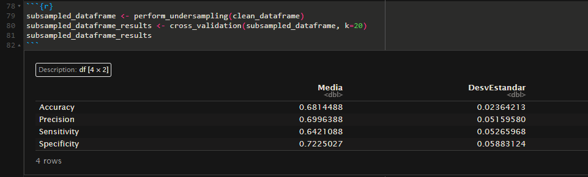

# A
create_folds()
```
create_folds <- function(data, k) {
  # Mezclar aleatoriamente los índices
  n <- nrow(data)
  indices <- sample(1:n, n)
  
  # Crear los folds
  fold_size <- floor(n/k)
  folds <- list()
  
  for(i in 1:k) {
    start_idx <- (i-1) * fold_size + 1
    end_idx <- min(i * fold_size, n)
    folds[[paste0("Fold", i)]] <- indices[start_idx:end_idx]
  }
  
  return(folds)
}
```

cross_validation()
```
cross_validation <- function(data, k) {
  # Asegurarnos que inclinacion_peligrosa sea factor
  data$inclinacion_peligrosa <- as.factor(data$inclinacion_peligrosa)
  
  # Asegurarnos que seccion y especie sean factores
  data$seccion <- as.factor(data$seccion)
  data$especie <- as.factor(data$especie)
  
  # Crear los folds
  folds <- create_folds(data, k)
  
  # Almacenar métricas
  metrics <- matrix(0, nrow = k, ncol = 4)
  colnames(metrics) <- c("Accuracy", "Precision", "Sensitivity", "Specificity")
  
  # Fórmula para el árbol
  train_formula <- formula(inclinacion_peligrosa ~ altura + circ_tronco_cm + lat + long + seccion + especie)
  
  # Para cada fold
  for(i in 1:k) {
    # Separar datos de entrenamiento y prueba
    test_indices <- folds[[i]]
    train_indices <- unlist(folds[-i])
    
    train_data <- data[train_indices, ]
    test_data <- data[test_indices, ]
    
    # Entrenar modelo
    tree_model <- rpart(train_formula, 
                        data = train_data, 
                        method = "class",
                        control = rpart.control(minsplit = 20,
                                                minbucket = 7,
                                                cp = 0.01))
    
    # Predecir
    predictions <- predict(tree_model, test_data, type = 'class')
    
    # Asegurarnos que las predicciones y valores reales sean numéricos para calculate_metrics
    true_values <- as.numeric(as.character(test_data$inclinacion_peligrosa))
    pred_values <- as.numeric(as.character(predictions))
    
    # Calcular métricas
    fold_metrics <- calculate_metrics(true_values, pred_values)
    metrics[i,] <- fold_metrics$metrics
  }
  
  # Calcular media y desviación estándar
  results <- data.frame(
    Media = colMeans(metrics),
    DesvEstandar = apply(metrics, 2, sd)
  )
  
  return(results)
}
```

# B

Cross Validation con datos sin tratar.


Cross Validation habiendo eliminado aquellos datos cuya clase "Especie" tenga menos de 10 ejemplares.


Cross Validation con undersampling del set tratado de la imagen anterior.
