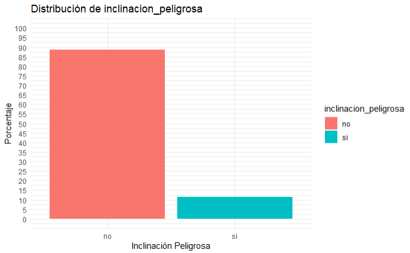
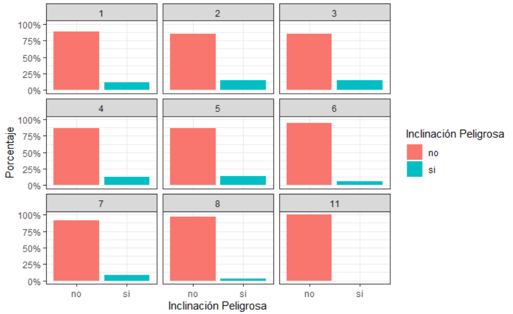
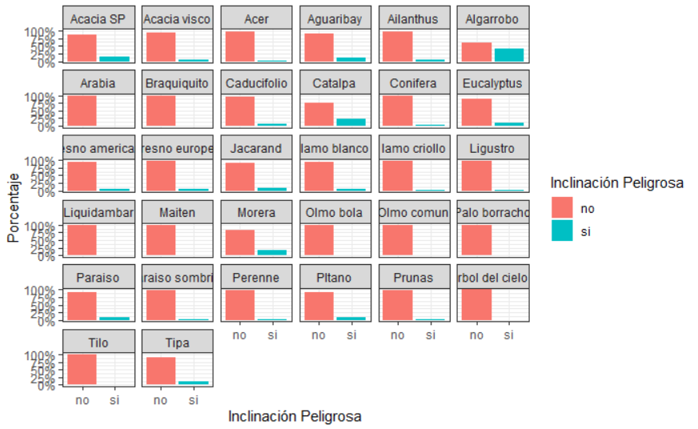
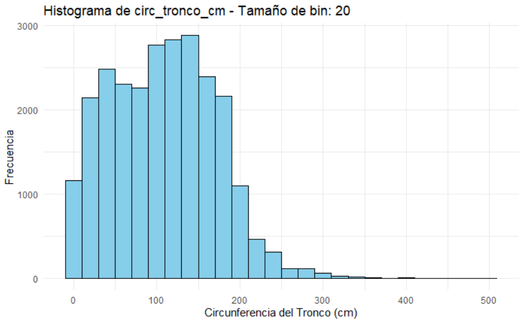
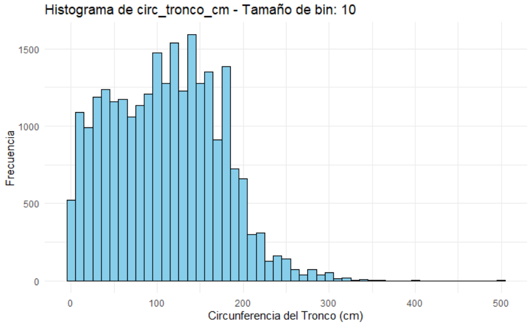
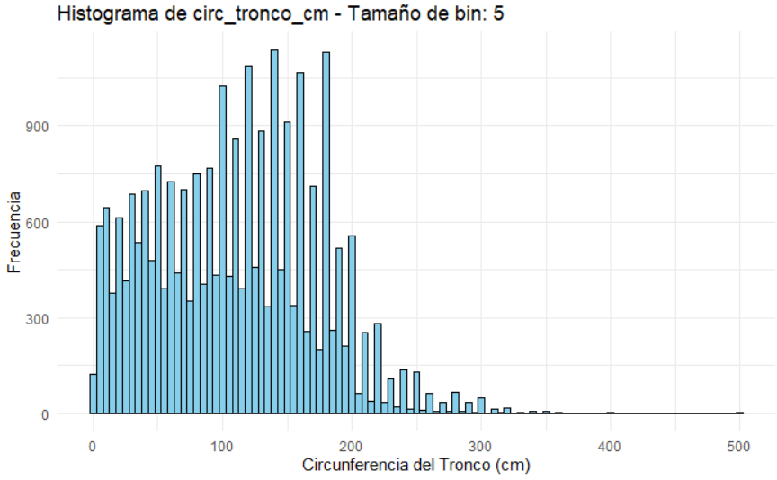
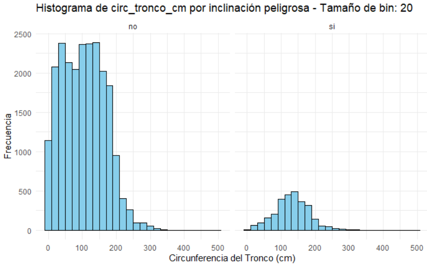
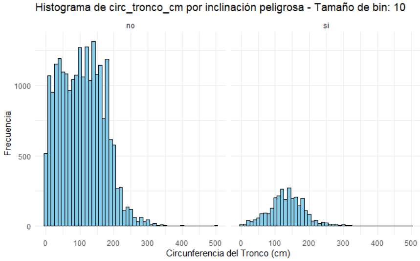
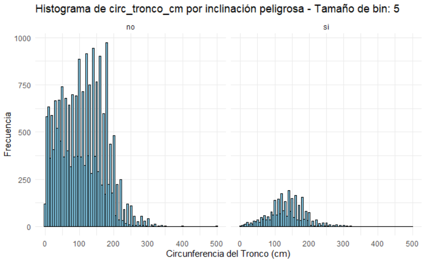

# 2. A partir del archivo arbolado-mendoza-dataset-train.csv responder las siguientes preguntas:
## a) ¿Cuál es la distribución de las clase inclinacion_peligrosa?

El 88.65% de los árboles no tienen una inclinación peligrosa, mientras que la cantidad restante (11.35%) sí tienen una inclinación que se considera peligrosa.

## b) ¿Se puede considerar alguna sección más peligrosa que otra?

Por los gráficos podemos observar que las secciones más peligrosas son la 2 y la 3, ya que hay más árboles con inclinación peligrosa por árboles con inclinación no peligrosa que las otras secciones.
## c) ¿Se puede considerar alguna especie más peligrosa que otra?

A simple vista podemos observar que la especie más peligrosa es el Algarrobo, ya que aproximadamente por cada árbol de inclinación no peligrosa de dicha especie, hay un árbol de inclinación peligrosa del 
# 3. A partir del archivo arbolado-mendoza-dataset-train.csv responder las siguientes preguntas:

## b) Generar un histograma de frecuencia para la variable circ_tronco_cm. Probar con diferentes  números de bins

## c) Repetir el punto b) pero separando por la clase de la variable inclinación_peligrosa

