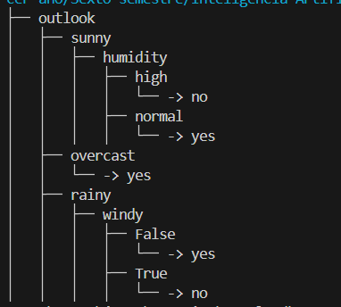

# A. Resultados sobre la evaluación sobre tennis.csv

# B. Información sobre las estrategias para datos de tipo real

Para que los árboles de decisión puedan manejar datos continuos (o de tipo real), existen diversas estrategias que adaptan algoritmos originalmente diseñados para variables discretas, como ID3. A continuación, se presentan algunas de las técnicas más utilizadas:

1. **Discretización previa**: Esta técnica convierte los datos continuos en categorías antes de construir el árbol de decisión. Entre las técnicas de discretización se incluyen:
   - **Binning**: Divide los datos en intervalos de igual tamaño o en función de su distribución.
   - **Discretización supervisada**: Crea intervalos en función de la relación con la variable objetivo, maximizando la ganancia de información.

2. **Punto de corte óptimo**: En lugar de discretizar la variable, algunos algoritmos prueban distintos puntos de corte dentro de los datos continuos para cada nodo. El objetivo es encontrar el valor de corte que maximice la ganancia de información o reduzca la impureza (en algoritmos como CART). Este proceso se realiza de forma dinámica en cada nodo para optimizar la división de los datos en función de la información en el subconjunto correspondiente.

3. **Divisiones dinámicas en cada nodo**: En algunos casos, los árboles ajustan los límites de división de forma dinámica en cada nodo. Esto permite que los puntos de corte de una variable continua varíen según el contexto de cada subconjunto de datos en el árbol.

4. **Árboles binarios**: Algoritmos como CART y C4.5 (una extensión de ID3) utilizan una estructura binaria en cada nodo para manejar datos continuos. En este enfoque, cada nodo realiza una división binaria (por ejemplo, "atributo ≥ valor" vs. "atributo < valor"), lo que simplifica las decisiones y facilita el trabajo con variables continuas.

5. **Normalización y transformación de datos**: Algunas estrategias incluyen transformar los datos antes de utilizarlos en el árbol. Esto puede implicar normalización, escalado o aplicar funciones como logaritmos, mejorando el rendimiento en casos donde los datos tengan una escala amplia o gran variabilidad.
### Ejemplos de algoritmos que manejan datos de tipo real en árboles de decisión

1. **C4.5**: Este algoritmo es una extensión de ID3, desarrollado por Ross Quinlan, que introduce el manejo de variables continuas. C4.5 divide los datos en dos ramas en cada nodo mediante el **punto de corte óptimo** para variables continuas, calculando la ganancia de información en diferentes puntos de corte posibles. Este algoritmo ha sido fundamental en el avance de los árboles de decisión, y su capacidad para manejar variables continuas lo convierte en una herramienta flexible para conjuntos de datos mixtos.

2. **CART (Classification and Regression Trees)**: Desarrollado por Breiman et al., CART es otro algoritmo de árbol de decisión que permite tanto clasificación como regresión. Al manejar datos continuos, CART realiza divisiones binarias en cada nodo en función de un punto de corte óptimo que maximiza la reducción de impureza (medida mediante el índice de Gini para clasificación o el error cuadrático para regresión). Su estructura de árbol binario lo hace adecuado para datos continuos y mixtos.

3. **CHAID (Chi-squared Automatic Interaction Detection)**: CHAID también permite trabajar con variables continuas, utilizando pruebas de independencia chi-cuadrado para encontrar puntos de corte. Aunque comúnmente se usa para análisis de segmentación de mercado, también se aplica en otros contextos de clasificación. Este algoritmo convierte variables continuas en intervalos mediante discretización supervisada, lo que permite una segmentación que se alinea con la variable objetivo.

4. **ID5R**: Una mejora incremental del algoritmo ID3, ID5R también maneja variables continuas mediante discretización dinámica de intervalos. A diferencia de ID3, que requiere reconstruir el árbol cuando hay cambios en los datos, ID5R ajusta el árbol de manera incremental, siendo más eficiente en escenarios con datos en evolución y variables continuas.

